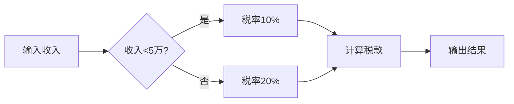

## 浏览器持久化存储

浏览器的**「持久化存储」**是指在浏览器中可以**长期保留数据**、即使用户关闭浏览器或重启设备也不会丢失的数据，常用于离线应用、本地缓存、用户设置保存等

###  一、主要持久化存储方式对比

浏览器提供了多种**「持久化存储机制」**，以下是目前主流浏览器支持的**「持久化存储方式」**汇总，按能力、容量和适用场景分类：

| 存储方式                 | 容量限制          | 是否持久化 | 跨页面共享    | 数据类型       | 适用场景                       |
| ------------------------ | ----------------- | ---------- | ------------- | -------------- | ------------------------------ |
| `Cookies`                | ~4KB              | ✅ 是       | ✅ 跨请求/页面 | 字符串         | 会话管理、跨请求携带身份       |
| `sessionStorage`         | ~5MB              | ❌ 否       | ❌ 不共享      | 字符串         | 会话级数据，页面跳转临时保存   |
| `localStorage`           | ~5MB              | ✅ 是       | ✅ 同域共享    | 字符串         | 小量键值数据，用户偏好等       |
| `IndexedDB`              | 数十 MB ~ 几百 MB | ✅ 是       | ✅ 同域共享    | 任意结构化数据 | 离线缓存、大数据、复杂对象存储 |
| `Cache Storage`          | 数百 MB           | ✅ 是       | ✅ 同域共享    | 响应对象       | PWA 离线缓存（Service Worker） |
| `File System Access API` | 几百 MB~GB        | ✅ 是       | ✅（需授权）   | 文件/目录      | 直接读写本地文件（需权限）     |

除了`File System Access API` 是直接存储在本地文件中，其余存储方式都是浏览器的能力，它们的存储**「过期时间」**如下👇：

| 存储方式         | 默认过期时间    | 是否可配置过期时间 | 自动清除机制           |
| ---------------- | --------------- | ------------------ | ---------------------- |
| `Cookies`        | 会话级 / 可配置 | ✅ 支持 `Max-Age`   | ❌ 不自动清除           |
| `sessionStorage` | 当前标签页会话  | ❌ 不支持           | ✅ 标签页关闭即失效     |
| `localStorage`   | 永久            | ❌ 不支持           | ❌ 不自动清除           |
| `IndexedDB`      | 永久            | ❌ 不支持           | ⚠️ 空间不足时可能被清除 |
| `Cache Storage`  | 永久            | ❌ 不支持           | ⚠️ 浏览器有清理策略     |

以上几种**「持久化存储方式」**中，**Cookie**有些特殊，它既是一种浏览器能力，同时也属于 **HTTP** 协议规范的一部分

- 作为 **HTTP** 规范：

  - 服务端通过 **HTTP** 响应头 `Set-Cookie` 设置 **Cookie**，格式如：

    ```mathematica
    Set-Cookie: sessionId=abc123; Path=/; HttpOnly; Secure; SameSite=Lax
    ```

  - 浏览器在之后的请求中自动携带该 **Cookie**：

    ```makefile
    Cookie: sessionId=abc123
    ```

  - 支持附加属性：如 `Expires`、`Max-Age`、`Secure`、`HttpOnly`、`SameSite` 等，这些都属于标准的 **HTTP** 头部定义

- 作为浏览器能力：

  - 浏览器会自动解析 `Set-Cookie` 响应头，并在后续请求中附带 `Cookie` 请求头

  - 浏览器限制了 **Cookie** 的跨域发送（受 `SameSite` 限制）

  - 可以通过 **JavaScript** 操作 **Cookie**（前提是未设置 `HttpOnly`）

    ```javascript
    document.cookie = "theme=dark; path=/";
    console.log(document.cookie); // 读取所有可访问的 Cookie
    ```

### 二、具体使用

#### 2.1、Cookie 的工作流程

```http
// 服务端响应
HTTP/1.1 200 OK
Set-Cookie: SESSIONID=abc123; Path=/; HttpOnly; Secure; SameSite=Lax

// 浏览器自动附带
GET /dashboard HTTP/1.1
Host: example.com
Cookie: SESSIONID=abc123
```

- **存储机制**：浏览器根据 `Domain`、`Path`、`Expires/Max-Age`、`Secure`、`HttpOnly`、`SameSite` 等属性决定写入方式与有效范围

- **JavaScript 操作**：

  ```js
  // 写入
  document.cookie = 'theme=dark; path=/; max-age=3600';
  // 读取
  const cookies = document.cookie; // 'SESSIONID=abc123; theme=dark'
  ```

#### 2.2、Web Storage API

```js
// 写入 localStorage
localStorage.setItem('token', 'xyz789');
// 读取 localStorage
const token = localStorage.getItem('token');
// 删除
localStorage.removeItem('token');
// 清空
localStorage.clear();
```

- **底层实现**：浏览器内部将数据以键值映射的形式存储在独立文件中，按域名（**Origin**）隔离
- **同步接口**：读写操作为同步阻塞，数据量大时可能造成 **UI** 卡顿

#### 2.4、IndexDB

> **IndexedDB** 是浏览器提供的一个内建的 **本地数据库系统**，用于在用户的浏览器中存储大量结构化数据（包括文件/二进制数据），支持事务、索引、查询等功能
>
> 特点：
>
> - 键值对存储（`key-value`）
> - 异步操作为主（通过事件或 **Promise**）
> - 支持事务、索引和游标（`cursor`）

以下是一个**完整的 IndexedDB 示例**，演示如何：

- 创建数据库
- 添加用户
- 查询用户
- 展示数据到页面

```html
<!DOCTYPE html>
<html lang="zh">
<head>
  <meta charset="UTF-8">
  <title>IndexedDB 示例</title>
</head>
<body>
  <h1>IndexedDB 用户管理示例</h1>

  <!-- 表单区域：输入用户 ID 和姓名 -->
  <div>
    <label>用户ID：<input type="number" id="userId" /></label><br />
    <label>用户名：<input type="text" id="userName" /></label><br />
    <button onclick="addUser()">添加用户</button>
  </div>

  <hr />

  <!-- 查询区域：根据 ID 查询用户 -->
  <div>
    <label>查询用户ID：<input type="number" id="queryId" /></label>
    <button onclick="getUser()">查询用户</button>
    <p id="queryResult"></p>
  </div>

  <script>
    // 声明数据库变量
    let db;

    // 打开或创建一个名为 'MyDatabase' 的数据库，版本号为 1
    const request = indexedDB.open('MyDatabase', 1);

    // 创建数据库结构, onupgradeneeded 事件：仅在首次创建或升级时触发，用于初始化/升级数据库结构
    request.onupgradeneeded = function(event) {
      // 这里拿到的 db 实例仅适用于结构操作（如建表、建索引）
       db = event.target.result;

      const store = db.createObjectStore('users', { keyPath: 'id' });

      // 为 'name' 字段创建索引
      store.createIndex('name', 'name', { unique: false });

      console.log('对象存储 "users" 已创建');
    };

    // 数据库打开成功回调，onsuccess 事件：每次数据库成功打开时触发，表示可以安全进行数据操作
    request.onsuccess = function(event) {
      db = event.target.result;
      console.log('数据库连接成功');
    };

    // 数据库打开失败
    request.onerror = function(event) {
      console.error('数据库连接失败：', event.target.error);
    };

    // 添加用户到数据库
    function addUser() {
      const id = parseInt(document.getElementById('userId').value);
      const name = document.getElementById('userName').value;

      // 校验用户输入
      if (!id || !name) {
        alert('请填写用户 ID 和用户名');
        return;
      }


     // 创建一个只作用于 'users' 的读写事务
      const tx = db.transaction('users', 'readwrite');

      // 通过事务获取对象存储（表）实例
      const store = tx.objectStore('users');

      // 向对象存储中添加数据
      const request = store.add({ id, name });

      // 当数据成功写入数据库时触发
      request.onsuccess = () => {
        alert(`用户 ${name} 添加成功`);
      };

      // 当添加数据失败（如主键 id 重复）时触发
      request.onerror = () => {
        alert('添加失败：该 ID 可能已存在');
      };
    }

    // 根据 ID 查询用户
    function getUser() {
      const id = parseInt(document.getElementById('queryId').value);

      // 创建一个只读事务
      const tx = db.transaction('users', 'readonly');
      const store = tx.objectStore('users');

      // 发起查询请求
      const request = store.get(id);

      // 查询成功回调
      request.onsuccess = () => {
        const result = request.result;
        const output = document.getElementById('queryResult');
        if (result) {
          // 显示查询结果
          output.textContent = `查询成功：ID=${result.id}, 姓名=${result.name}`;
        } else {
          output.textContent = '未找到该用户';
        }
      };

      // 查询失败回调
      request.onerror = () => {
        alert('查询失败');
      };
    }
  </script>
</body>
</html>

```

功能说明:

| 功能         | 描述                                                      |
| ------------ | --------------------------------------------------------- |
| 创建数据库   | 使用 `indexedDB.open()` 创建名为 `MyDatabase` 的数据库    |
| 创建对象存储 | 在 `onupgradeneeded` 中定义 `users` 表，并设置主键为 `id` |
| 添加数据     | 输入 **ID** 和姓名后，点击“添加用户”按钮存入数据库        |
| 查询数据     | 输入 **ID**，点击“查询用户”按钮从数据库读取数据           |

#### 2.5、Cache Storage

> **Cache Storage** 是浏览器提供的缓存机制，常用于 **Service Worker** 中，将资源（如 HTML、JS、CSS、图片、接口响应等）缓存到本地，以实现 **离线访问**、**加速加载** 和 **降低网络请求频率**
>
> 它是现代浏览器（支持 **Service Worker**）的标准组成部分，广泛用于 **PWA**（渐进式 Web 应用）中
>
> 特点：
>
> - 面向资源（基于 `Request` / `Response` 对象）
> - 支持多个命名 **cache**（类似命名空间）
> - 支持精细化控制（添加、匹配、删除等）
> - 可与 **Fetch API** 配合使用
>
> 错误用途及原因：
>
> | 错误用途                                   | 原因                                                         |
> | ------------------------------------------ | ------------------------------------------------------------ |
> | 用作本地数据库                             | **Cache Storage**  无法像 **IndexedDB** 一样做结构化查询或存储任意数据；只能缓存 `Request → Response` |
> | 替代 **LocalStorage** / **SessionStorage** | **Cache Storage** 只缓存请求响应，不能存储任意 JS 对象       |

**Cache Storage** 通常和  **Service Worker** 配合使用，但其也可以单独使用，以下是一个简单的**缓存网络请求**的示例：

```html
<!DOCTYPE html>
<html lang="zh">
    <head>
        <meta charset="UTF-8" />
        <title>Cache Storage 示例</title>
    </head>
    <body>
        <h1>Cache Storage 示例</h1>
        <button id="cache-btn">缓存并读取数据</button>

        <pre id="output"></pre>

        <script>
            // 定义一个异步函数，用于演示 Cache Storage 的用法
            async function cacheExample() {
                const cacheName = 'my-cache' // 缓存名称
                const requestUrl = './example.json' // 需要缓存的资源路径，需与本 HTML 文件同目录

                const output = document.getElementById('output') // 获取输出区域

                try {
                    // caches 是浏览器提供的全局 CacheStorage 对象，用于管理缓存
                    // open 方法用于打开一个指定名称的缓存（如果不存在则新建），返回一个 Promise，解析为 Cache 实例
                    // open 方法的参数为缓存名称（字符串），如 'my-cache'
                    const cache = await caches.open(cacheName)

                    // 先获取资源内容
                    const response = await fetch(requestUrl)

                    // cache.put 用于将请求和响应对象存入缓存
                    // put 方法的第一个参数为请求（Request 对象或 URL 字符串），第二个参数为响应（Response 对象）
                    // 由于 response 只能被读取一次，这里用 response.clone() 进行克隆，避免后续读取出错
                    await cache.put(requestUrl, response.clone())

                    output.textContent += '✅ 已将 example.json 加入缓存\n'

                    setTimeout(async () => {
                        // cache.match 用于查找缓存中与指定请求匹配的响应
                        // 参数可以是 Request 对象或 URL 字符串，这里用的是 URL 字符串
                        // 返回值是一个 Promise，解析为匹配到的 Response 对象（如果没有则为 undefined）
                        const cachedResponse = await cache.match(requestUrl)
                        if (cachedResponse) {
                            // 解析缓存中的 JSON 数据
                            const data = await cachedResponse.json()
                            output.textContent +=
                                '📦 缓存内容：\n' + JSON.stringify(data, null, 2) + '\n'
                        } else {
                            output.textContent += '❌ 未找到缓存内容\n'
                        }

                        // 清除整个缓存（可选操作）
                        const deleted = await caches.delete(cacheName)
                        output.textContent += deleted ? '🗑️ 缓存已清除\n' : '⚠️ 缓存清除失败\n'
                    }, 5000)

                } catch (err) {
                    // 捕获并输出错误信息
                    output.textContent += '❌ 错误: ' + err + '\n'
                }
            }

            // 给按钮绑定点击事件，触发缓存示例函数
            document.getElementById('cache-btn').addEventListener('click', cacheExample)
        </script>
    </body>
</html>

```

效果如下👇：


单独使用 **Cache Storage** 虽然也能缓存请求，但有以下局限：

- 「缓存逻辑」只能在用户交互或页面加载后执行，**无法拦截网络请求**
- 页面刷新时，缓存逻辑如果不执行，就不更新
- 无法实现离线访问，无法控制请求路由（例如 **fallback** 到缓存）

#### 2.6、离线缓存

**Cache Storage** 主要使用场景是结合 **Service Worker** 缓存**请求（Request）**及其**响应（Response）**从而实现**「离线缓存」**和「**请求控制 」**

> **Service Worker 是浏览器在后台运行的独立线程**，可以拦截网络请求、缓存资源、实现离线访问、推送通知等功能
>
> 通俗理解：==它是站点和浏览器之间的**“中间代理层”**，可以决定请求如何处理==，是实现**渐进式 Web 应用**（**PWA**）的关键组件
>
>  **工作机制（核心流程）**
>
> 1. **注册（register）**： JS 代码调用 `navigator.serviceWorker.register('/sw.js')` 注册一个 **Service Worker**
> 2. **安装（install）**： 第一次注册时触发，通常在这一步缓存静态资源
> 3. **激活（activate）**：安装完成后激活，可清除旧缓存等
> 4. **拦截请求（fetch）**：注册成功后，所有在其作用域内的请求都会被其监听，这时可以决定是从缓存读取还是发起网络请求
> 5. **生命周期控制**：浏览器控制其启动与关闭，不受页面刷新影响（除非手动注销或更新）
>
> **注意事项**
>
> - **Service Worker 只能在 HTTPS 或 localhost 下使用**
> - **作用域是根据注册路径决定的**，例如注册 `/sw.js`，默认只控制根路径及其子路径的请求
>
> **简单示例**
>
> ```javascript
> // 页面中注册
> if ('serviceWorker' in navigator) {
>   navigator.serviceWorker.register('/sw.js');
> }
> ```
>
> ```javascript
> // sw.js 文件中
> self.addEventListener('install', event => {
>   console.log('Service Worker 安装');
> });
> 
> self.addEventListener('fetch', event => {
>   event.respondWith(fetch(event.request)); // 拦截所有请求并放行
> });
> ```

**Cache Storage**常见缓存更新策略如下👇：

| 策略名称                                     | 简介                                                         |
| -------------------------------------------- | ------------------------------------------------------------ |
| Cache First（缓存优先）                      | 先查缓存，命中即返回；否则请求网络并缓存结果。加载快，适合静态资源 |
| Network First（网络优先）                    | 先请求网络，失败时再查缓存。保证最新，适合动态内容或 API     |
| Stale While Revalidate（陈旧优先，后台更新） | 先返回缓存（即使过期），同时后台发起网络请求更新缓存；兼顾速度和更新性 |
| Cache Only（只读缓存）                       | 只读缓存，不请求网络。适合离线模式或必须从缓存读取的场景     |
| Network Only（只读网络）                     | 始终请求网络，不查缓存。适合始终需要最新数据的场景           |
| Custom（自定义策略）                         | 根据请求路径、时间戳、版本号等逻辑判断是否使用缓存或更新缓存 |

下面是一个 **Network First（网络优先**）的示例：

`index.html`

```html
<!DOCTYPE html>
<html lang="en">
<head>
  <meta charset="UTF-8">
  <title>Network First Demo</title>
</head>
<body>
  <h1>Network First 示例</h1>
  <p id="status">正在加载数据...</p>

  <script>
    // 注册 Service Worker
    if ('serviceWorker' in navigator) {
      navigator.serviceWorker.register('sw.js')
        .then(reg => console.log('Service Worker 注册成功:', reg))
        .catch(err => console.error('Service Worker 注册失败:', err));
    }

    // 发送请求以触发 Service Worker 的 fetch 拦截
    fetch('example.json')
      .then(res => res.json())
      .then(data => {
        document.getElementById('status').textContent = '获取数据成功: ' + JSON.stringify(data);
      })
      .catch(err => {
        document.getElementById('status').textContent = '获取数据失败';
        console.error(err);
      });
  </script>
</body>
</html>

```

`sw.js`

```javascript
const CACHE_NAME = 'network-first-demo-v1';

self.addEventListener('install', event => {
  console.log('[SW] 安装');
  self.skipWaiting();
});

self.addEventListener('activate', event => {
  console.log('[SW] 激活');
  event.waitUntil(clients.claim());
});

self.addEventListener('fetch', event => {
  // 只处理 GET 请求
  if (event.request.method !== 'GET') return;

  event.respondWith(
    fetch(event.request)
      .then(networkResponse => {
        // 请求成功，更新缓存并返回网络响应
        return caches.open(CACHE_NAME).then(cache => {
          cache.put(event.request, networkResponse.clone());
          return networkResponse;
        });
      })
      .catch(() => {
        // 网络请求失败，尝试从缓存中返回
        return caches.match(event.request);
      })
  );
});

```

`example.json`

```json
{
  "message": "这是从服务器获取的数据"
}
```

### 三、Cache Storage 和 HTTP 缓存

**Cache Storage（缓存存储）**

- 浏览器提供的 **Web API**
- 由开发者通过 **JavaScript** 显式控制
- 可以缓存任意请求和响应（如 **API** 数据、**HTML** 页面等）

 **HTTP 缓存（浏览器缓存）**

- 浏览器基于 **HTTP** 响应头自动管理的缓存机制
- 依赖服务器设置的缓存头，如 `Cache-Control`、`ETag` 等
  - 例如：设置 `Cache-Control: max-age=86400`，用户一天内访问该资源都会直接命中缓存
- 主要用于静态资源（JS、CSS、图片等）的缓存与更新
- 无需开发者显式操作，浏览器自动处理

以下是 `Cache Storage` 与 `HTTP 缓存` 的简明对比表格：

| 对比项       | Cache Storage                         | HTTP 缓存（浏览器缓存）        |
| ------------ | ------------------------------------- | ------------------------------ |
| 控制方式     | 前端 JS 手动管理（如 Service Worker） | 浏览器根据响应头自动处理       |
| 使用对象     | 请求-响应对，支持任意资源             | 静态资源为主，如 JS/CSS/图片等 |
| 控制粒度     | 精确控制（增删查）                    | 控制有限，依赖服务端设置       |
| 离线支持     | ✅ 支持（PWA 场景）                    | ❌ 不支持                       |
| 开发难度     | 较高，需要写代码控制                  | 较低，只需设置响应头           |
| 生命周期控制 | 由开发者完全决定                      | 由浏览器根据 HTTP 头自动决定   |
| 应用场景     | 离线缓存、自定义缓存逻辑              | 静态资源优化、CDN 加速         |

**一句话总结**

> **HTTP 缓存**是服务端通过响应头告诉浏览器“我多久不变”，而**Cache Storage**是前端自己通过 JS 决定“我想缓存什么、什么时候缓存、怎么用”

### 四、总结推荐

| 目的                        | 推荐方式                 |
| --------------------------- | ------------------------ |
| 存储少量数据（用户偏好）    | `localStorage`           |
| 临时数据（仅当前页面/会话） | `sessionStorage`         |
| 大数据/复杂结构/离线缓存    | `IndexedDB`              |
| 用户登录态、跨请求存储      | `Cookies`                |
| 离线缓存页面资源            | `Cache Storage`          |
| 访问用户文件系统            | `File System Access API` |




