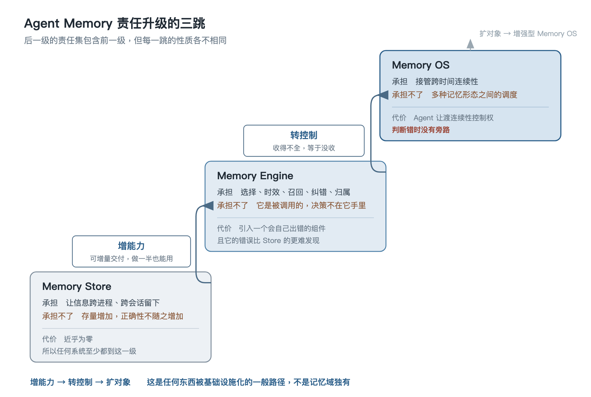
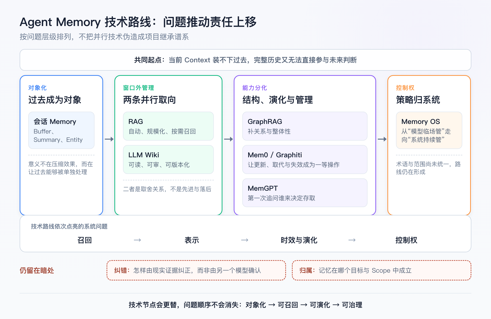
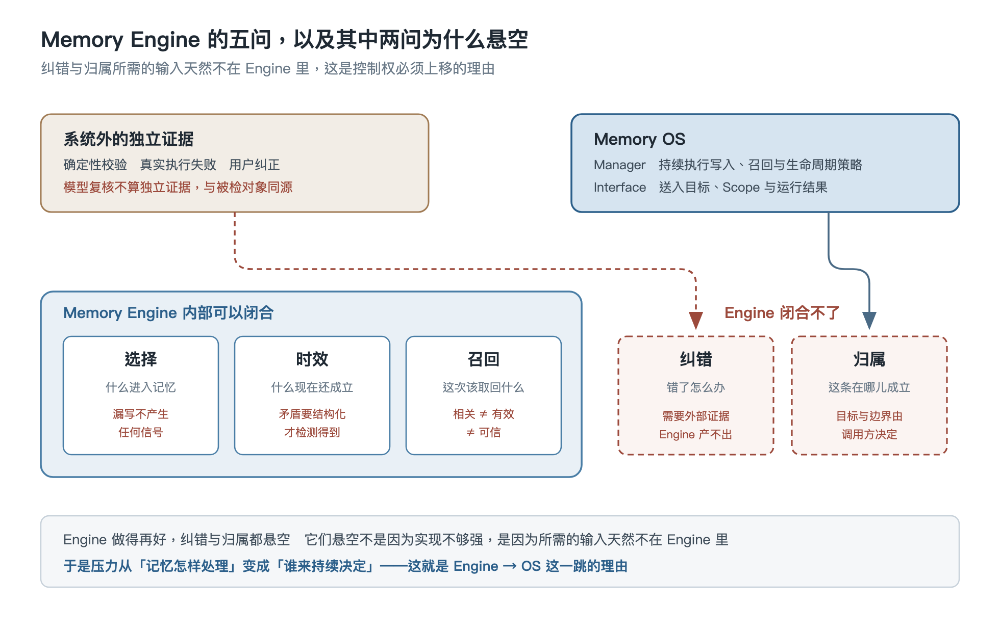

## Agent Memory 认知模型与架构全景

### 一、前言

> 文档状态：内容填充版，总结章待正文定稿后重新提炼
>
> 文档职责：建立 **Agent Memory** 的责任坐标系，使后续功能、设计与实现文档可以直接引用，不必各自重新定义边界
>
> 使用场景：间隔一段时间后恢复整体认知，或面对新概念、新框架时判断它承担了哪份责任、处在哪一级
>
> 内容边界：
>
> - 不介绍安装与接口，不展开抽取、分块、向量化、建图、重排与 **Prompt** 实现
> - 不用单一案例贯穿全文，技术只作例证，不作能力目录
> - 不对具体框架的实现行为下断言，只指认它占据的位置
>
> 事实基线：本文以截至 2026-08 可访问的论文、评测与官方项目说明为依据，并结合个人既有认知整理

本文包含三种性质不同的信息：

| 类型 | 含义 |
|---|---|
| 研究与项目事实 | 论文、评测与官方说明中明确提出的问题与结论 |
| 认知模型 | 为建立稳定边界而提炼的分析框架，不是行业统一术语 |
| 工程判断 | 基于问题结构推出的责任划分，应在实践中继续验证 |

全文沿一条主干展开，主干只有三个词：

```text
Memory Store → Memory Engine → Memory OS
```



==三跳不是产品成熟度，而是责任偏序：后一级的责任集包含前一级，且每一跳的性质各不相同==

### 二、问题起点：为什么 **Context** 与完整历史都不够

#### 2.1、一次判断只能使用当前 **Context**

**LLM** 生成下一步判断时能直接使用的，只有当前 **Context**

模型参数里有训练阶段形成的通用能力，但当前用户是谁、任务进行到哪一步、项目规则刚刚怎样变化、上次为什么失败，都必须由运行时重新提供

一个 **Agent** 的基本运行链可以压缩为：

```text
目标与当前 Context
  -> LLM 产生判断
  -> Runtime 路由 Tool
  -> Tool 观察或改变外部环境
  -> Observation 返回
  -> Runtime 更新状态并构造下一轮 Context
```

这条链能在一次运行里连续推进，却跨不过三个边界：

- **Context** 有容量、成本与注意力上限
- **Session** 能保存历史，但历史只会越来越长
- **Process** 只是一次运行的物理载体，退出即消失

需要注意的是，这三个边界的性质不同：**Process** 的边界是硬的，进程结束状态就没了；**Context** 与 **Session** 的边界是软的，它们不会突然失效，而是随着长度增加持续劣化。软边界更危险，因为系统不会报错，只会慢慢变笨

**CoALA** 把语言 **Agent** 描述为模块化记忆、内外行动空间与决策过程的组合，这说明 **Memory** 是与判断、行动并列的系统责任，不是模型参数的别名

来源：[Cognitive Architectures for Language Agents](https://arxiv.org/abs/2309.02427)

#### 2.2、更大的 **Context** 解决不了这个问题

最自然的反驳是：既然瓶颈是窗口，那窗口变大不就行了

这个反驳必须被正面回答，否则整篇文章的前提不成立

窗口增大确实缓解了容量问题，但记忆要处理的从来不止容量：

| 问题 | 窗口增大之后 |
|---|---|
| 装不下 | 缓解 |
| 成本与延迟 | 不缓解，长上下文的代价随长度增长 |
| 注意力稀释 | 不缓解，相关内容在大量无关内容中更难被用上 |
| 事实冲突 | **恶化** |
| 跨 **Process** 存续 | 完全不解决，窗口再大也随进程消失 |

冲突那一行是关键。假设项目规则在三个月里改过两次，完整历史里同时存在三个版本的规则

窗口小的时候，你被迫做选择，选错了至少是一个明确的错误；窗口大的时候，三个版本一起进入 **Context**，系统看起来"什么都没丢"，模型则在三条互斥的陈述之间即兴挑一条，或者调和出一个哪个版本都不是的折中

==把互相矛盾的历史一起放进更大的窗口，不是解决了冲突，是把冲突交给模型即兴调和，而且不留下任何冲突发生过的痕迹==

所以"更大的窗口"改变的是这些问题什么时候暴露，不是它们存不存在

#### 2.3、完整历史只解决"没有丢"

另一个方向的朴素做法是：全都存下来，需要时再查

聊天记录、工具日志与任务轨迹确实能证明过去发生了什么。它们不回答的是：

- 哪些内容值得在未来继续使用
- 哪些只是当时的临时状态
- 新信息出现后，旧结论是否仍然成立
- 当前目标应该取回哪一部分

**MemGPT** 正是从有限 **Context** 出发，用分层记忆之间的数据移动提供超出窗口容量的可用上下文——它借来的 OS 类比首先处理的是有限资源下的跨时间连续性

来源：[MemGPT: Towards LLMs as Operating Systems](https://arxiv.org/abs/2310.08560)

存下来之后怎么用，朴素做法有三种，它们失败在不同地方：

| 用法 | 失败方式 |
|---|---|
| 全量重放 | 噪声与冲突一起进来，就是 2.2 那条 |
| 摘要压缩 | 损失不可逆，而且发生在最没有信息的时刻——压缩时还不知道未来会问什么 |
| 全文检索 | 只能按字面找，且找回来的内容不带"它现在还成不成立"的信息 |

三者的共同点比各自的差异更重要：

==三种朴素用法都没有"这条还成不成立"这个概念——它们处理的是内容，不是内容的状态==

两条朴素路线的失败方式，正好互为镜像：

```text
全部塞进 Context
  -> 留存问题换成噪声问题

全部写进数据库
  -> 得到可恢复的数据，没得到可用的认知
```

#### 2.4、**Agent Memory** 的工程定义

本文采用：

> **Agent Memory** 是把过去的经历与证据转化为可维护记忆，并在未来目标下重新激活以支持判断与行动的系统能力

这个定义里"可维护"和"重新激活"是承重的：只满足前半句的是归档，只满足后半句的是检索

换一个更尖锐的说法，这件事的全部难度都从这里长出来：

==**Memory** 的本质不是保存过去，是对过去做出承诺——写入是在断言"这条以后还成立"，召回是在断言"这条现在仍成立且与当前相关"==

两个断言都可能错。更麻烦的是它们的错误不对称：写入时的错误断言会被后续召回反复兑现，而每一次兑现又会产生新的记录，让这条错误看起来更像是被验证过的

两个断言都可能错，那么问题就变成了：怎样才能让它们尽量不错

这个问题不能凭空设计出答案。过去五年里已经有很多人一步步试过，撞过的墙都留在原地——先把这条路走一遍，比直接给一个模型更可靠

### 三、技术发展路线：这条路是怎么走过来的

抽象必须从样本里长出来，否则只是空中楼阁

从 2022 年到现在，这条路已经走了足够多的节点，每个节点的形状都一样：**出现一个问题，出现一种技术解决它，更复杂的问题出现，这种技术撑不住，出现新技术**。样本量到了可以抽象的程度，这正是本文选在当前节点建模型的原因

需要先说明的是，这条路不是一条单线。**RAG** 与 **LLM Wiki** 是并行长出来的两种取向，**MemGPT** 与 **RAG** 也没有先后继承关系。所以下面按**问题出现的顺序**讲，不按项目发布时间排谱系——把并行的东西写成先后，是给历史编因果

#### 3.1、从贴进 Prompt 到把历史当成对象

最早根本没有记忆这回事。你要模型知道什么，就把文档、代码、规则粘进提示词，下次再粘一遍

窗口只有几千 token 的年代，这个做法撑不了多久。先撑不住的不是外部知识，是对话本身——聊到第二十轮，前面的内容已经放不下了

于是出现了第一批被称为 memory 的东西：**LangChain**、**LlamaIndex** 一代的 buffer、summary、entity memory。做法很直接，缓冲最近 N 轮、滚动摘要、抽实体维护一张表

从效果上说这一步很粗糙，滚动摘要的损失不可逆，也不解决模型不知道的外部知识。但它的意义不在效果：

==它第一次把"过去"当成一个可以被单独处理的对象，而不是拼在 Prompt 里的一段文本==

对象一旦独立出来，接下来的所有问题才有地方安放

#### 3.2、**RAG**：把知识放到窗口之外

会话压缩解决不了的是量级问题。一个项目的文档、一个组织的资料，比任何窗口都大几个数量级，而且其中绝大部分和这次提问无关

**RAG** 给出的答案是把知识挪到窗口外面：切块、向量化、存进向量库，提问时按相似度召回几块拼进 Prompt。论文由 Lewis 等人在 2020 年提出，2023 年成为工程标配

来源：[Retrieval-Augmented Generation for Knowledge-Intensive NLP Tasks](https://arxiv.org/abs/2005.11401)

这是整条路上最重要的一次范式转变：

==**RAG** 第一次把知识放到了窗口之外，并让"这次取回哪些"成为一个独立的系统问题==

今天所有记忆方案的召回环节，都还在它划出的框架里

它撑不住的地方也很清楚，而且三处性质不同：

- **相似不等于相关**：向量召回的是措辞像的，不是这次真正需要的
- **切块破坏结构**：跨文档、整体性的问题答不了，因为答案不在任何一个块里
- **完全无状态**：它不知道哪一块已经被推翻了

第三条最要命。**RAG** 的世界里没有"过期"这个概念，只有"在不在库里"——语料更新之前，被推翻很久的旧结论会一直被召回，而且措辞越贴题排得越靠前

这三处后来分别催生了三条不同的路：第二条催生了 **GraphRAG**，第三条催生了专门的记忆层，而第一条至今没有被真正解决

#### 3.3、**LLM Wiki**：并行长出来的另一条路

几乎同一时期，另一种取向也在长。它针对的不是 **RAG** 的能力短板，而是它的**性质**——向量库是个黑箱，人看不到里面有什么，也改不动；而且每次提问都要从原始碎片重新拼装一遍理解

Karpathy 把这个模式明确提出来：不把知识交给向量库，而是让 **LLM** 持续维护一份人机共读的 Markdown Wiki。结构是三层——不可变的原始资料、**LLM** 生成并维护的交叉引用页面、记录结构与约定的 Schema；核心操作是 `Ingest`、`Query` 与 `Lint`

来源：[LLM Wiki 原始说明](https://gist.github.com/karpathy/442a6bf555914893e9891c11519de94f)

关键差别在于成果的形态。**RAG** 每次查询都在临时拼装，Wiki 则是一个**持续累积的成品**：交叉引用已经建好，综合结果已经反映了读过的全部内容

它在工程里的落地，就是 `CLAUDE.md`、`.cursorrules`、`AGENTS.md` 这类随仓库版本化的规则文件——可读、可审、可 diff、可回滚

它的短板同样明显：检索靠目录、链接与全文，规模上去之后召回不精；内容演化依赖显式触发，没人管就一直旧着

所以这两条路的关系不是接力：

```text
RAG      自动、规模化、不可读
LLM Wiki 可读、可审、可版本化、靠人与 LLM 共同维护
```

==二者不是先进与落后，是"可控"与"可规模化"的取舍——这也是它们至今并行使用、而不是一方替代另一方的原因==

**LLM Wiki** 还留下一处常被忽略的贡献。它的 `Lint` 操作专门检查矛盾、孤立页面与知识缺口——这意味着它已经意识到，一份持续累积的知识会自己长出不一致

==这是这条路上第一次把"记忆内部的不一致"当成需要专门操作来处理的问题==，也就是后来时效与纠错两问的雏形

#### 3.4、**GraphRAG**：补上关系与整体性

回到 **RAG** 的第二处短板。切块之后，"这个项目整体是怎么组织的"这类问题就答不了了，因为答案不在任何一个块里，而在块与块的关系里

**GraphRAG** 的做法是先从语料抽实体与关系建图，做社区检测形成层级摘要，再用局部搜索与全局搜索取回

来源：[Microsoft GraphRAG 官方说明](https://microsoft.github.io/graphrag/)

==它让检索从"找相似的块"变成"沿关系走"==，补的是表示与召回

但它处理的对象仍然是相对稳定的文档语料：语料变了要重建索引，事实之间没有时间关系

所以路走到这里，三个节点解决的其实是同一件事的不同侧面——**这次该取回什么**。取回来的东西还成不成立、该不该记、归谁所有，一个都还没被正面处理

#### 3.5、**MemGPT**：第一次问"谁来管记忆"

真正换了问题的是 **MemGPT**

它面对的场景不再是"回答一个问题"，而是"持续陪着一个人工作"。这时需要跨会话保持的不只是知识，还有任务进行到哪、用户是什么情况、上次为什么失败

它的做法借了虚拟内存的分页思路：把上下文分成窗口内与窗口外，由模型通过函数调用自己搬运

来源：[MemGPT: Towards LLMs as Operating Systems](https://arxiv.org/abs/2310.08560)

这是第二次范式转变，重要性不在实现，在提问方式：

==**RAG** 问的是"这次取回什么"，**MemGPT** 第一次问"谁来决定取回和存放"——记忆管理从外部管道变成了系统自己的职责==

它给出的答案是"模型自己管"。这个答案后来被证明不够稳——模型临场判断意味着同样的情况可能有不同处理——但**问题被提出来了**，而这个问题就是后来 **OS** 那一跳的源头

#### 3.6、专门的记忆层：补上演化

**RAG** 留下的第三处短板，一直要到 2024 至 2025 年才被正面处理

**Mem0** 从长期交互中抽取显著信息，并判定这条是新增、更新还是删除；**Graphiti** 构建时序 Context Graph，事实带有效时间，新事实到达时旧事实转为失效而不是被删掉

来源：[Mem0](https://arxiv.org/abs/2504.19413)、[Graphiti 官方仓库](https://github.com/getzep/graphiti)

它们真正的共同点，不是都做了图或都用了抽取，而是把更新、取代、失效变成了**一等操作**，而不是重建索引的副产品

这是第三次范式转变：

==记忆不再只是被检索的内容，而是有状态、会演化的对象——"这条现在还成不成立"第一次成为系统内建的语义==

到这一步，取回什么、还成不成立都有了着落。剩下的是：这些操作什么时候发生、按什么策略发生——而这两件事仍然写在系统外面的业务代码和提示词里

#### 3.7、**Memory OS** 提法：想把控制权收上来

2025 到 2026 年，**MemoryOS**、**MemOS** 一类工作开始把记忆当成系统级资源，做统一抽象、分层存储、跨层调度与生命周期控制

来源：[Memory OS of AI Agent](https://arxiv.org/abs/2506.06326)、[MemOS](https://arxiv.org/abs/2507.03724)

它们接的正是 **MemGPT** 留下的那个问题，只是答案从"模型自己管"换成了"系统来管"

这一步目前还没走完：术语没有统一，各家对 OS 的范围划得差异很大，而纠错与归属仍然没有被正面处理

#### 3.8、评测的演进是问题演进的旁证

技术路线容易被宣传口径干扰，评测不会——评测衡量什么，说明领域公认的难点在哪

**LongMemEval** 把长期记忆拆成 indexing、retrieval、reading，并证明检索正确时读取仍可能失败；2026 年的 **LongMemEval-V2** 进一步把考察范围从用户历史扩展到环境经验，包括静态状态、动态状态、工作流知识、环境陷阱与前提意识

来源：[LongMemEval](https://arxiv.org/abs/2410.10813)、[LongMemEval-V2](https://arxiv.org/abs/2605.12493)

==评测的重心从"能不能找回来"移到"找回来能不能用对"，再移到"能不能积累环境经验"——这条移动轨迹和技术路线是同一条==

#### 3.9、这条路点亮了什么，还剩什么是暗的

把整条路按它依次解决的问题排开：

| 节点 | 新解决的问题 | 留给下一步的 |
|---|---|---|
| 贴进 Prompt | — | 窗口装不下 |
| 会话记忆抽象 | 把过去当成对象 | 只压缩对话，不管外部知识 |
| **RAG** | 知识放到窗口外，按需取回 | 相似不等于有效，且完全无状态 |
| **LLM Wiki** | 可读、可审、可版本化的沉淀 | 检索不精，演化靠显式触发 |
| **GraphRAG** | 关系与整体性 | 静态语料，无时间语义 |
| **MemGPT** | 提出"谁来管"这个问题 | 答案是模型临场判断，不稳定 |
| **Mem0** / **Graphiti** | 演化成为一等操作 | 判定信号仍来自模型，策略仍在外部 |
| **MemoryOS** / **MemOS** | 试图收归控制权 | 术语未统一，纠错与归属仍空 |



这条路走下来，依次被点亮的正好是：**召回 → 表示 → 时效与演化 → 控制权**

而始终没有被正面处理的是两件事：

```text
纠错：错了怎么被现实纠正，而不是被另一个模型确认
归属：这条在哪个范围内成立，默认怎样继承
```

这不是巧合，也不是本文事后挑出来的——它是把整条路逐个节点对照之后剩下的空白

==一条走了五年的技术路线，依次点亮了召回、表示、时效与控制，唯独把纠错和归属留在暗处；这两处正是下一段路最可能发生的地方==

但上面这段话里藏着一个还没交代的东西：它一直在说某个节点"点亮了哪一问"、"还剩哪些没处理"，仿佛已经有一把现成的尺子

这把尺子必须先被造出来，否则"点亮"只是一种说法

好在这条路本身已经提示了它的形状。回看每一个节点在做的事，其实都是同一件：**把原本散在别处的一份责任，收进系统里**

- **RAG** 把"这次取回什么"从人工挑选收了进来
- **Mem0** 与 **Graphiti** 把"旧的怎么办"从重建索引收了进来
- **MemGPT** 与 **MemOS** 想把"什么时候做这些"也收进来

各节点的差别，因此不在于用了图还是用了向量，而在于**收进来了多少**。既然差别可以按这个刻度排，那就可以脱离具体技术，先把刻度本身立起来

### 四、主干：责任升级的三跳

#### 4.1、从路到刻度

按"收进来了多少"排，上一章那八个节点自然聚成三堆：

```text
只把「留下来」收进系统
  -> 会话记忆抽象、向量库、文件型 Wiki 的存储部分

把「留下来的还能不能用」也收进系统
  -> RAG 的召回、GraphRAG 的表示、Mem0 与 Graphiti 的演化

把「什么时候做、按什么策略做」也收进系统
  -> MemGPT 提出、MemoryOS 与 MemOS 尝试
```

三堆分别对应三个名字：**Memory Store**、**Memory Engine**、**Memory OS**

需要强调的是，这三个名字是从责任的多少推出来的，不是从发布时间推出来的——上一章已经说过，**RAG** 与 **MemGPT** 是并行长出来的，把它们排成先后是给历史编因果

#### 4.2、三级责任与三次跨越

| | **Memory Store** | **Memory Engine** | **Memory OS** |
|---|---|---|---|
| 承担 | 让信息跨进程、跨会话留下 | 让留下的内容持续可用：选择、时效、召回、纠错、归属 | 接管跨时间连续性：何时形成、召回什么、如何进入 **Context**、反馈如何回流 |
| 承担不了 | 存量增加，正确性不随之增加 | 它是被调用的，决策不在它手里 | 多种记忆形态之间的调度 |
| 跨越压力 | 时间 | 决策散落——策略写在业务代码与 **Prompt** 里，各调用点各自为政 | 控制权 |
| 这一跳的性质 | — | 能力增加 | 控制权转移 |
| 代价 | 近乎为零，所以所有系统至少都到这一级 | 引入一个会自己出错的组件，且它的错误比 Store 的更难发现 | **Agent** 让渡连续性控制权，判断错时没有旁路 |

三级的责任集是包含关系：**Engine** 仍然需要持久化，**OS** 仍然需要 **Engine**

这个包含关系不要求任何人按这个顺序造过东西——**RAG** 与 **MemGPT** 就是并行长出来的。主干描述的是责任偏序，不是历史谱系。混淆这两件事会导致一个常见错误：以为出现得晚的方案一定处在更高一级

判断一个系统跨没跨过某一跳，有可观测的判据，不必看它怎么自称：

| 判据 | 跨过了哪一跳 |
|---|---|
| 关掉进程再启动，它还知道上次的结论 | 到了 Store |
| 同一件事说了两遍相反的，它只召回后一遍 | 到了 Engine |
| 业务代码里没有"什么时候写记忆"这段逻辑 | 到了 OS |

第三条判据最有区分度：**OS** 的标志不是它多了什么，而是**别处少了什么**

#### 4.3、三跳的性质各不相同

把上表第四行单独抽出来：

```text
Store → Engine        增加能力
Engine → OS           转移控制权
OS → 增强型 OS        扩张管理对象
```

第一跳系统多做了事，第二跳系统没多做事、而是把决定权从调用方收了回来，第三跳能力与控制权都不变、变的是管理对象的种类

这个区分不是文字游戏，它有直接的工程后果：**第一跳可以增量做，第二跳不能**

给一个已有系统加上去重、加上失效规则、加上向量索引，是一次次独立的增强，做一半也能用。而把策略从各个调用点收归系统，是一次性的：只要还有一个调用点绕过 **Manager** 直接写记忆，那条路径上的所有保证都不成立

==增能力可以增量交付，转控制不能——控制权收得不全，等于没收==

再抽一层，这条路径本身可以离开记忆域：

==增能力 → 转控制 → 扩对象，是任何东西被基础设施化的一般路径==

数据库、调度器、包管理都走过同一条路：先有人把功能做出来，再有人把调度权收上去，最后管理对象扩张。遇到任何一个新兴基础设施，都可以先问它走到了哪一跳

#### 4.4、**Memory Store** 只解决留存

**Store** 是面向记忆对象的持久化层，最低责任只有写入与按条件读取

它可以建在文件、关系库、向量库或图库上。这一级的选型讨论最多，但恰恰是最不重要的——因为四种载体在"能不能留下"这件事上都合格，差异要到下一级才显形

需要区分两个容易混的东西：

```text
Storage：文件、数据库、向量库、图库等通用持久化设施
Memory Store：以记忆对象为单位的存取层，建在 Storage 之上
```

差别在于有没有"记忆对象"这个概念。日志文件是 **Storage**，不是 **Memory Store**，因为它存的是事件流，没有可以被单独更新、失效和引用的对象

**Store** 通常会顺手提供一批字段：来源、时间、**Scope**、置信度、有效期。这批字段是这一级最大的陷阱：

==字段是写给未来的承诺，而 Store 只负责保存承诺，不负责兑现==

一个记忆表里有 `confidence` 列，不代表这个数被认真算过；有 `expires_at` 列，不代表召回时有人看它。字段的存在只证明设计者想到了这件事，不证明系统做了这件事

如果系统只提供：

```text
save(memory)
get(memoryId)
search(query)
delete(memoryId)
```

它就无法决定什么值得写入、重复怎样合并、新事实是否应使旧事实失效、当前该相信哪一条

==Store 解决"有没有留下"，不解决"留下来的还能不能用"==

##### 4.4.1、载体选择的代价是前置的

这一级最容易被当成纯技术选型：文件、关系库、向量库、图库，反正都能存

在"能不能留下"这件事上它们确实都合格，问题在于：

==Store 的选型在 Store 这一级看不出差别，差别要到 Engine 才显形，而那时已经改不动了==

具体锁死了什么：

| 载体 | 到 Engine 这一级才暴露的约束 |
|---|---|
| 纯文件 | 没有可判定的取代关系，时效只能靠模型每次现场比对 |
| 纯向量 | 相似度是唯一信号，有效与可信无处安放 |
| 关系库 | 结构清晰，但开放语义要靠 Schema 演进跟上 |
| 图库 | 关系与时间表达力最强，建图与实体消歧成本前置 |

这和 5.2 会讲的时间维是同一类问题：**表示层的能力上限在设计期就定死了，后面只能在上限之内做优化**

所以 Store 这一级真正该问的不是"用什么存"，是"我打算在 Engine 那一级做到哪一步，这个载体撑不撑得住"

留存是几乎零代价的，所以任何系统都至少到这一级

而一旦东西留下来了，时间就开始起作用：内容会重复、会互相矛盾、会过期，会多到召不准。这些问题不是 **Store** 做得不好造成的，是**留存本身必然带来的后果**——存得越久越多，它们越严重

接住这些后果的，就是下一级

但在进入 **Engine** 的内部问题之前，还需要先把责任翻译成使用者能感知的能力，否则读者只知道系统"多承担了责任"，不知道这些责任最终表现为什么

#### 4.5、从责任到能力：可用记忆系统至少要表现出什么

前面三跳讲的是责任：系统把什么从外部调用方、业务代码和临场 **Prompt** 里收进来

换到使用者视角，问题会变成另一种问法：一个 **Agent Memory** 系统怎样才算真的"有记忆"

答案不能停在"能存历史、能搜历史"

那只是 **Store** 与召回环节的最低表现，一个可用的记忆系统，至少要表现出六类能力：

| 能力 | 使用者能感知到什么 | 背后的责任 | 缺了会怎样 |
|---|---|---|---|
| 事实召回 | 过去明确说过、做过、观察到的证据，未来还能被找回来 | 召回 | 系统表现为普通健忘 |
| 时间状态判断 | 用户或环境发生变化后，系统知道旧事实是否仍成立 | 时效 | 新旧事实一起进 **Context**，模型现场调和 |
| 记忆治理 | 记忆会被更新、覆盖、合并、失效与撤回，而不是只追加 | 选择、时效、纠错 | 存量越大，噪声、冲突与错误巩固越严重 |
| 个性化沉淀 | 多次交互形成的偏好、约束与工作方式，能沉淀为稳定状态 | 归属 | 系统只能记得孤立片段，不能形成用户或项目画像 |
| 规则与执行 | 记忆能约束后续行动，而不是只在回答时被引用 | **OS** 的 **Manager** 与 **Interface** | 系统"知道"规则，但行动链仍然不受规则约束 |
| 安全边界 | 没有证据时拒答，敏感或越界记忆不会被错误使用 | 归属、纠错、旁路 | 系统会把不该用的记忆带进判断，且错误很难诊断 |

这组能力也解释了为什么"召回做得好"不等于"记忆系统做得好"

事实召回只证明系统能把过去找回来；时间状态判断证明系统知道哪些过去现在仍成立；记忆治理证明系统能维护这批状态；个性化沉淀证明状态能绑定到正确主体；规则与执行证明状态能进入行动链；安全边界证明系统知道哪些状态不能用、不能泄露、不能乱推断

==召回只是入口，真正的 **Agent Memory** 能力是维护动态状态：现在该相信什么、忽略什么、执行什么、拒绝什么==

近来的 **AML** 相关文章把事实召回、时序理解、记忆治理、个性化、规则执行与安全边界放在一起讨论，真正有价值的不是榜单名次，而是这组能力画像正在把"记忆系统到底该会什么"显性化

这组能力清单仍然只是外部表现

要解释它们为什么难、会怎样失败、哪些能力 **Engine** 自己闭合不了，就必须回到内部责任拆解

### 五、**Memory Engine**：五问及其失效方式

第三章末尾说过，判断一个方案要看它承担了哪几问

上一节把这些问题翻译成了外显能力，这一章再反过来拆内部责任：把"让留下的内容持续可用"这件事拆开，就是选择、时效、召回、纠错、归属

它们不是阶梯，是并列责任，所以下面每一问不看"跨越压力"，改看**失效方式**——这一问没做好时，系统具体怎么坏

#### 5.1、选择：什么进入记忆

| | |
|---|---|
| 责任 | 从经历、观察与工具结果中决定什么进入记忆，以什么粒度和形态 |
| 做不到 | 无法终审"值不值得记"——价值是召回时的竞争结果，而竞争对手在写入时还不存在 |
| 失效方式 | 双向不对称：过度写入稀释召回预算，可见；漏写不产生任何信号，表现为普通无知，不可见 |
| 代价 | 每次写入都是一次无人核验的断言，写入越自动，断言越多 |

##### 5.1.1、四种触发方式的取舍

形成由什么触发，是这一问最先要定的事，四种主要路线各有明确取舍：

| 触发方式 | 优势 | 代价 |
|---|---|---|
| 用户显式指令 | 断言最可靠，来源清楚 | 覆盖率极低，只能捕获用户当场想得起来说的 |
| 规则触发 | 可控、可审计、零模型成本 | 只能捕获预先想到的模式 |
| 模型自主判断 | 覆盖率最高 | 断言最多且最不可核，噪声随使用量线性增长 |
| 事后批量抽取 | 能看到完整轨迹，可以据此判断哪些真的被用上了 | 延迟高，且对话已经结束，拿不到向用户追问的机会 |

实践中通常是组合，但组合不会消除取舍，只会让取舍变得不可见——很多系统的记忆噪声，来自模型自主写入这条路径无人限流，而其他三条路径的贡献可以忽略不计

##### 5.1.2、粒度决定失效的最小单位

一条记忆记多大，看起来是个格式问题，实际决定的是别的事

记太细，一个判断需要多条记忆拼起来才成立，召回预算被碎片吃掉，而且缺一条就会得出相反结论；记太粗，一条记忆里混进多个事实，其中任何一个过期，整条都得连坐

==粒度就是失效的最小单位：几个事实写在一条里，就意味着它们从此共享同一个生死==

这条推出一个具体做法：**变化速率不同的信息不应写在同一条记忆里**。项目用什么包管理器、当前迭代的负责人是谁、这个模块为什么当初那样设计——三者的半衰期差着数量级，混成一条的结果是最短的那个决定整条的寿命

##### 5.1.3、原文、摘要与结构化

写入形态有三种，它们的差别在于**丢掉了什么，以及丢掉的东西还能不能找回来**：

```text
保留原文     不丢信息，但召回时仍要现场理解
摘要         压缩后可直接消费，损失不可逆
结构化       可过滤、可比较，但只装得下 Schema 预见到的东西
```

摘要是这三者里最危险的，因为它的损失发生在最没有信息的时刻：

==摘要是在还不知道未来会问什么的时候，提前决定哪些细节以后都不需要了==

一个常见后果是，摘要保留了结论、丢掉了适用条件。半年后这条结论被召回，条件已经不成立，但没人知道它曾经有条件

##### 5.1.4、形成是提案，不是终审

有一种常见的方向性错误：把"什么值得成为记忆"当成形成期的核心职责，然后给形成期列一串判据——是否有复用价值、是否只是临时状态、是否已有更可靠的同类

形成期回答不了这个问题。一条记忆值不值得占据召回时那个位置，取决于那一刻还有哪些候选在竞争，而它们当时尚未产生

==形成是提案，不是终审；它能做的是弱筛选，加上保留可撤回性==

这个结论有直接设计后果：形成期该优化的不是准确率，是**可撤回性**。写入时留下足够的来源、时间和上下文，使得这条记忆日后被判定为噪声时能够被定位和移除。一个写得很准但无法回溯的记忆系统，长期比一个写得较松但可清理的更糟

##### 5.1.5、遗忘拿不到反馈

失效方式那一栏还藏着一个更麻烦的结论

保留一条错记忆，它会进入 **Context**、产生可见的坏输出、可以被追溯到那条记忆；删掉一条对的记忆，**不产生任何错误信号**——**Agent** 只是安静地不知道了，表现为普通无知，归因不到那次删除

==依据观察到的错误来调整保留策略的系统，会系统性地偏向过度保留：遗忘是一项永远拿不到反馈的操作==

这条有明确适用边界：它支配的是反馈驱动的保留策略。靠显式删除、人工审阅或固定 TTL 决定遗忘的系统不受它支配，因为那些决策本来就不依赖效果观测

反过来说，这也解释了为什么记忆系统的"自动优化"几乎总是往多存的方向走——不是设计者偏好保留，是另一个方向上没有梯度

##### 5.1.6、这一问的现有解法

| 路线 | 代表 | 官方定位 |
|---|---|---|
| 人工显式 | 编码助手的项目记忆文件，如 `CLAUDE.md`、`.cursorrules` 这类随仓库版本化的规则文件 | 由人写、人审，进入每次会话的 **Context** |
| 会话压缩 | 早期框架的 buffer / summary / entity memory，如 **LangChain**、**LlamaIndex** 一代的记忆抽象 | 对话历史的压缩与摘要策略 |
| 模型自主 | **MemGPT**：模型通过函数调用自行决定往窗口外存什么、取什么 | 虚拟上下文管理 |
| 抽取巩固 | **Mem0**：从长期交互中抽取显著信息，并判定新增、更新还是删除 | 可扩展的长期记忆层 |

来源：[Mem0](https://arxiv.org/abs/2504.19413)

选择是五问里方案最密集的一问，因为它最早暴露——任何做过多轮对话的系统都撞到过"这轮该带什么进去"

值得注意的是这四条路线的**断言强度是递减的**：人工显式最可靠但覆盖最低，模型自主覆盖最高但产生的未核验断言也最多。多数系统把它们混用，混用的结果是噪声主要由最后一条路径贡献，而它往往是唯一没有限流的

#### 5.2、时效：什么现在还成立

| | |
|---|---|
| 责任 | 区分"当时为真"与"现在为真"，处理新旧事实的取代关系 |
| 做不到 | 只能执行失效规则，判断不了规则本身对不对 |
| 失效方式 | 新旧并存且系统无法判定当前版本，召回时两条同时命中，模型自行调和，产出折中而不是真相 |
| 代价 | 时间必须进入表示层，且至少两条时间轴；不预留时间维的表示，上线后改不动 |

##### 5.2.1、两条时间轴

```text
事实有效时间：这件事在世界上什么时候成立
系统记录时间：系统什么时候知道它、什么时候改了它
```

它们必须分开，因为回答的问题不同。只有一条时间轴时，"三个月前录入的一条关于去年的事实"和"三个月前才开始成立的事实"长得一模一样

更要紧的是下面这个区分：

==只有一个时间字段的记忆系统，分不开"这条错了"与"这条过期了"——更正与失效是两件事==

更正意味着这条从来就不该被相信，它过去参与过的判断都可疑；失效意味着它当时是对的，过去的判断成立，只是从某个时刻起不再适用。把两者压成同一个操作，等于放弃了追查历史错误的能力

这个代价是前置的：表示层一旦定型，补时间维要动 Schema、索引与全部查询。它属于必须在设计期决定、无法事后追加的少数几件事

##### 5.2.2、矛盾要能被检测出来才谈得上失效

失效的触发有三种来源：

```text
新事实到达并与旧事实矛盾   -> 需要系统能检测出"矛盾"
到达预设有效期             -> 只对本来就有期限的事实有效
召回时惰性判断             -> 把成本推迟到最贵的时刻
```

第一种是唯一通用的，但它有个前提常被忽略：

==矛盾只有在表示层足够结构化时才检测得到；两条互斥的自然语言记忆，系统看不出它们互斥，只会把它们一起召回==

"项目用 pnpm"和"项目已迁回 npm"，作为两段文本，它们的语义相似度很高——相似到会被同一个查询一起召回，却低到不足以让系统判定后者取代了前者。只有当"包管理器"成为一个有唯一取值的结构化槽位时，第二条到达才构成一次明确的取代

这解释了时序图谱路线为什么能在记忆领域占住一个生态位：它把实体、关系和时间放进结构本身，因此取代关系是可判定的，而不是需要模型每次现场推断。这是**所处位置带来的结构优势**，与任何一家实现得好不好无关

反过来，纯文本记忆并不是做不好时效，而是它必须在每次召回时用模型重新判断哪条更新——把一个本可以在写入时判定一次的问题，改成每次读取都判定一遍，且每次的判定结果可能不同

##### 5.2.3、失效不等于删除

一条事实过期了，它仍然可能有用：它是"当初为什么那样决定"的解释

如果失效等于删除，系统会陷入一种特别难查的状态——它记得所有当前结论，却无法解释任何一个结论的来历，因为解释所需的前提都已经因为过期被清掉了

==失效与删除必须分开：一条过期的事实仍然是解释过去决策的证据==

工程含义是失效应当是状态迁移而不是物理移除，且默认召回只看有效集，追溯时才打开历史集

##### 5.2.4、这一问的现有解法

| 路线 | 代表 | 官方定位 |
|---|---|---|
| 双时间时序图谱 | **Graphiti**：持续摄入 Episode，抽取实体与事实，事实带有效时间区间，新事实到达时旧事实转为失效而非删除 | Temporal Context Graph Engine |
| 覆盖式演化 | **Mem0**：抽取时直接判定新增、更新还是删除 | 长期记忆的增删改维护 |
| 分层换出 | **MemoryOS**：短期、中期、长期三级存储之间按策略更新与迁移 | 借 OS 分页思路做记忆更新 |
| 无时效概念 | 纯文件型与纯向量型方案 | 能存能查，但没有"取代"这个动作 |

来源：[Graphiti 官方仓库](https://github.com/getzep/graphiti)、[Memory OS of AI Agent](https://arxiv.org/abs/2506.06326)

时效是五问里**拉开差距最大**的一问。选择和召回上大家做法接近，时效上则直接分成"有取代语义"和"没有取代语义"两类系统，而后者无论检索多强，都只能把冲突原样交给模型

这也是前面那条判断的现实注脚：有取代语义的方案，几乎都在表示层做了结构化——因为不结构化就检测不出矛盾

#### 5.3、召回：这次该取回什么

| | |
|---|---|
| 责任 | 在当前目标下，从存量中找出应当影响这次判断的记忆 |
| 做不到 | 检索只解决"相关"，解决不了"有效"与"可信" |
| 失效方式 | 检索完全正确时，读取与组织不当仍会造成明显下降——命中不是终点 |
| 代价 | 召回预算是真正的稀缺资源，每多召回一条就少一条别的 |

**LongMemEval** 把长期记忆拆成 indexing、retrieval 与 reading 三段，并给出了上面那条实证：检索结果完全正确，性能仍可能显著下降

来源：[LongMemEval](https://arxiv.org/abs/2410.10813)

##### 5.3.1、三个信号来自三个地方

| 信号 | 来源 | 检索能不能给 |
|---|---|---|
| 相关 | 语义相似或结构邻接 | 能 |
| 有效 | 时间与取代关系 | 不能 |
| 可信 | 来源与验证状态 | 不能 |

==相关、有效、可信是三个独立信号，检索只覆盖第一个==

把三者混成一个相似度分数，等于用"像不像"回答"对不对"。而且这个错误有个特别不好的性质：语义相似度对一条记忆是不是最新、有没有被验证过完全无感，所以一条被推翻很久的旧结论，只要措辞贴题，排序可以一直很靠前

##### 5.3.2、召回键的问题

用什么去检索，比用什么算法检索更能决定结果

默认做法是拿用户当前这一轮的输入当召回键。这个做法隐含了一个很强的假设：

==用当前一轮输入做召回键，等于假设用户每次都会重述上下文==

而真实对话里，决定该召回什么的信息往往不在这一轮里——它在任务目标里、在前几轮里、在当前进行到哪一步里。用户说"那就先这样吧"的时候，这句话本身不包含任何可供检索的线索

可行的方向是把召回键从"这一轮说了什么"换成"当前任务是什么、进行到哪一步"，代价是这需要一个任务状态的表示，而那已经越过 **Engine** 的边界了——这是第六章要处理的事

##### 5.3.3、召回时机决定一致性

什么时候召回，有三种做法，取舍不在成本上：

| 时机 | 问题 |
|---|---|
| 每轮召回 | 成本高，且同一任务不同轮次看到的过去不一样 |
| 任务开始时召回一次 | 稳定，但中途出现的新需要取不到 |
| 由模型按需触发工具调用 | 灵活，但模型不知道自己不知道什么 |

第一行的问题最隐蔽：

==每轮重新召回，会让同一个任务在不同轮次看到不同的过去；前后判断不一致的根源可能不在模型，在召回层==

一个表现是 **Agent** 在长任务里"改口"——第三轮还在遵守某条约束，第七轮就不遵守了。查模型是查不出原因的，因为那条约束在第七轮根本没被召回

第三行的问题则是元认知的：模型只会去查它意识到自己需要的东西，而记忆最有价值的场景，恰恰是**它不知道自己该问**——用户三个月前提过一次的偏好，模型这次不会想到要去查

##### 5.3.4、召回预算是真正的稀缺资源

稀缺的从来不是磁盘，是召回时那几千个 token 的位置

==一条记忆的价值是竞争性的，不是绝对的——它值不值得留，取决于召回时能不能挤掉别的候选==

这正好解释了 5.1 为什么说形成不能终审：终审所需的信息，在形成期还不存在

还有一个推论：记忆系统的规模效应是负的。存量越大，单条记忆被召回的概率越低，同时它被无关查询误召的绝对次数越高。==记忆系统不会因为记得多而变强，只会因为召得准而变强==

##### 5.3.5、召回结果与当前指令冲突时听谁的

这是个必须有答案、而且没有好答案的问题

记忆说用户偏好 A，用户这次说要 B。听记忆的，用户改不了主意；听当前的，那条记忆是不是该更新、什么时候更新，又成了新问题

==默认听记忆的系统会让用户无法改主意，而且用户往往意识不到自己在和一条三个月前的记录较劲==

比较稳的取向是：**当前指令优先，冲突事件本身作为一次强信号回写**。这条规则简单，但它已经不属于 **Engine**——**Engine** 只负责把两条都交出来，谁优先是策略，策略归 **Manager**

##### 5.3.6、这一问的现有解法

| 路线 | 代表 | 官方定位 |
|---|---|---|
| 向量与关键词检索 | **RAG**：查询向量化后检索外部语料，把结果拼进 **Context** | 检索增强生成 |
| 图结构检索 | **GraphRAG**：先从语料抽实体与关系建图、形成社区摘要，再用局部搜索与全局搜索取回上下文 | 面向跨文档与整体性问题的检索 |
| 混合检索与重排 | **Graphiti** 一类：语义相似、关键词、图遍历并用，再做重排 | 多路召回后融合 |
| 分层调度取回 | **MemGPT**：模型自己判断何时把窗口外内容调进来 | 虚拟上下文管理 |

来源：[Microsoft GraphRAG](https://microsoft.github.io/graphrag/)、[MemGPT](https://arxiv.org/abs/2310.08560)

召回是技术最密集的一问，也因此最容易被误当成记忆的全部——一个系统把混合检索和重排做得很好，仍然可能完全没有选择、时效与纠错

**LongMemEval** 的价值正在于此：它把 reading 从 retrieval 里单独拆出来，证明了"检索对了"和"用对了"是两件可以分别失败的事

#### 5.4、纠错：错了怎么办

| | |
|---|---|
| 责任 | 让错误的记忆有机会被发现并撤回 |
| 做不到 | 不能靠自身生成过程发现自身错误——写入者、巩固者、消费者同源 |
| 失效方式 | 反馈放大：错误记忆被召回、影响判断、结果写回、继续强化 |
| 代价 | 必须引入记忆系统之外的独立证据 |

##### 5.4.1、反馈放大

```text
错误、过时或低价值内容
  -> 写入 Memory
  -> 未来检索命中
  -> 进入 Context
  -> 产生偏离的判断或行动
  -> 结果再次写回 Memory
```

**Agent Memory** 在这里的处境比技能沉淀更糟，因为三个环节同源：内容由 **LLM** 抽取、由 **LLM** 判定该合并还是该失效、再由 **LLM** 消费。让另一个模型来评审，只是把自我确认扩展到模型之间

需要注意的是，放大不只发生在内容上，也发生在**置信度**上。一条记忆每被召回一次、每参与一次没有出错的判断，就更像是被验证过的。而"没有出错"往往只是没人检查

##### 5.4.2、独立证据的强度不同

独立证据可以按强度排：

| 证据 | 强度 | 说明 |
|---|---|---|
| 确定性校验 | 最强 | 编译、测试、Schema 校验，不依赖任何模型判断 |
| 真实执行失败 | 强 | 现实直接否定，但需要能归因 |
| 用户纠正 | 强 | 权威，但覆盖率低且滞后 |
| 结构性矛盾检测 | 中 | 只在表示层结构化时可得 |
| 模型复核 | **不是独立证据** | 与被检对象同源 |

最后一行是这张表存在的理由。用一个更强的模型复核，换来的是另一套偏好，不是外部真值

==记忆系统的上限，取决于它能引入多少独立于自身生成过程的证据==

##### 5.4.3、真正的瓶颈是归因

即使观察到了失败，还有一步几乎总是缺的：这次失败该算到哪一条记忆头上

一次任务失败时，**Context** 里通常有十几条召回记忆、若干工具结果和用户的原始指令。把失败关联到其中某一条，需要的信息在失败发生时往往已经不可得

==纠错的瓶颈不是"发现错了"，是"知道错在哪一条"；没有归因，反馈只能整体降权，不能定点修正==

整体降权的后果是双向伤害：对的记忆和错的记忆一起被削弱，系统表现为"越用越钝"

这也给出了一个具体设计要求：**召回记录必须与本次运行的结果关联保存**。哪几条进了这次 **Context**、这次结果如何——这份关联是日后一切定点纠错的前提，而它只能在运行时顺手记下，事后无法重建

##### 5.4.4、巩固让撤回变难

合并、摘要、构建高层结论，通常被当作纯收益：减少冗余、提高召回效率

代价在撤回时才出现。一条记忆被推翻时，由它派生出来的摘要、合并结果、图上新增的边不会自动跟着失效——派生链越长，一次撤回要追的下游越多，而多数系统根本没记派生关系

==巩固提高了召回效率，同时把撤回变难了：派生内容不会因为源被推翻而自动失效==

所以巩固的适用条件是**源已经足够稳定**。对刚写入、尚未经过任何验证的内容做激进合并，是在给还没验过的东西建下游依赖

##### 5.4.5、这一问的现有解法

这是五问里**现有方案覆盖最薄**的一问，所以这张表要反过来读：

| 接近纠错的能力 | 代表 | 它实际解决了什么 | 它没解决什么 |
|---|---|---|---|
| 事实取代 | **Graphiti** 的失效机制 | 新事实到达时旧事实退场 | 新事实本身对不对，仍由模型判定 |
| 增删改判定 | **Mem0** 的 update / delete 决策 | 冗余与显式变更 | 判定信号仍来自模型 |
| 模型复核 | 各类 reviewer / critic 设计 | 表达一致性、去重 | 与被检对象同源，不是外部真值 |

三行的共同点是：==它们处理的都是"记忆之间的不一致"，不是"记忆与现实的不一致"==

真正的独立证据基本都来自记忆系统之外——测试与 CI 的失败、命令执行报错、用户当场纠正。而把这些信号接回记忆、并归因到具体某条，目前几乎没有被当成一等能力来做

==这是当前 **Agent Memory** 最大的结构性空缺：几乎所有方案都在优化"记得准不准"，很少有方案在做"记错了怎么被现实纠正"==

对建认知模型的人来说，这个空缺比任何一家的能力清单都值得记住——它标出的是这个领域下一步必然要去的方向

#### 5.5、归属：这条在哪儿成立

| | |
|---|---|
| 责任 | 一条记忆在什么范围内成立：哪个用户、**Agent**、项目、任务 |
| 做不到 | 字段存在不等于字段被执行 |
| 失效方式 | 越界召回，且这类错误表现为"看起来合理的建议"，比事实错误更难识别 |
| 代价 | **Scope** 必须同时进入表示层与召回链，两处都改；划粗会串，划细会漏 |

##### 5.5.1、越界召回为什么特别难发现

事实错误会撞上现实：说错了包管理器，命令就跑不通

越界召回不会。A 项目的编码约定进入 B 项目的判断，产出的代码能编译、能跑、风格自洽，只是遵守了一条 B 项目从来没同意过的规则。它不表现为错误，表现为**没人要求过的固执**

==越界召回的产物看起来完全合理，只是悄悄换掉了前提==

这也是为什么归属不能等到"以后做权限时一起做"：它的失败模式不产生报错，因此不会自己浮出来

##### 5.5.2、默认值比表达能力更重要

**Scope** 有多个维度，而且它们会打架：用户、项目、任务、时间段、可见性。同一条约束在项目级成立，在任务级就不该召回

绝大多数系统在**表达** **Scope** 上没有困难，困难在**默认**上：一条新记忆默认属于哪一级？子任务默认能不能看到父任务的记忆？

默认继承会串，默认不继承会漏。而这两种错误的可发现性又是不对称的——漏了会被用户当场发现（"我不是跟你说过吗"），串了不会

==**Scope** 的默认值比 **Scope** 的表达能力更重要：绝大多数越界召回来自默认继承，不是来自表达不了==

##### 5.5.3、提升需要跨 **Scope** 的重复证据

反过来的问题是：一条在项目 A 学到的规律，什么时候可以升级成通用规律

单次成功不构成依据。在一个项目里有效的做法，可能只是这个项目的特殊条件

==记忆的提升需要跨 **Scope** 的重复证据；把一次成功直接泛化成通用规则，是记忆系统产生系统性偏见的主要途径==

保守做法是提升必须显式，且保留被提升前的原始 **Scope**，以便日后发现泛化过头时能退回去

##### 5.5.4、归属先是本体问题

**Scope** 还决定另外三件事，它们经常被误当成权限配置：

```text
这条记忆能不能被审查
这条记忆能不能被撤回
这条记忆能不能被带走
```

一个用户无权查看和删除自己记忆的系统，与一个可以的，不是同一种东西的两个部署档次——前者的用户没有办法纠正系统对自己的错误认知

==归属先是本体问题，然后才是权限问题；**RBAC** 与多租户属于后者，可以晚做，前者不能==

而不管上面这些设计得多好，都还有一层：

==记忆里的 **Scope** 只是声明，召回链执行它才是边界==

##### 5.5.5、这一问的现有解法

| 路线 | 代表 | 提供的边界 |
|---|---|---|
| 图分区 | **Graphiti** 的 `group_id` | 数据分区，不等于身份与权限模型 |
| 用户与会话模型 | **Zep** 一类托管平台 | 用户、会话、线程的显式归属 |
| 可寻址记忆单元 | **MemOS** 提出的 **MemCube** 抽象 | 让记忆成为可标识、可迁移、可调度的单元 |
| 目录隔离 | 文件型方案 | 靠路径隐式划分，简单但无法表达交叉 **Scope** |

来源：[MemOS](https://arxiv.org/abs/2507.03724)

分区手段是普遍存在的，缺的不是表达能力

缺的是**默认规则**：新记忆默认属于哪一级、子任务默认能不能看父任务的记忆、跨项目的通用规律怎样被提升——这几件事在多数方案的说明里根本不出现，因为它们不是功能，是策略，而策略属于下一层

#### 5.6、五问自己的边界

五问是本文提炼的分析框架，不是行业定论，所以要说清它可能漏了什么

当前能看到的一个洞是**跨主体的记忆传播**：**Agent** A 学到的一条结论交给 **Agent** B 时，B 应该以什么置信度接收

这不是归属问题——归属回答"这条在哪个范围内成立"，而这里的问题是"从别处来的结论，凭什么信"。它也不是纠错问题，因为传过来的时候还没有出错

随着多 **Agent** 协作变多，这一问可能需要单独立项。它的形状已经能大致看出来：==记忆一旦跨主体传递，来源链就从"哪次经历"变成了"哪个 **Agent** 的判断"，而后者的可信度评估目前没有现成办法==

之所以在这里写出来，不是为了补全，是因为：

==说不出自己边界的认知模型，没有办法判断什么时候该被扩展——它只会在遇到装不下的东西时被整个丢掉==

这也是本文用五问而不用某个框架的能力清单做主干的原因：清单没法长出第六项，问题可以

#### 5.7、五问中有两问 **Engine** 闭合不了

五问讲完，回头看会发现它们并不同质——有三问 **Engine** 关起门来就能做完，另外两问不行



按"能不能在 **Engine** 内部完成"重新分组：

```text
选择、时效、召回
  -> Engine 内部可以闭合

纠错
  -> 需要外部独立证据，Engine 自己产不出

归属
  -> 需要调用方传入目标与边界，Engine 自己不知道
```

前面几节其实已经四次撞到同一堵墙：召回键需要任务状态（5.3.2）、冲突优先级是策略（5.3.5）、归因需要运行结果关联（5.4.3）、**Scope** 默认值由调用方决定（5.5.2）

这四处的共同点是，所需的信息都在 **Engine** 之外，而且都掌握在调用方手里

==**Engine** 做得再好，纠错与归属都悬空；它们悬空不是因为实现不够强，是因为所需的输入天然不在 **Engine** 里==

于是压力从"记忆怎样处理"变成了"谁来持续决定"

### 六、**Memory OS**：控制权的转移与代价

#### 6.1、决策散落是什么样

**Engine** 是被调用的。在它之上，总有人要回答：

- 什么时候写入，按什么阈值
- 这次召回多少条，进 **Context** 的哪一段
- 召回结果与当前指令冲突时听谁的
- 行动失败后要不要回写，回写到哪一条
- 子任务能不能看到父任务的记忆

散落状态下，这五个答案分别在：写入阈值在某个业务函数里、召回条数在另一处的常量里、冲突规则写在系统提示词里、失败回写压根没实现、**Scope** 继承由每个调用点各写各的

系统拥有 **Engine**，却没有稳定的记忆运行边界——每个调用点都在各自定义什么算记忆

最直接的可观测后果是：

==策略散落时，没有人能回答"它现在记得什么、为什么记得"——这个问题的答案分布在若干函数和几段提示词里，只能靠读代码重建==

==有 Engine 不等于有记忆系统：策略散落时，记忆的行为由最后一个改提示词的人决定==

#### 6.2、最小 **Memory OS** 的组成

```text
Memory OS
= Memory Engine
+ Memory Manager
+ Agent Memory Interface
```

| 组成 | 核心责任 | 缺了它会退化成什么 |
|---|---|---|
| **Memory Engine** | 形成、表示、维护、检索与重构 | 一个带字段的数据库 |
| **Memory Manager** | 持续执行写入、更新、召回与生命周期策略 | 一个被随意调用的记忆组件 |
| **Agent Memory Interface** | 接收目标、**Scope** 与反馈，把可用记忆交付给 **Context** 构建链 | 一个与 **Agent** 运行无关的知识服务 |

**Manager** 承接的正好是 5.7 里那两问悬空的部分，**Interface** 承接的是把目标、**Scope** 和运行结果送进来的通道——没有这条通道，**Manager** 也无从执行策略

这一跳没有增加任何新能力，**Engine** 能做的事一件没多。变的只有一件：策略从调用方收归系统

#### 6.3、**Manager** 要做的四类决策

上一节把 **Manager** 说成"执行策略"，太笼统。它实际要定的是四件事，每一件都是真取舍

##### 6.3.1、写入时机

| 时机 | 能看到什么 | 代价 |
|---|---|---|
| 实时，边聊边写 | 只看得到过程，看不到结果 | 写入的是猜测，且占用交互延迟 |
| 回合结束 | 本回合结论 | 跨回合才成立的结论仍然抓不到 |
| 任务结束 | 完整轨迹，能判断哪些真的被用上 | 会话已结束，拿不到向用户追问的机会 |
| 异步批处理 | 最完整，可跨任务比对 | 记忆有可见的生效延迟，用户刚说的下一轮还不算数 |

==写入时机决定了写入时能看到多少：写得越早信息越不完整，写得越晚越拿不到追问的机会——这两头都不可兼得==

多数系统选任务结束，但要注意它有个隐藏假设：任务有明确终点。对长期陪伴型或持续运行的 **Agent**，"任务结束"这个时刻并不存在，退化成异步批处理是必然的

##### 6.3.2、召回预算分配

给记忆留多少 token，是固定配额还是按任务浮动

这件事看着是调参，实际决定的是记忆有没有稳定的话语权：

==记忆预算必须显式；不显式时，记忆会和工具输出、对话历史一起争抢剩余空间，而争抢的胜负由拼接顺序决定，不由重要性决定==

一个常见症状是：任务前期记忆生效良好，进行到中后期工具输出堆积后，记忆悄悄被挤出去了，而没有任何地方报告过这件事

##### 6.3.3、冲突优先级

召回结果与当前指令冲突时听谁的——5.3.5 已经给出取向：当前指令优先，冲突本身作为强信号回写

这里补的是它为什么必须由 **Manager** 定而不能由模型临场定：临场判断意味着同一种冲突在不同轮次可能有不同结果，而用户感知到的是"它有时听我的，有时不听"

==凡是会被用户感知为"性格"的行为，都必须是策略，不能是临场判断==

##### 6.3.4、反馈回流

行动结果要不要回写、回写到哪一条，5.4.3 已经说过归因是瓶颈。**Manager** 这一层还要面对一个采样问题：

==成功不产生报告，失败才产生报告——反馈信号天然偏负，只靠反馈调整的记忆系统会持续低估自己做对的部分==

这和 5.1.5 的遗忘不可归因是同一类问题的第二次出现：==记忆系统的两个主要反馈通道，一个只有负样本，一个连样本都没有==

工程上的应对不是找更多信号，而是承认信号稀疏，把自动调整的幅度压小，把定期人工审阅当成一等流程

#### 6.4、**Interface** 的两种形态

**Interface** 通常被当成接口形式问题（用 **Tool** 还是用 **SDK**），实际上它有两种性质完全不同的形态：

```text
拉取式：记忆是一个 Tool，模型自己决定何时查
注入式：Runtime 在构造 Context 时自动放进去
```

| | 拉取式 | 注入式 |
|---|---|---|
| 预算 | 按需占用，省 | 固定占用，无论用不用 |
| 可解释 | 有显式调用记录 | 记忆来源对模型不可见 |
| 模型能否拒绝 | 能，不查就不受影响 | 不能，错误记忆一定参与判断 |
| 主要失败 | **漏召** | **误召** |

拉取式的失败方式在 5.3.3 已经出现过：模型只会查它意识到自己需要的东西，而记忆最有价值的场景恰恰是它不知道该问——用户三个月前提过一次的偏好，模型这次不会想到去查

注入式的失败方式相反：它保证了覆盖，代价是模型没有拒绝权，一条越界或过期的记忆一旦被注入，就必然参与这次判断

==两种形态的失败方式互补——拉取式漏召，注入式误召；所以它们不是二选一，而是需要按记忆类型分工==

一个可用的分法是：**稳定且必须生效的用注入，情境性且量大的用拉取**。项目约束、用户长期偏好属于前者，历史任务细节属于后者

#### 6.5、接管是连续的，不是开关

前面把 **OS** 写得像一个门槛，容易造成误解。实际上接管是有梯度的，而且每一档都可以单独选择：

| 接管项 | 不接管时 | 接管后失去的旁路 |
|---|---|---|
| 何时写入 | 各调用点自行决定 | 业务无法为特殊场景临时加记忆 |
| 召回什么 | 调用方传检索词 | 调用方不能指定"这次只看这几条" |
| 进不进 **Context** | 调用方自己拼 | **Agent** 无法拒绝某条记忆 |
| 冲突听谁的 | 各处提示词各写 | 用户的当场指令可能被策略压过 |
| 何时遗忘 | 人工清理 | 人可能找不回被自动清掉的东西 |

==每多接管一项决策，系统就多一分一致性，同时少一条旁路；接管程度不该一次拉满，而应当按"这项决策错了以后能不能被人发现"来决定==

按这个标准，"何时写入"和"召回什么"可以早接管，因为错了容易看出来；"何时遗忘"应当最晚接管，因为它的错误按 5.1.5 根本不产生信号

#### 6.6、接管的代价：**Agent** 失去旁路

控制权转移是有价格的，而这个价格在讨论中经常被漏掉：

==接管越彻底，**Agent** 越没有绕过记忆系统直接查看原始证据的通道；一旦系统认定某条事实有效，这次运行里就没有第二条路==

这把 5.4 的独立证据问题从"治理最佳实践"提升成了 **OS** 层的必答题。两个方向必须至少有一个不闭合：

```text
运行时不闭合
  -> Agent 能取回原始证据，绕过记忆系统的结论

治理上不闭合
  -> 纠错信号来自记忆系统之外
```

==记忆系统不能闭合：两处都闭合时，接管程度越高，错误越不可发现==

旁路有三档，成本递增：

| 旁路 | 代价 |
|---|---|
| 本次召回了哪些，可见 | 几乎为零 |
| 能从记忆追回原始证据 | 需要保留来源链路 |
| 能临时禁用记忆重跑 | 需要记忆与运行解耦 |

第一档是底线，而且便宜到没有不做的理由：

==最低限度的旁路是"这次召回了哪些"可见；连这个都没有时，记忆错误表现为模型无缘无故的固执，无法诊断==

第二档不要求系统自己保存原始 Episode——证据可以留在业务系统或对话系统里——但记忆必须保留取回它的路径

#### 6.7、**OS** 自身怎么失败

收权解决了散落，但它把错误的性质也换掉了

散落时，一个调用点的策略写错，只影响经过它的那条路径；收归 **Manager** 之后，一条策略写错，全系统一致地错

==转控制把局部错误换成了全局一致的错误——收权的收益和风险是同一件事，一致性本身既是目的也是放大器==

这条推出两个具体要求：

- **策略必须可观察**：当前生效的写入阈值、召回预算、冲突规则应当能被读出来，而不是只存在于代码里
- **策略变更必须可回滚**：**Manager** 的一次配置调整，影响面等同于一次全量数据变更

还有一种更隐蔽的失败：**Manager** 工作正常，但它执行的策略是在旧的数据分布上调出来的。记忆存量增长一个数量级之后，原来合适的召回条数与阈值可能全部失效，而系统不会报错，只会缓慢变钝——这正是 2.1 说过的软边界，在 **OS** 这一层再次出现

#### 6.8、最小 **OS**、增强型 **OS** 与 **Memory Platform**

不同研究对 **Memory OS** 的范围并不一致

2025 年的 **MemoryOS** 采用短、中、长三级个人记忆存储，通过 **Storage**、**Updating**、**Retrieval** 与 **Generation** 形成分层更新系统

来源：[Memory OS of AI Agent](https://arxiv.org/abs/2506.06326)

**MemOS** 则把记忆提升为一等系统资源，强调纯文本、激活与参数记忆的统一表示、调度与演化

来源：[MemOS: A Memory OS for AI System](https://arxiv.org/abs/2507.03724)

**Memory OS** 因此仍处在概念形成期，不能把任一项目的定义当成行业边界。本文作三层区分，避免把未来复杂度变成当前门槛：

| 层级 | 核心组成 | 不是必要条件 |
|---|---|---|
| 最小 **Memory OS** | Engine、Manager、Interface、运行反馈闭环 | 不要求同时支持所有记忆形态 |
| 增强型 **Memory OS** | 异构记忆统一抽象、跨层调度、预取、提升、淘汰、迁移 | 不要求企业平台设施 |
| **Memory Platform** | 用户、权限、多租户、Dashboard、托管部署与 **SLA** | 不决定底层是否构成 Memory OS |

**MCP**、**REST API** 与 **SDK** 是可能的接入协议。它们只有在承载稳定 **Agent Memory Interface**、且背后存在 **Manager** 与生命周期闭环时，才参与构成 **Memory OS**

==Store 负责留存，Engine 负责闭环，OS 负责接管==

#### 6.9、关键技术速览

前面各节按责任分散引用了若干方案，这里集中给一句话定位。**只用于建立最小认知**，详细归属看第五章各节：

| 方案 | 一句话定位 | 主要落在 |
|---|---|---|
| **CoALA** | 语言 **Agent** 的认知架构框架：模块化记忆、内外行动空间与决策过程 | 概念框架 |
| **MemGPT** | 虚拟上下文管理，模型自行在窗口内外搬运数据，OS 类比来自分页 | Engine，偏调度 |
| **RAG** | 检索外部语料并拼入 **Context** | Engine 的召回环节 |
| **GraphRAG** | 抽实体关系建图并形成社区摘要，支持局部与全局搜索 | Engine 的表示与召回 |
| **Mem0** | 从长期交互中抽取显著信息，并判定新增、更新或删除 | Memory Engine |
| **Graphiti** | Temporal Context Graph Engine，事实带有效时间，支持取代与混合检索 | Memory Engine |
| **Zep** | 在图谱引擎之上提供用户、会话与上下文组装的托管平台 | Platform |
| **MemoryOS** | 短中长三级存储加更新、检索、生成模块的分层记忆系统 | 声称 OS |
| **MemOS** | 把记忆作为一等资源统一抽象与调度，提出 **MemCube** | 声称 OS，偏增强型 |
| **LongMemEval** | 长期记忆评测，把能力拆成 indexing、retrieval、reading | 评测 |
| **MCP** | 让能力被统一发现和调用的接入协议 | Interface 的可能载体 |
| 向量库与图库 | **pgvector**、**Qdrant**、**Neo4j**、**FalkorDB** 等 | Storage |

这张表会过期，第五章那些按责任展开的判断不会——所以它放在这里，不放在开头

#### 6.10、定位演示

下面用三个占据不同生态位的方案走一遍模型。这是**方法演示**，不是能力评测——判断依据是它们公开声明自己解决什么问题，不涉及实现核验，快照时间 2026-07

| | **RAG / GraphRAG** | **Graphiti** | **MemOS** |
|---|---|---|---|
| 生态位 | 让外部内容进入本次 **Context** | 让事实的变化与来源可被表达和查询 | 让记忆成为可调度的系统资源 |
| 选择 | 不承担，语料由外部给定 | 承担 | 承担 |
| 时效 | 不承担 | 核心能力 | 承担 |
| 召回 | 核心能力 | 承担 | 承担 |
| 纠错 | 不承担 | 部分：可表达取代，独立证据仍需外部提供 | 部分 |
| 归属 | 不承担 | 提供分区手段 | 提供可寻址单元 |
| 落在哪一级 | Engine 的一个环节 | Memory Engine | 声称 OS，偏增强型 |

三行结论：

- 只覆盖召回的方案，无论检索多先进，都停在 **Engine** 的一个环节上——**GraphRAG** 比 **RAG** 强的是表示与检索，不是多承担了一问
- 覆盖了选择、时效、召回的方案是完整 **Engine**，但纠错与归属仍悬空，需要外部补
- 自称 **OS** 的系统之间范围差异很大，判断它们不能靠名字，要看有没有 **Manager** 与运行反馈闭环

==定位一个方案，问的不是它叫什么，是它承担了五问中的哪几问、悬空了哪几问==

这套判断对夸大的说明书是免疫的。一个方案怎样描述自己，改变不了它能不能检测矛盾、有没有独立证据来源、**Scope** 由谁决定——这些是它所处位置的结构性约束，不是宣传口径能移动的

技术会变，上面这张表一年后大概率要重写；但表头那五列不会变，这才是这张表存在的理由

### 七、总结（待补）

> 本章在正文定稿并修订后再写。它应当从最终正文中重新提炼可迁移判断，并标注每条判断在前文的出现位置；现在写会收束到中间版本的结论上

### 八、参考资料

- [Retrieval-Augmented Generation for Knowledge-Intensive NLP Tasks](https://arxiv.org/abs/2005.11401)
- [LLM Wiki 原始说明](https://gist.github.com/karpathy/442a6bf555914893e9891c11519de94f)
- [Cognitive Architectures for Language Agents](https://arxiv.org/abs/2309.02427)
- [MemGPT: Towards LLMs as Operating Systems](https://arxiv.org/abs/2310.08560)
- [LongMemEval: Benchmarking Chat Assistants on Long-Term Interactive Memory](https://arxiv.org/abs/2410.10813)
- [Mem0: Building Production-Ready AI Agents with Scalable Long-Term Memory](https://arxiv.org/abs/2504.19413)
- [Memory OS of AI Agent](https://arxiv.org/abs/2506.06326)
- [MemOS: A Memory OS for AI System](https://arxiv.org/abs/2507.03724)
- [Memory in the Age of AI Agents](https://arxiv.org/abs/2512.13564)
- [LongMemEval-V2: Evaluating Long-Term Agent Memory Toward Experienced Colleagues](https://arxiv.org/abs/2605.12493)
- [为什么 Agent Memory需要 AML：看 AML “变量控制”的工程设计](https://mp.weixin.qq.com/s/NR7ULXjaEGyinDFyknNe1Q)
- [Agent Memory Leaderboard 官方入口](https://agentmemoryleaderboard.ai/)
- [Microsoft GraphRAG 官方说明](https://microsoft.github.io/graphrag/)
- [Graphiti 与 Zep 的边界说明](https://help.getzep.com/graphiti/getting-started/overview)
