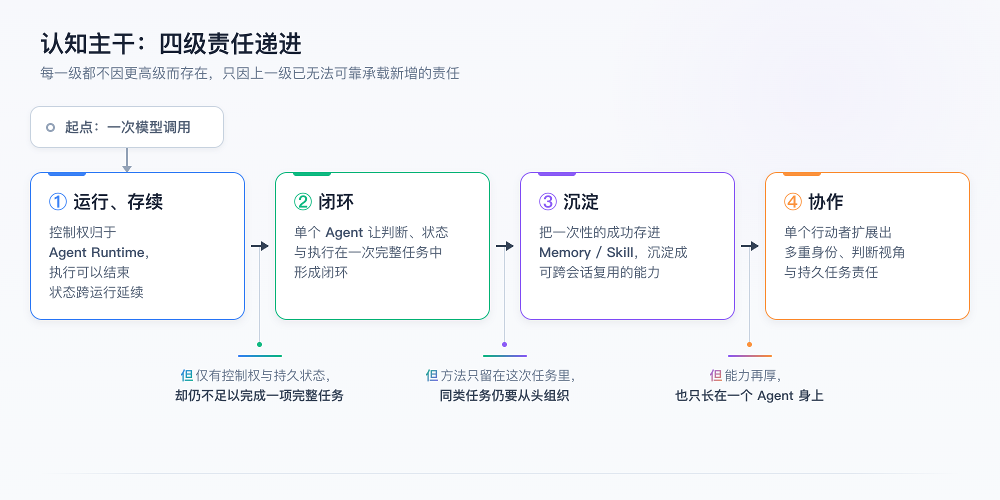
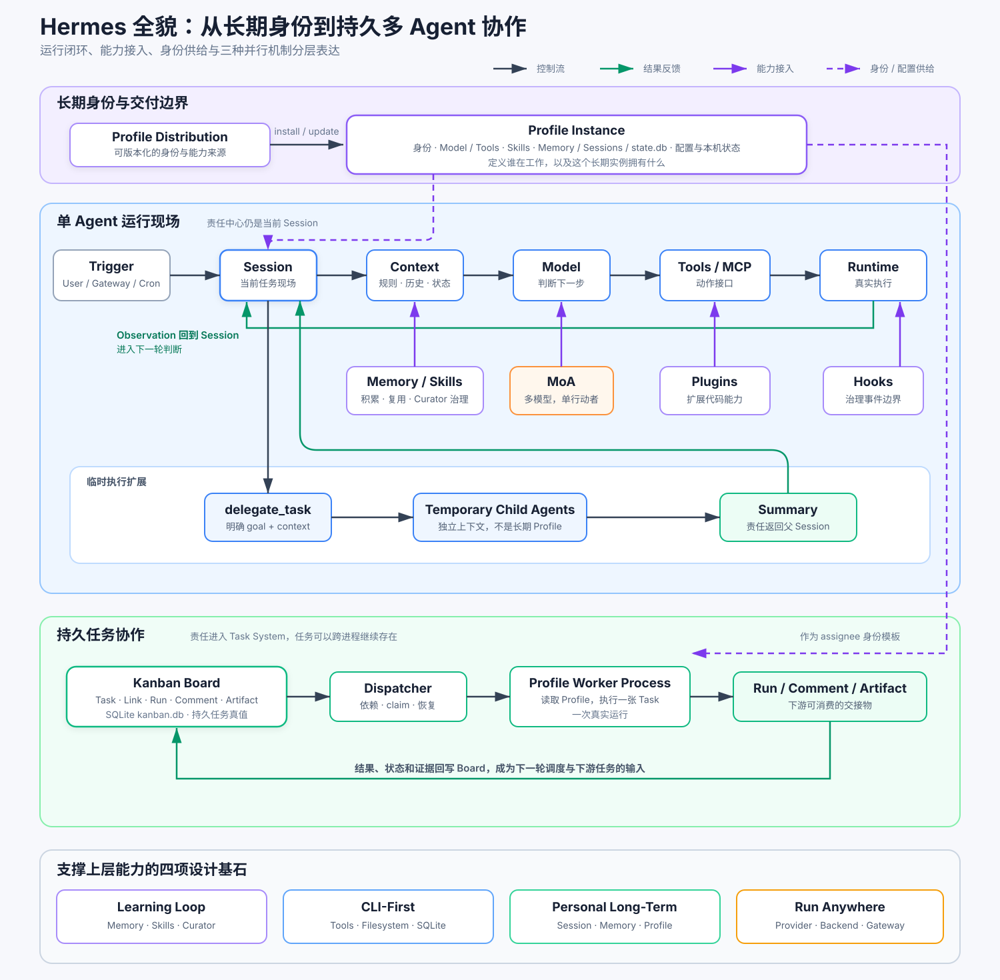
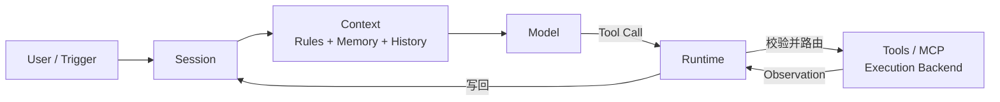
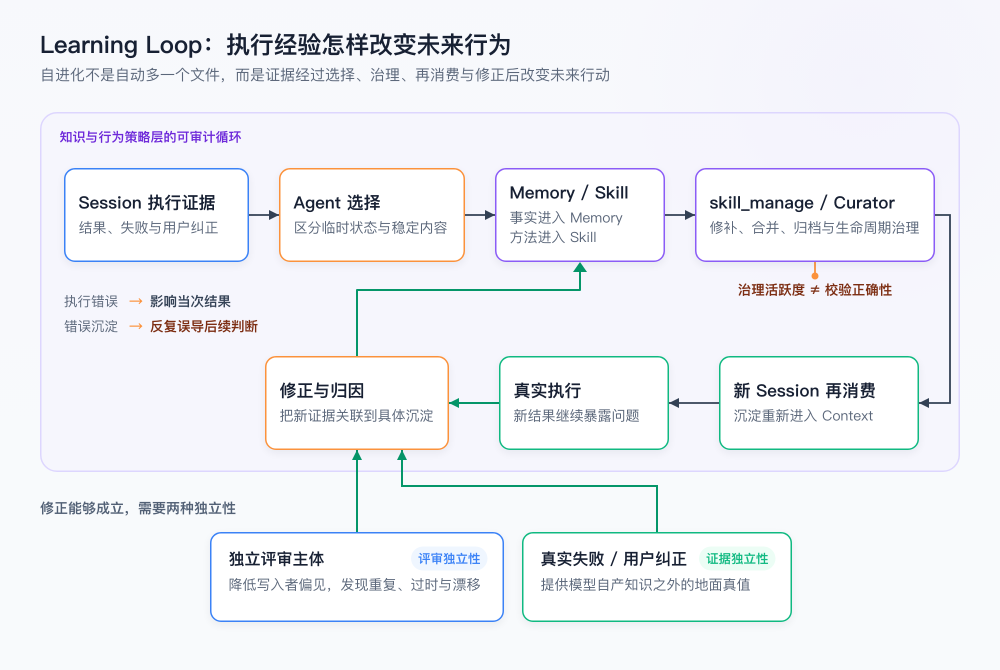
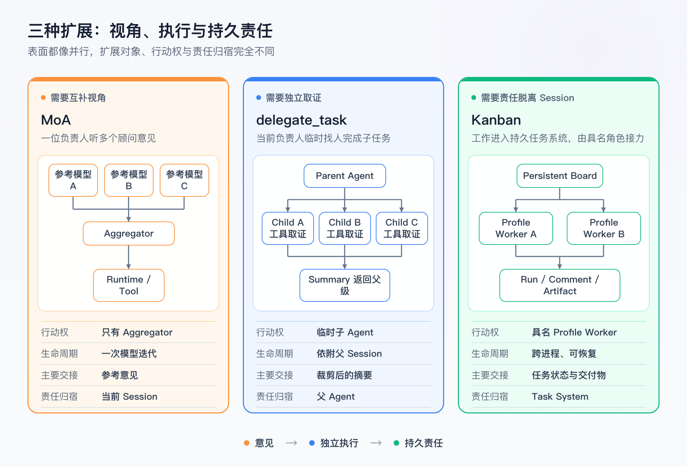
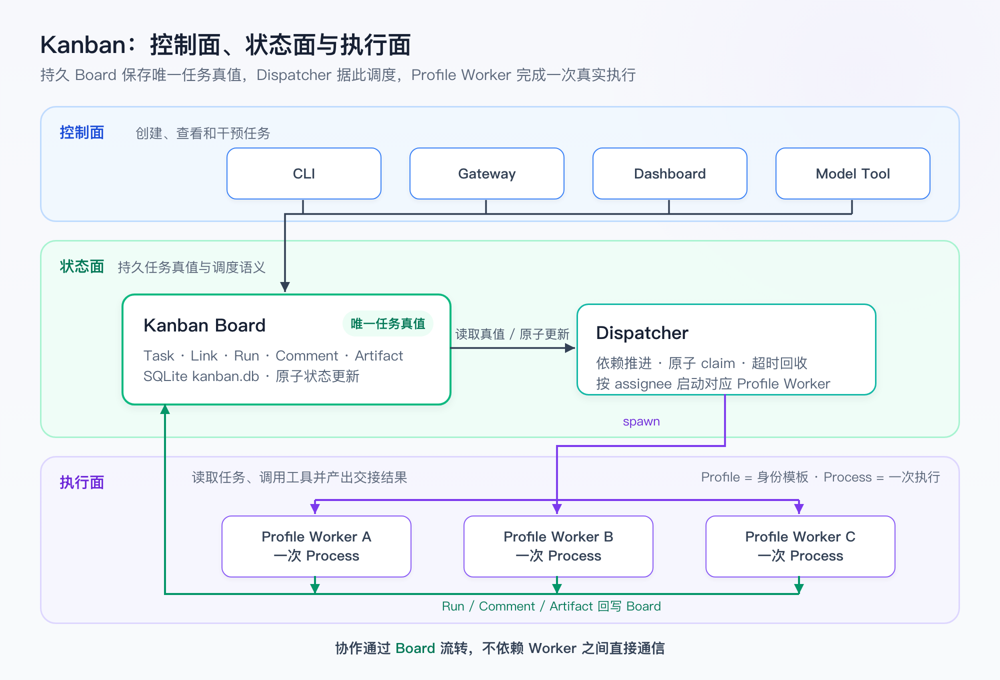
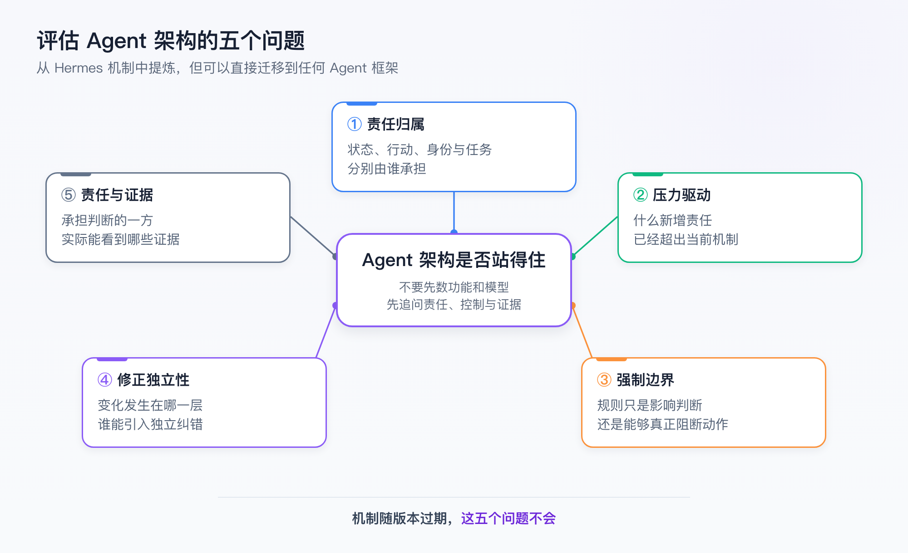

## Hermes 认知模型与架构全景

### 一、前言

> 文档职责：沿复杂度演进的路线恢复 **Hermes** 全貌，并在关键节点提供足够有深度的输入、判断与记忆锚点
>
> 使用场景：间隔一段时间后帮助快速恢复认知并能向别人讲清楚 **Hermes** 的整体结构与进阶机制
>
> 内容边界：
>
> - 不替代个人理解，不复述安装、命令和参数，不保留实战教程
> - 基础机制只建立坐标，**Profile**、**Profile Distribution**、**MoA**、**delegate_task** 与 **Kanban** 重点展开
>
> 事实基线：本文以 **Hermes Agent v0.18.2** 及审阅时可访问的官方文档为依据，并结合个人对 **Hermes** 的机制研究和工程实践整理

本文包含三种性质不同的信息：

| 类型 | 含义 |
|---|---|
| **Hermes** 机制 | 当前官方文档中明确存在的概念与行为 |
| 认知模型 | 为了理解全貌而建立的分析框架，不是 **Hermes** 官方固定术语 |
| 工程判断 | 基于机制和实践形成的边界、取舍与风险判断，应在实际使用中继续验证 |

全文沿四级台阶展开，收成一条主干：**运行、存续 → 闭环 → 沉淀 → 协作**



==主干的四级不是难度递增，而是责任递进：每一级都不因更高级而存在，只因上一级已无法可靠承载新增的责任==

### 二、**Hermes Agent Runtime** 的运行模型与持久状态架构

#### 2.1、**Agent** 运行闭环、执行载体与持久状态

下面是一个 **ReAct** 语义链路：它描述模型怎样在“**判断—行动—反馈**”之间循环，却没有回答谁推进循环、动作在哪里执行，以及循环结束后能留存什么

```text
用户目标与当前 Context
  -> LLM 提出下一步动作
  -> Tool 改变外部世界
  -> Observation 返回
  -> LLM 继续判断或结束
```

在 **Hermes** 中这条语义链路被展开成一条真实的运行时控制流：

```text
User / Trigger
  -> Session 承接目标与当前任务责任
  -> Runtime 从规则、历史、Memory、Skills 与工具说明构建 Context
  -> LLM 基于 Context 提出候选动作
  -> Runtime 校验并路由 Tool Call
  -> Tool / Execution Backend 执行真实动作
  -> Runtime 收集 Observation，写回 Session
  -> 进入下一轮判断或结束
```

真实的运行时控制流中：

- **LLM** 负责判断
- **Tool** 暴露动作接口
- **Runtime** 掌握控制权并连接判断与执行
- **Agent** 不是链路中的某一个节点，而是围绕目标持续推进整条闭环的行动者

但这条链路仍然只描述逻辑控制流，真实执行还必须落到操作系统载体上：

```text
Process：一次具体运行的 OS 载体
  └─ Runtime：推进循环、读写状态、调度工具
       └─ Tool / Execution Backend：触碰文件、网络、命令与外部系统
            ↑
       Sandbox / 授权边界：限制这次执行能够触碰什么
```

操作系统载体链路中：

- **Runtime** 是逻辑控制系统
- **Process** 是某次运行的物理载体
- **Sandbox** 是包围执行面的约束边界
  - 它负责限制当前 **Process** 执行能够访问哪些文件、网络、命令和凭据
  - 新的 **Process** 启动时，相同的授权与 **Sandbox** 边界会再次生效


到这里，**Hermes** 已经可以在一个 **Process** 内完成一次真实的任务闭环，但 **Process** 只是单次运行的载体：

- 进程退出、程序重启或后台 **Worker** 结束，都会终止当前这次执行
- 如果任务现场、长期身份和未完成任务也只存在于这个 **Process** 中，下一次运行就只能从头开始

因此，从单次任务走向**跨会话、跨运行的持续协作**，关键是让 **Agent** 的生命周期不再等同于某个 **Process** 的生命周期

**Hermes** 将“**单次执行**”与“**持久化状态**”分开：

```text
Process 启动
  -> Runtime 读取 Profile，并载入 Session 或 Task
  -> LLM 与 Tool 在 Runtime 控制下完成多轮判断和行动
  -> Runtime 持续写回消息、工具结果和任务状态
  -> Process 结束

Session、Profile 与 Task System 仍然存在
  -> 新的 Process 启动
  -> Runtime 重新读取这些状态
  -> 工作从上次停止的位置继续
```

其中：

- **Session** 保存当前任务的消息与工具轨迹
- **Profile** 提供长期身份、能力和配置
- **Task System** 保存跨后台运行的任务状态、依赖与责任

==**Process** 承载一次执行，持久化状态承接下一次执行==

所以，本文对 **Hermes** 的总体定位是：

> **Hermes** 是以个人持续协作和真实工具执行为中心，把会话、持久状态、记忆、可维护的技能进化、主动触发、身份实例和持久协作组织成连续系统的 **Agent Runtime**

这里的“**持续**”不是让模型或进程永久驻留，而是把逻辑控制、物理执行与持久状态拆开，使一次运行可以结束，下一次运行仍能恢复身份、现场与责任

#### 2.2、**Hermes** 架构分区、时间尺度与设计基石



这张图不是功能清单，而是后续章节的坐标系，阅读时先从上到下识别三个结构区域：

- **长期身份与交付边界**：**Profile Distribution** 负责交付可版本化内容，**Profile Instance** 保存当前机器上的身份、能力、配置与私有状态
- **单 Agent 运行现场**：当前 **Session** 承担任务责任，模型判断、工具执行与结果反馈在这里形成闭环，**delegate_task** 只临时扩展这次执行
- **持久任务协作**：任务进入 **Kanban Task System** 后，可以跨 **Worker Process** 保存状态、依赖、结果与责任

理解三个区域之后，还要注意图中同时叠加了三种时间尺度：

| 时间尺度 | 核心对象 | 作用 |
|---|---|---|
| 一次判断 | **Model Iteration** | 基于当前 **Context** 产生下一步判断 |
| 一次交互任务 | **Session** | 消息、工具轨迹与当前任务现场 |
| 跨运行任务 | **Kanban Task System** | 任务状态、依赖、运行记录与交接结果 |

**Profile** 不属于其中某一种工作状态，它为交互 **Session** 和后台 **Worker Process** 提供身份、能力、配置与长期状态

**四项设计基石** 不是真正意义上的“最底层技术”，而是贯穿上述区域的设计约束，它们不是 **Hermes** 官方固定分层，而是本文根据官方能力机制研究提炼出的认知模型：

| 设计基石 | 核心取舍 | 在架构中的表现 |
|---|---|---|
| **Learning Loop** | 让执行经验改变未来行为 | **Memory**、**Skill**、**skill_manage** 与 **Curator** |
| **CLI-First** | 让模型判断贴近真实工具和本地运行环境 | **Tool Runtime**、文件系统、本地进程与 **SQLite** |
| **Personal Long-Term** | 围绕个人长期关系组织状态，而不是每轮从零开始 | **Session**、**Memory**、**Profile** 与私有状态 |
| **Run Anywhere** | 不把 **Agent** 绑定在某个模型、入口或重型平台上 | **Provider**、终端后端、**Gateway** 与轻量持久化 |

其中，**SQLite** 同时支撑 **Session** 与 **Kanban** 的持久状态，**Curator** 则在 **Learning Loop** 中治理 **Skill** 生命周期，它们是落实设计约束的关键机制，但不是独立于整体架构之外的新层级

#### 2.3、单 **Session** 到持久协作的复杂度演进

当目标明确、边界清晰，并且工作可以在当前交互中完成时，一个 **Session** 加若干工具调用已经足够

但随着时间跨度、复用要求和参与者增加，单 **Session** 会依次暴露新的边界：

```text
一次模型判断不能改变真实环境
  -> Session + Tool + Runtime 形成真实执行闭环

一次执行结束后仍需恢复现场
  -> Session / Profile / Task 状态脱离 Process 生命周期

完整历史高保真但高噪声
  -> Memory 保存稳定事实，Skill 保存成熟方法

语义方法不足以保证稳定执行
  -> Hook / Plugin 将能力推进 Runtime 边界

工作不能持续依赖用户即时发言
  -> Cron 提供时间触发

单一行动者无法承担新的身份、判断和交接压力
  -> Profile / MoA / delegate_task / Kanban

成熟身份需要跨环境建立
  -> Profile Distribution
```

后续每一层都不是因为“功能更多所以更先进”，而是因为上一层开始无法可靠承载新的生命周期、责任或交接要求

### 三、单 **Agent** 的任务责任、状态管理与执行控制

#### 3.1、**Session** 的任务责任与运行现场

对于目标明确、边界清晰的一次性任务，一个单 **Agent** 已经足够：用户给出目标，**Session** 保存现场，**Context** 提供规则和历史，**LLM** 决定下一步，**Runtime** 校验并路由工具调用，**Tool** 作用于真实环境，结果作为 **Observation** 写回 **Session**



这条闭环中，**Session** 不是一份聊天记录的别名，而是当前任务责任的承载现场

- 它保存消息、工具轨迹和模型配置，使任务可以继续与恢复
- 但最终是否已经取得充分证据、是否应该继续行动，仍由当前 **Agent** 在这个现场中判断

#### 3.2、**Context**、**Session**、**Memory** 与 **Skill** 的职责与维护

如果 **Session** 只存在于模型 **Context** 或当前 **Process**，进程退出就意味着**任务现场消失**

**Hermes** 选择本地文件与 **SQLite** 保存状态，使会话能够恢复、搜索和重建

当前每个 **Profile** 的 `state.db` 保存会话与消息，**Session Search** 通过全文索引从历史中召回相关片段，这里真正重要的不是数据库表结构，而是运行状态获得了**跨进程连续性**

当同一类工作持续多轮甚至跨越数月，需要区分四种状态：

| 状态 | 解决的问题 | 生命周期与代价 |
|---|---|---|
| **Context** | 本轮判断必须看到什么 | 最短，受上下文窗口限制 |
| **Session** 历史 | 当时发生了什么 | 高保真但高噪声 |
| **Memory** | 以后默认应记住什么 | 低容量，要求主动选择和更新 |
| **Skill** | 以后遇到同类任务应怎样做 | 保存程序性知识，需要持续维护 |

四种状态分别由不同机制维护：

- **Context** 由 **Runtime** 持续组装，空间不足时由 **Context Compression** 做有损续航
- **Session** 由 `state.db` 保存完整现场，**Session Search** 负责从历史证据中按需召回
- **Memory** 由 **Agent** 通过 `memory` 主动选择和更新，并在后续会话中进入 **Context**
- **Skill** 由 **skill_manage** 创建和修补，**Curator** 在适用范围内治理技能生命周期，防止过时与膨胀

最短记法是：**Context** 维持当前判断，**Session** 保留完整现场，**Memory** 延续稳定认知，**Skill** 复用成熟方法

==持久化解决状态连续性，选择与维护才形成认知连续性==

到这里，**Session** 已经能够保存与恢复，长期认知和程序性能力也有了进入当前判断的路径；下一个问题是，**Agent** 怎样把判断转化为对真实环境的行动

#### 3.3、**LLM**、**Tool** 与 **Runtime** 的行动责任链

**LLM** 只能判断下一步做什么，不能直接改变真实环境，**Tool** 把动作表达成可调用接口，**Runtime** 再把一次工具调用变成真实执行：

```text
LLM 生成 Tool Call
  -> Runtime 校验参数、授权与环境
  -> Tool / Backend 执行
  -> Observation 返回 Session
  -> LLM 决定下一步
```

三者承担不同责任：

- **LLM** 负责判断，决定尝试什么动作
- **Tool** 负责表达，定义动作名称、参数与返回结果
  - **Toolsets** 把多个 **Tool** 组织成可启用或禁用的能力集合
  - **MCP** 规定外部能力怎样被统一发现和调用
- **Runtime** 负责执行，处理校验、授权、环境、副作用与结果回传

当 **Runtime** 能够读写文件、调用服务和启动进程后，单 **Agent** 已经具备真实行动能力；随之而来的问题是，模型判断和真实执行分别应当受到什么约束

#### 3.4、**Context** 语义引导与 **Runtime** 强制执行边界

一个单 **Agent** 同时受到两个控制面约束，它们不能互相替代：

```text
Context
  -> 向 LLM / Agent 提供规则、历史与状态
  -> 影响怎样判断

授权 / Sandbox
  -> 由 Runtime 强制执行
  -> 限制动作能否发生以及可以影响什么
```

两个控制面的职责分别是：

- **Context**
  - **AGENTS.md / HERMES.md** 等提供项目或目录的局部规则
  - **SOUL.md** 提供当前 **Hermes** 实例的长期身份表达和互动倾向
  - **Session** 历史、**Memory**、**Skill** 与工具结果也会按需进入
  - 渐进加载决定哪些信息在什么时候进入，而不是启动时一次塞入全部内容
  - 无论来自哪里，进入后都只是语义输入，只能影响模型怎样判断
- **授权 / Sandbox**
  - 由 **Runtime** 强制执行
  - 限制动作能否发生，以及可以影响哪些资源和环境

==**Context** 中语义声明“不要访问某目录”，不等于操作系统已经禁止访问该目录：真正不可越过的边界只能由授权与 **Sandbox** 强制==

到这里，一个单 **Agent** 已经能完成真实工作；下一个问题不再是“能不能做”，而是每次遇到相似任务都要从头组织方法，长期使用会反复消耗上下文和人工注意力

### 四、能力的沉淀治理、责任升级与主动触发

#### 4.1、执行经验的选择与复用边界

一次复杂任务完成后，完整消息、工具轨迹与结果保留在 **Session** 中，在这份高保真现场里，既有只对当前任务有效的临时状态，也有值得跨任务复用的稳定内容

经验沉淀不是让未来任务重新加载单次任务的完整 **Session**，而是由 **Agent** 从中选择值得复用的内容，将其转化为承担不同责任的持久化对象：

- 稳定事实进入 **Memory**，延续“是什么”的认知
- 可复用做法进入 **Skill**，固化“怎样做”的程序性知识

未来任务的一次行动，由两类沉淀产物与既有的 **Tool** 协同支撑：

```text
Memory 提供事实前提：项目使用 pnpm、测试依赖本地数据库

Tool 执行原子动作：读取仓库、搜索资料、运行测试

Skill 组织判断与流程：先核验事实，再分析影响，最后根据证据形成结论
```

三者互相不可替代：

- 只有 **Memory**，事实不会自己组织成方法，每次仍要临场重新编排步骤
- 只有 **Tool**，动作接口齐全，动作的顺序与取舍却无处沉淀
- **Skill** 补上两者之间的方法层：消费 **Memory** 的事实，编排 **Tool** 的动作，自身只被 **LLM** 消费、不直接执行

==选择本身带有判断风险：一次偶然成功可能被错误泛化，旧命令可能继续影响未来任务，程序性知识越多，发现成本和 **Context** 污染也越高==

==经验只有经过选择才可能形成能力，但被选择并不代表它已经长期正确==

#### 4.2、**Learning Loop** 的治理闭环与自进化边界

**Hermes** 的 **Learning Loop** 不是“任务完成后自动多一个文件”，而是一条从执行证据回到未来行为的循环：

```text
Session 中的执行结果、失败与用户纠正
  -> Agent 选择稳定事实与可复用做法
  -> 更新 Memory，用 skill_manage 创建或修补 Skill
  -> Curator 维护 Skill 生命周期
  -> 新 Session 按需重新消费
  -> 新结果继续修正 Memory / Skill
```



循环的前半段就是上一节的选择与沉淀；被选择的内容能否保持长期正确，取决于后三个环节：

- **维护**
  - **skill_manage** 面向单个 **Skill** 的创建与修补
  - **Curator** 面向 **Skill** 集合：按活动情况推进活跃、过时与归档，保护被固定的关键能力，可用辅助模型合并重复技能
    - **Curator** 主要治理后台自我改进标记的 **agent-created Skill**；人工编写、前台按用户要求创建或从 **Hub** 安装的 **Skill** 不进入这套治理
    - 默认启用 `prune_builtins` 时，长期未使用的内置 **Skill** 也可能按活跃度被归档，但不会被合并或修补
    - **治理信号是活跃度，不是正确性**：它能回收无人使用的技能，拦不住被频繁加载的错误技能
- **再消费**
  - 沉淀的内容只有被新 **Session** 使用才有意义，只追加不消费，是状态累积而不是能力复用
  - **消费同时是检验**：错误的沉淀只有在被使用时才有机会暴露，不被消费的错误会永远显得正确
- **修正**
  - 新的执行结果回写 **Memory / Skill**，一次偶然成功要在下一轮接受证据检验
  - **回写的前提是归因**：失败要被观察到，还要被关联到某条具体沉淀，而归因只能依赖 **Agent** 临场判断

三个环节的分量并不相等，判断哪个承重，先看错误在循环中怎样放大：

```text
执行错误
  -> 影响一次任务

沉淀错误
  -> 在后续消费中反复误导判断
```

放大只能被修正终止；而修正要真正发生，需要两种彼此独立的东西——独立的评审主体与独立的外部证据：

- **独立的评审主体**
  - 让写入者之外的角色来复核是 **evaluator / critic** 架构的通用做法：评审比生成容易，独立评审者没有作者偏见，能发现原模型在产出里看不见的问题
  - **Hermes** 已部分落地：
    - 后台自我改进 **review agent** 单独回看历史 **Session** 并标记技能
    - **Curator** 的 **LLM Review** 用辅助模型决定保留、修补、合并或归档
  - 但这种方法偏向库级治理——去重、过时、合并，**仍在模型自己产出的知识基底上推理，能压制累积与漂移，不等于真值校验**
- **独立的外部证据**
  - 一条沉淀究竟对不对，需要由模型自产知识之外的证据裁定，例如真实执行的失败、用户纠正、确定性测试、结构化校验和权威外部状态
  - 否则评审只是模型之间互相确认：**==同一个模型既是写入者又是纠错者，外部证据缺席时，修正会退化为自我确认==**

==**Hermes** 所谓“自进化”发生在**知识和行为策略层**，不发生在底层 **LLM** 权重层：模型没有在本地自动训练，变化的是未来 **Session** 会带入哪些事实、加载哪些方法、采取怎样的行动路径==

这个限制同时是可审计性的来源：**Memory** 与 **Skill** 都是本地文件，每一次进化都可以被查看、对比和回滚，权重层的进化做不到这一点

==**只有“执行 → 选择 → 沉淀 → 维护 → 再消费 → 修正”闭环，才构成工程意义上的自进化；而闭环的上限，取决于修正能引入多少独立性——独立的评审主体与独立的外部证据**==

#### 4.3、**Skill / Hook / Plugin** 的责任边界

一条稳定做法固化成 **Skill** 之后仍然只是语义输入：它影响 **Agent** 怎样判断，却不能保证每次运行都照做

于是同一条规则要问的是——**它该停在语义层，还是下沉到能真正拦截、甚至交付代码的更强层级**

**Skill / Hook / Plugin** 就是这条责任强度轴上依次加深的三个刻度：

| 机制 | 介入层 | 能做到 | 做不到 |
|---|---|---|---|
| **Skill** | 语义层，被 **LLM** 消费 | 提供一类任务的判断方法与流程，影响怎样判断 | 不能强制，模型可以不照做 |
| **Hook** | 事件层，挂在 **Runtime** 生命周期 | 在特定事件观察、注入，部分事件可阻断动作 | 不能等同授权系统或 **Sandbox** |
| **Plugin** | 代码层，**Runtime** 扩展载体 | 注册并交付工具、**Hook**、命令、**Skill** 等代码能力 | 不能自证安全，也不等于 OS 权限 |

**Plugin** 与 **Hook** 不是上下层替代关系：**Hook** 是事件扩展点，**Plugin** 是能够注册 **Hook** 和其他代码能力的扩展载体

一项需求该落在哪一刻度，三者的判据并不相同：

```text
需要一套判断方法，模型照做即可
  -> Skill：所有结论必须记录证据来源

规则必须在特定事件上确定性生效，不能指望模型每次都记得
  -> Hook：某类工具调用前必须先做确定性检查

需要的不是一条约束，而是一份新能力
  -> Plugin：接入新的外部工具集或平台适配
```

前两者约束的是**已有动作**，**Plugin** 交付的则是**新的动作本身**——这也是它与 **Hook** 不能互相替代的原因

沿这根轴下沉，代价同向增加：

- **副作用更直接**：动作不再经过模型判断这一层，由 **Runtime** 直接执行
- **暴露面更大**：代码执行与供应链风险随之扩大

第三方 **Plugin** 与 **Hook** 因此应按可执行代码审查，而不是按提示模板审查

==下沉不等于更可靠：强制力与风险沿同一方向增强，只有语义边界已无法承载该责任时，下沉才有意义==

但无论下沉到哪一刻度，这根轴都不提供安全边界：

- **Hook** 拦得住经过它的动作，却拦不住绕过它的代码
- **Plugin** 注入的是应用层能力，不是操作系统权限

==这根轴是行为强制，不是安全边界；不可越权的地基不在轴上，而是在授权与 **Sandbox** 这条独立的控制面==

#### 4.4、**Cron** 的时间触发与任务边界

前面三节内容讲的都是一次运行的内部机制，**Cron** 机制讲的是另一件事——谁来发起运行

在此之前，能定时执行的只有 **Curator** 这种内置的维护机制，**Cron** 把“定时执行”能力开放给用户：定期检查、心跳、日报都不必再等用户主动触发

定时任务触发后，由 **Gateway** 起一次新的运行，跑完投递结果：

```text
Schedule 到期
  -> Gateway Scheduler
  -> 起新的 Agent Session 或运行脚本
  -> 执行检查
  -> 保存并投递结果
```

触发方式分两档，按“要不要模型判断”来选：

- **Agent Cron**：到期起新 **Session**，能理解、取舍、调用工具，也可加载 **Skill**；代价是不确定、较贵、较难验证
- **No-Agent Cron**：到期跑一段确定性脚本，只做监控、告警、心跳；便宜、可验证，不涉及模型

检查能用确定性脚本表达时，模型触发不带来额外判断，只增加不确定与成本

但无论哪一档，**Cron** 移动的只是触发时机：

- 每次运行都是全新 **Session**，作业之间默认隔离
- `context_from` 能把上一次输出接到下一个 **prompt** 前面，形似流程编排，实为文本拼接，不携带依赖、责任与恢复

**Cron** 抽离的是“什么时候开始”，不是“任务怎样被管理”；它不会自动带来依赖、责任归属、验收、人工介入与失败恢复

至此，同一个 **Agent** 已经能够从执行中积累方法、治理能力，并在没有用户触发时主动运行；**当工作进一步需要不同身份、临时执行者或跨进程责任交接时**，问题才从**能力进化**转向**多主体协作**

### 五、单 **Agent** 边界的扩展机制

单 **Agent** 无法继续承载新的责任时，该引入哪个机制并不取决于它有多强，而取决于超出边界的是哪一类责任

**Hermes** 在这一层提供六个机制，各自扩展不同的对象：

```text
Gateway
  -> 从哪里进入和接收结果

Profile
  -> 谁在工作，以及身份、能力与状态怎样长期存在

MoA
  -> 同一行动者怎样获得更多模型判断视角

delegate_task
  -> 当前 Session 怎样临时扩展执行宽度

Kanban
  -> 工作怎样离开当前 Session，进入持久任务系统

Profile Distribution
  -> 成熟身份与能力怎样跨环境交付
```

==扩展的从来不是 **Agent** 的数量，而是**入口**、**身份**、**判断**、**执行**、**任务**与**交付**这六类互不相同的责任==

#### 5.1、**Gateway** 的访问入口、常驻形态与接入边界

**Hermes** 的原生入口是本机终端，但任务不总在终端前产生：需求可能来自一条 **Telegram** 私信、一次群聊讨论，结果也应当回到同一个对话里

**Gateway** 因此把访问入口接到消息平台上：

```text
消息平台（Telegram / 微信 …）
   │  消息进、结果回
   ▼
Gateway：长期驻留的 server
   ├─ 消息网关
   │    ├─ 消息渠道：平台连接、配对、允许列表、命令权限
   │    └─ 会话路由：聊天 ↔ Session 映射
   ├─ Cron 调度循环
   ├─ Kanban Dispatcher（内嵌）
   └─ 后台通知
   │
   │  交给
   ▼
Agent：模型、工具与 Runtime 的责任边界不变
```

**Gateway** 与 **CLI** 共用同一套程序、配置、**Session**、**Memory**、**Skills** 与工具，它们的区别在于生命周期：

- **CLI** 只存在于一次交互之中，单次对话结束就退出
- **Gateway** 是一个系统常驻进程，它必须长驻不退，才能持续监听平台消息

**Gateway** 承担以下职责：

- **消息网关**
  - **连接平台**：负责连接消息平台并管理入口
    - **Agent** 从终端暴露出去之后，“消息渠道”需要显式治理，为此提供两层：
      - **配对与允许列表**：不在列表中的用户需私信取得一次性配对码，由管理员在本机批准
      - **命令权限分层**：配置管理员后，普通用户只能运行显式允许的斜杠命令
    - ==**消息平台**改变的只是从哪里触发任务，内部运行模型并未重写——这是 **Run Anywhere** 在入口层的体现==
  - **路由会话**：把每个聊天对应到各自的 **Session**，使不同来源的对话互不串线
- **Cron 调度循环**：按计划扫描到期作业，到期时起一次新的运行
  - 起新的 **Agent Session**，还是跑一段确定性脚本，取决于该作业是否需要模型判断
- **Kanban Dispatcher**：默认每 60 秒扫描任务板
  - 回收超时的 `running` 任务、把依赖满足的任务推进到 `ready`、以原子更新认领任务
  - 认领成功后，启动 `assignee` 对应的 **Profile Worker Process**
- **后台通知**：把上述后台运行产生的结果投递回消息渠道，用户不必先发问才看到

**Gateway** 的能力边界：

- ==接入治理只解决谁能进入，不构成能力约束；进来之后能做什么，仍由工具授权与 **Sandbox** 决定==
- ==默认运行形态下，**Gateway** 是 **Agent** 自主运行的宿主：它不启动，定时任务的自动触发与后台任务的自动调度都不会发生==

#### 5.2、**Profile** 的长期身份与状态边界

同一个 **Hermes** 实例可以“扮演”不同角色（例如：研究者、代码分析者、风险复核者）但“扮演”只会改变语义输入，三者背后仍是同一份 **Memory**、同一套 **Skills** 与工具、同一个目录与运行状态

这意味着角色之间不存在隔离：任意一个角色写入的记忆、沉淀的方法、持有的工具权限，对其余角色同样生效，**==角色差异只停留在语义层，没有形成可治理的身份边界==**

**Profile** 把它们真正分开：一个 **Profile** 就是一个独立的 `HERMES_HOME` 目录，因此同时回答四个问题：

| 问题 | **Profile** 提供的边界 |
|---|---|
| 谁在行动 | 名称、描述、身份表达与职责定位 |
| 能做什么 | 模型、工具、**MCP** 与 **Skills** |
| 记得什么 | 独立 **Memory**、**Sessions** 与 `state.db` |
| 从哪里运行 | 独立 **HERMES_HOME** 与相关进程状态 |

其中“描述”不只是给人看的备注：**Kanban** 的编排者正是依据各 **Profile** 的描述决定把任务指派给谁，描述含混，任务就会指错人

隔离带来能力，也带来代价——四个问题各自独立作答，意味着答案之间不共享：

- 一个 **Profile** 学到的 **Memory** 与沉淀的 **Skills**，不会出现在另一个 **Profile** 里
- 模型、工具、**MCP** 与各自的 **Gateway** 令牌都要分别配置和维护
- 新建 **Profile** 时可以只复制配置、**SOUL.md** 与 **Skills**，也可以连 **Memory**、**Cron** 与 **Plugin** 等长期资产一起克隆；**Session** 历史与 `state.db` 仍然不会随克隆复制

==**Profile** 之间不共享记忆与技能：隔离既是它提供的价值，也是各自积累、各自维护的代价==

**Profile** 容易被想象成一个常驻的员工，但它自己并不运行：

```text
Profile = 长期身份、能力、配置和状态边界

Agent = 某次运行中围绕目标持续决策的行动者

Process = 操作系统承载某次运行的实例
```

**Profile** 的能力边界：

- 它自己并不运行——同一个 **Profile** 可以先后产生多个 **Session** 与 **Worker Process**，**Profile** 不是常驻员工，**Process** 也不是长期身份

- 它能提供的隔离也有层级：**Profile** 提供的是应用层实例隔离，不自动等于操作系统用户隔离、文件系统 **Sandbox** 或企业权限系统


回到开头那个问题：角色差异要**形成身份边界**，靠的不是名称，而是==把身份、能力、记忆与配置固定成可治理的**长期实例**==

**Profile** 是 **Personal Long-Term** 的结构载体——==长期关系不再依附某个聊天窗口，而是依附一个可以持续积累又彼此隔离的**身份实例**==

#### 5.3、**MoA**、delegate_task 与 **Kanban** 的扩展对象

同一个复杂任务可以用三个参考模型评审，也可以临时委派三个子任务，还可以让多个长期 **Profile** 跨天协作

表面上都像并行，扩展的对象却完全不同：

| 机制 | 扩展对象 | 独立行动者 | 生命周期 | 主要交接物 |
|---|---|:--:|---|---|
| **MoA** | 模型判断视角 | 否 | 当前模型迭代 | 参考意见 |
| **delegate_task** | 当前运行现场的临时执行者 | 是 | 依附原 **Session** | 子任务摘要 |
| **Kanban** | 持久任务与具名角色协作 | 是 | 跨进程、可恢复 | **Task / Run / Comment** 与交付物 |



**delegate_task** 与 **Kanban** 都会产生独立执行者，但区别在于：

- **delegate_task** 的子任务结束后，判断与交付仍回到父 **Session**
- **Kanban** 则让任务、状态与交接物脱离任何一个 **Session** 独立存在

最短记法：

```text
MoA = 一位负责人听多个顾问意见

delegate_task = 当前负责人临时找人完成子任务

Kanban = 工作进入持久任务系统，由具名角色分阶段接力
```

三者也不是三种可以任选的并行方案，而是一条递进——每一级的出现，都因为上一级无法承担新的责任：

```text
需要互补视角
  -> MoA：多个模型提供意见，但它们没有行动权，无法各自取证

需要各自独立取证
  -> delegate_task：产生独立执行者，但判断与交付仍回到父 Session

需要责任脱离当前 Session
  -> Kanban：任务、状态与交接物独立于任何一次会话存在
```

==分界很具体：**MoA** 缺的是独立取证，**delegate_task** 缺的是责任脱离 **Session**==

#### 5.4、**MoA** 的模型判断与行动权边界

单模型的盲区不是随机的：同一个模型在同类问题上会稳定偏向某些维度、遗漏另一些，例如：评审迁移方案时，它可能偏重可用性而漏掉数据回填，或偏重代码实现而漏掉回滚与业务中断

换一个更强的模型，往往只是换一套偏好

要照见盲区，需要的是**不同**的模型，但多引入一个模型，不应该连 **Session**、工具与行动者一起变——否则“多一个视角”就变成了“多一个 **Agent**”

**Mixture of Agents** 这个名字可能会造成误解，但它并不创建 **Agent**，而是以一个虚拟 **Provider** 的身份，占据 **Session** 原本主模型的位置：

```text
Session 的主模型位置
  ├─ 普通 Model Provider ── 一次迭代调用一个模型
  └─ MoA Virtual Model Provider ── 一次迭代在内部展开为
        ├─ Reference Models（可配多个，并行给出私有意见）
        └─ Aggregator Model（一个，读完意见后行动）
              └─> 调用 Tool，或直接回复用户
```

参与的模型全部由使用者在 **MoA Preset**（保存模型组合与参数的命名配置）里指定；**Hermes** 固定的不是模型，而是这套先后顺序，以及行动权只交给 **Aggregator** 这一条规则

三者的行动权并不相同：

| 对象 | 能做什么 | 不能做什么 |
|---|---|---|
| **Reference Model** | 提供风险、反例与补充视角 | 不能调用工具，也不能回复用户 |
| **Aggregator Model** | 综合意见并决定回复或取证 | 不能凭意见确认事实，事实只能来自取证 |
| **Runtime / Tool** | 读取文件、执行命令、访问真实系统 | 不替模型作业务判断 |

它们看到的东西同样不同：

- **Reference Model**：裁剪后的会话文本，只有用户与助手的文本消息，不含系统提示词、**Tool Schema** 与工具调用轨迹
- **Aggregator Model**：正常 **Agent Context**——系统提示词、**Tool Schema**、完整会话与工具轨迹，外加全部参考意见
- **Runtime / Tool**：只接收 **Tool Call** 的名称与参数，不消费模型上下文

这个视野差距不会随轮次缩小：工具结果返回后，**Aggregator** 拿到新的轨迹，**Reference Models** 在下一轮仍然只看到文本

==**Reference Models** 不是三个独立审计员：它们看不到工具轨迹，给出的是基于对话文本的推断，不是基于证据的核验==

所以在迁移评审中，多个模型都认为方案安全，只能证明它们形成了相似判断，不能证明脚本真实可执行、迁移具有幂等性或生产环境允许停机

参考模型给意见，**Runtime** 给事实，**Aggregator** 作决定

这不是实现上的欠缺，而是选择的结果：多视角被放在模型层而不是 **Agent** 层，换来的是低成本与零结构改动，付出的就是参考模型既没有行动权，也拿不到证据。**MoA** 的适用范围由此划定：

- **适合**：架构取舍、方案评审，以及其他需要互补视角的判断
- **不适合**：机械操作与简单事实查询
- **需要升级**：若这些视角必须各自读文件、跑命令、独立取证，就已经超出模型层能承担的范围——那是 **delegate_task** 的职责

==**MoA** 的价值在暴露反例，不在形成多数票；**模型数量增加的同时，成本、尾部延迟与共享偏见也一起增加**==

#### 5.5、**delegate_task** 的临时执行与责任回归

**MoA** 的参考模型给不出证据，因为它们没有行动权，当几个视角必须各自读文件、跑命令、独立取证时，需要的就是真正的执行者

**delegate_task** 可以让父 **Agent** 临时创建子 **Agent** 并行处理

```text
Parent Agent
  ├─> Child A：核验外部资料
  ├─> Child B：分析当前代码
  └─> Child C：检索风险案例

Child Summaries
  -> Parent 验证、综合并承担最终回答
```

子 **Agent** 是临时的：不是命名 **Profile**，不是长期员工，也不是 **Kanban Worker Process**。它的能力边界来自父 **Agent**：

- **继承**模型与已启用工具——因此拿不到父 **Agent** 本来就没有的能力
- **不继承** **Memory** 与自动加载的 **Context Files**，两者在创建时都会被跳过

**delegate_task** 是父 **Agent** 调用的一个 **Tool**，`goal`（做什么）与 `context`（需要知道什么）由父 **Agent** 在调用时自己写入

这套临时委派有三处限制，性质各不相同：

- **隔离只在消息层**：父子共用目录与执行后端时仍会读写同一批文件，独立推理不构成独立的安全边界
- **信息两向有损**：去程只有 `goal` 与 `context`，发出后无法追补；回程只有摘要与元数据，子 **Agent** 读过的文件与工具轨迹不跟着回来
- **后台不等于持久**：父 **Session** 被停止、切换或进程关闭时，活跃的子 **Agent** 可能直接被取消

```text
fresh context != fresh filesystem
summary       != evidence
background    != durable
```

==父 **Agent** 承担最终责任，但交出去的只是一次写定的 `goal` 与 `context`，收回来的只是裁剪过的摘要==

==**Background** 不等于 **Durable**：父 **Agent** 不必同步等待，不表示子任务已经成为可跨重启恢复、可人工接管的持久工作单==

**delegate_task** 扩展的是当前执行宽度，责任始终没有离开父 **Session**：父 **Agent** 仍要自己判断目标是否达成、摘要是否可信，必要时重新取证

若工作需要跨天推进、需要人工审批、失败后还要能恢复，就已经超出一次会话能承载的范围——那是 **Kanban** 的职责

#### 5.6、**Kanban** 的持久任务与跨进程交接

**Kanban** 的做法是让工作、执行记录与交接结果都成为持久对象，不再依附任何一次 **Session**：

```text
Task
  + Link
  + Run
  + Comment / Event
  + Workspace / Attachment
```

任务因此可以被查看、认领、阻塞、重试、恢复、审计和交接

**Kanban** 不是看板界面，而是 **Hermes Runtime** 中持久化、调度和恢复后台工作的协作基础设施

##### 5.6.1、控制面、状态面与执行面



| 层 | 主要对象 | 职责 |
|---|---|---|
| 控制面 | **CLI**、**Gateway**、**Dashboard**、模型工具 | 创建、查看和干预任务 |
| 状态面 | **SQLite Board DB** 与 **Dispatcher** | Board 保存唯一任务真值与原子事务，Dispatcher 据此推进依赖、认领任务与超时恢复 |
| 执行面 | **Profile Worker Process** | 读取任务、调用工具并产出交接结果 |

这张图的关键不是组件数量，而是唯一任务真值位于持久 **Board** 中；所有协作通过任务板流转，**Profile** 之间不需要直接建立进程通信

这里再次出现 **SQLite**，但责任已经不同：`state.db` 跟随 **Profile** 保存各自的会话历史，`kanban.db` 跟随 **Board** 保存所有协作者共同依赖的任务真值

跨 **Profile** 协作不是共享彼此的完整 **Context**，而是共享显式的 **Task**、状态、评论和交付物；**SQLite** 提供持久性与原子状态更新，**Task Model + Dispatcher** 才赋予这些状态协作语义

==数据库存在不等于任务系统可靠：恢复能力来自原子认领、依赖推进、超时回收与单一调度所有权==

##### 5.6.2、**Task** 到真实运行的控制链

```text
Task 指定 assignee Profile
  -> Dispatcher 原子 claim
  -> Runtime 读取 Profile 配置
  -> 启动独立 Worker Process
  -> Worker 建立任务 Session
  -> 读取 Task、父任务交接与评论
  -> 调用工具完成工作
  -> 回写 Run、Comment、交付物与状态
```

需要区分三个对象：

```text
Profile
  = 长期身份、能力与状态边界

Worker Process
  = 该身份执行某张 Task 的一次真实运行

Task
  = Process 消失后仍然存在的工作状态
```

**Task** 定义工作，其余对象各自支撑依赖与交接：

- **Link** 表达任务之间的依赖
- **Run** 记录一次执行，并保存结构化交接
- **Comment** 保存补充与纠偏
- **Attachment** 保存需要跨执行者消费的文件

##### 5.6.3、持久任务的安全与业务门禁边界

**Board** 是项目级任务与数据范围，**Tenant** 是业务命名空间和过滤字段，**Workspace** 是 **Worker** 实际读写文件的目录

它们都不是天然强安全边界：多个任务使用相同目录仍可能写入冲突，多 **Profile** 也不会自动提供代码工作区隔离

同样，依赖系统可以判断父任务是否结束，却不会自动理解审核是否通过、证据是否充分或业务是否允许进入下一阶段

```text
Task Graph 创建成功
  != 后台工作已经完成

Task 进入 done
  != 业务目标已经通过验收
```

需要强业务门禁时，应加入结构化判定、明确 **Policy** 或外部状态机，而不是把普通任务状态当成完整业务语义

==多 **Agent** 的成熟度不取决于同时启动多少模型，而取决于任务、状态、证据和控制权能否跨执行者可靠交接==

#### 5.7、**Profile Distribution** 的交付契约与私有状态边界

当单个 **Profile** 已经成熟，下一个问题是怎样把这套身份和能力交付给另一台机器或另一个用户，同时不复制原用户的凭据与历史

```text
Profile Source
  -> install / update
  -> Profile Instance
       ├─ Distribution-owned Content
       └─ Runtime Private Data
```

| Profile 组成 | 典型内容 | 所有权 |
|---|---|---|
| **Profile Source** | `distribution.yaml`、`SOUL.md`、默认配置、**Skills**、模板、工具和 **MCP** 声明 | 分发作者维护 |
| **Distribution-owned Content** | 安装后由 **Runtime** 读取、更新时由分发方维护的内容 | 分发契约决定 |
| **Runtime Private Data** | 凭据、认证、`state.db`、**Memory**、**Sessions**、日志与业务数据 | 当前用户和运行环境 |

所有权分界在更新时才被真正检验：

- **Distribution Update** 只改分发方拥有的内容
- `.env`、`sessions/`、`memory/`、`workspace/` 等用户目录不在更新范围内
- `config.yaml` 介于两者之间：默认保留本机版本，只有显式强制才会被覆盖

==**Distribution** 交付的是可在别处重建的身份与能力定义；私有数据既不随分发复制，也不被更新覆盖==

如果说 **Profile** 解决“这个长期身份怎样存在”，**Profile Distribution** 解决的就是“这个身份怎样跨机器和环境重新建立”，它连接了 **Personal Long-Term** 与 **Run Anywhere**

一套成熟 **Distribution** 因此是在声明一份版本化的能力契约：

- 它是谁、需要什么、能做什么
- 哪些资产由作者更新，哪些私有状态必须保留
- 更新之后怎样验证仍然可用

分发越方便，供应链信任要求越高，安装一个 **Distribution**，接受的不只是工具代码

- **SOUL.md** 定义身份表达
- **Skills** 定义做事方法
- **Cron** 与 **MCP** 配置还会带来真实副作用

==**Distribution** 交付的不只是代码：**SOUL.md** 与 **Skills** 决定 **Agent** 怎样判断，这一部分容易被只关注代码差异的审查遗漏==

> **Profile** 是运行实例，**Distribution** 是交付契约，私有状态属于安装后的本地环境

#### 5.8、机制升级的任务压力与工程代价

机制不是一次性全部启用，而是随任务压力逐级引入。选型时先判断当前压力落在哪一层，再看这一层要付的代价：

| 当前压力 | 首选机制 | 升级代价 |
|---|---|---|
| 一个行动者即可完成，只需工具取证 | 单 **Agent** | — |
| 同类任务反复出现，方法需要固化 | **Skill** 与 **Curator** | 需持续治理，否则过时与膨胀 |
| 某条规则必须确定性生效，不能靠模型自觉 | **Hook** | 责任进入代码面，扩大供应链暴露 |
| 工作需要按时自行发起，不等用户发问 | **Cron** | 增加不确定性与验证成本 |
| 同一行动者需要从消息平台进入并接收结果 | **Gateway** | 扩大访问面与授权治理 |
| 需要独立的长期身份、能力、配置与状态 | **Profile** | 状态与配置各自维护，互不共享 |
| 同一行动者需要互补判断视角 | **MoA** | 增加模型调用、尾部延迟与共享偏见 |
| 若干子任务可自包含并通过摘要交接 | **delegate_task** | 增加任务拆分与父级复核 |
| 需要跨角色、跨进程、依赖、审计或人工介入 | **Kanban** | 增加任务建模与状态治理 |
| 成熟身份与能力需要交付到另一环境 | **Profile Distribution** | 增加版本管理与供应链信任成本 |

更重的机制不是更高级的默认答案，只有当前层次的责任已经无法被更轻机制可靠承担时，升级才有意义

### 六、五条可迁移的架构判断

前五章按机制展开，但值得长期保留的不是机制清单，而是下面这五条判断——它们从 **Hermes** 的具体设计推出，却不依赖 **Hermes** 才成立：

- **责任归属**：理解一个框架，等于能说出每份责任落在哪个对象上
- **压力驱动**：新机制因上一层无法承载而出现，不因更先进而出现
- **强制边界**：进入模型上下文的只是建议，不可越过的必须落在运行时
- **自进化层级**：变化发生在知识层而非权重层，上限取决于修正的独立性
- **责任与证据**：承担判断的一方，未必掌握支撑它的证据



#### 6.1、责任归属的四个尺度

全文的组织轴心不是“**Hermes** 有哪些能力”，而是“这份责任由谁承担”。同一个问题在四个尺度上被反复回答：

```text
状态归谁
  -> Context 维持当前判断，Session 保留完整现场，Memory 延续稳定事实，Skill 复用成熟方法

行动归谁
  -> LLM 负责判断，Tool 负责表达，Runtime 负责执行

身份归谁
  -> Profile 是长期身份，Process 是单次运行，Agent 是行动者

任务归谁
  -> Task 定义工作，Run 记录执行，Link 与 Comment 承载交接
```

四组划分的对象不同，追问的却是同一件事

==理解一个 **Agent** 框架，就是能说出每一份责任落在哪个对象上；归属不清时，功能清单的完整程度并不构成理解==

#### 6.2、机制升级的驱动力与成熟度标尺

这条判断在全文出现三次：

| 出现位置 | 当地的说法 |
|---|---|
| 主干四级的递进依据 | 每一级都不因更高级而存在 |
| 单 **Session** 复杂度演进的收尾 | 每一层因上一层无法可靠承载而出现 |
| 机制选型路径的收尾 | 更重的机制不是更高级的默认答案 |

三处措辞不同，结论一致：新机制之所以出现，是因为上一层已经无法可靠承载新增的责任，不是因为它更先进

它的直接推论是，并行程度不是成熟度指标

==多 **Agent** 的成熟度不取决于同时启动多少模型，而取决于任务、状态、证据与控制权能否跨执行者可靠交接==

#### 6.3、语义影响与强制执行的控制面分界

这是全文复现次数最多的一条界线，在两个不同尺度上重复出现：

| 出现位置 | 语义侧：只能影响判断 | 强制侧：能真正阻断动作 |
|---|---|---|
| 单 **Agent** 的控制约束 | **AGENTS.md**、**SOUL.md**、**Memory**、**Skill** | 授权与 **Sandbox** |
| 能力扩展的责任下沉 | **Skill** | **Hook** 可阻断，但仍不等于 **Sandbox** |

两处的机制不同，失效方式却一致：写在语义侧的规则，模型可以不照做，也可能被绕过

==凡是进入模型上下文的，都只是建议；凡是不可越过的，必须落在运行时的强制面上==

持久任务还存在另一条相邻但不同的边界：**Task** 状态与依赖已经由 **Board / Dispatcher** 强制执行，但它们表达的只是技术流程状态，不自动等于业务验收结论

```text
Task 进入 done
  = 技术流程已经结束

业务目标通过验收
  = 结构化判定、Policy 或外部状态机已经确认
```

==技术状态需要运行时保证，业务通过需要独立门禁；两者都不是写一句提示词可以替代的==

#### 6.4、自进化的发生层级与独立性上限

第四章把“自进化”从模糊承诺还原成可检验的工程闭环，推出三个并不直观的结论：

- 变化发生在**知识与行为策略层**，不在权重层——因此每一次进化都是文件，可查看、可对比、可回滚
- 治理机制的信号是**活跃度**而非正确性——它能回收无人使用的技能，拦不住被频繁加载的错误技能
- 闭环的承重环节是**修正**，而修正需要两种独立性：独立的评审主体与独立的外部证据

==同一个模型既是写入者又是纠错者时，修正会退化为自我确认；自进化的上限，取决于闭环能引入多少独立于它自身的证据==

#### 6.5、责任与证据的分离

承担判断的一方，未必掌握支撑判断的证据。这条缺口在全文出现三次：

| 出现位置 | 责任落在谁 | 证据缺在哪 |
|---|---|---|
| 自进化的修正环节 | 写入沉淀的同一个 **Agent** | 独立证据需要来自真实执行、用户纠正、确定性校验或权威外部状态 |
| **MoA** 的一次判断 | 持有行动权的 **Aggregator** | 参考意见由看不到工具轨迹的模型给出 |
| **delegate_task** 的一次委派 | 承担最终回答的父 **Agent** | 回程只有摘要，子 **Agent** 的执行过程不随之返回 |

三处的机制不同，形态一致：判断照常做出，可核验的依据却停在别处。**Kanban** 通过持久化 **Run**、**Comment** 与 **Attachment** 为证据提供了与任务共同保存的位置，缩小了责任与证据的距离；但持久化结构只提供挂接路径，不会自动保证证据充分、真实或可复核

==评估一个协作机制要问两遍：责任落在谁身上，以及他能看到什么；两者不会自动重合==

#### 6.6、五条判断的适用边界

它们是判断框架，不是实现结论：

- 它们能指出责任**应当**落在哪里，不能证明某个实现**确实**落在了那里——后者仍需回到源码、配置与真实运行核验
- 它们从单一框架的某个版本推出，机制名称会变化，但“责任归属、压力驱动、强制边界、修正独立性、责任与证据的分离”这五个提问方式可以直接迁移到其他 **Agent** 框架的评估上

> 机制随版本过期，这五条判断不会
