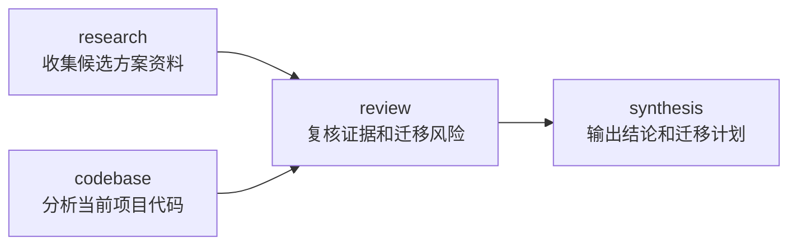

## **Hermes Kanban** 能力封装：单 **Profile**（基础篇）

### 一、前言

[《**Hermes Kanban** 多 **Agent** 编排机制》](<../../03、AI 框架相关/Hermes/05、Hermes Kanban 多 Agent 编排机制.md>) 已经说明了 **Task**、**Profile**、**Worker Process**、**Dispatcher**、**Board** 和 **Task Graph** 如何组成后台任务系统

机制层解决的是：

> **Hermes** 如何持久化、调度和执行后台任务

开发者还需要解决另一个问题：

> 如何把通用的 **Kanban** 创建能力，封装成随 **Profile** 交付的业务能力

在默认调用路径中，用户提出任务后，**LLM** 可以直接决定是否调用内置 `kanban_create`：

```text
用户提出任务
  -> LLM 判断是否调用 kanban_create
  -> LLM 生成 Task 内容、执行 Profile、Workspace 和依赖关系
  -> kanban_create 把 Task 写入 Board
```

这种方式适合开放式任务：任务数量、执行身份和依赖关系都需要由 **LLM** 根据当前上下文动态决定

但当某项业务已经具有稳定规则时，开发者可以把规则固化到脚本中：

```text
用户提出业务目标
  -> LLM 判断是否调用这项能力
  -> Skill 或 MCP Tool 接收业务输入
  -> 开发者代码生成固定的 Kanban 参数
  -> Hermes 把 Task 写入 Board
```

这条路径没有取消 **LLM** 的语义判断，也没有重新实现 **Kanban**

它只是重新划分了控制权：

- **LLM** 判断用户是否需要这项业务能力
- **Skill** 或 **MCP Tool** 描述能力的触发语义和业务输入
- 脚本固定执行 **Profile**、工作空间、超时、依赖和幂等规则
- **Hermes Kanban** 负责持久化、调度和后台生命周期

### 二、相关语法与技术概念

#### 2.1、调用链中的四个角色

单 **Profile** 中的完整调用链包含四个角色：

| 角色 | 负责什么 | 不负责什么 |
|:---|:---|:---|
| **LLM** | 理解用户意图，判断是否调用后台任务能力 | 不负责保证底层参数始终符合业务规则 |
| **Skill / MCP Tool** | 向模型说明能力语义、输入和调用方法 | 不负责调度 **Task** |
| 业务脚本 | 校验输入，固定任务内容、依赖和运行参数 | 不负责后台生命周期 |
| **Hermes Kanban Runtime** | 持久化、依赖推进、领取、执行和重试 | 不理解业务规则为何这样设计 |

对应的控制流是：

```text
语义控制
  LLM -> 是否调用

业务控制
  Script -> 调用后创建什么

运行时控制
  Kanban Runtime -> 创建后如何执行
```

这三个控制层不能混为一谈

脚本能够保证“调用发生后怎样创建”，但不能保证 **LLM** 一定触发调用

#### 2.2、`kanban create` 的输入和返回

最轻量的写入入口是 **Hermes CLI**：

```bash
hermes kanban --board engineering create "调研向量数据库" \
  --body "比较三个候选方案并输出适用边界" \
  --assignee technology-agent \
  --workspace scratch \
  --tenant engineering \
  --priority 10 \
  --idempotency-key assessment:req-001:research \
  --max-runtime 30m \
  --json
```

常用参数可以分成三组：

| 参数 | 表达什么 | 应由谁控制 |
|:---|:---|:---|
| `title`、`body` | **Task** 要完成什么 | 业务输入与脚本模板共同生成 |
| `assignee`、`workspace`、`tenant` | 谁执行、在哪里执行、属于哪个业务范围 | 开发者代码 |
| `parent`、`priority`、`max-runtime`、`idempotency-key` | 依赖、调度和重试边界 | 开发者代码 |

`--json` 返回创建后的完整 **Task**

脚本至少需要读取：

```json
{
  "id": "t_47661df3",
  "status": "ready"
}
```

其中 `task_id` 有两个用途：

- 返回给调用方，用于查询和订阅任务
- 作为后继任务的 `--parent`，建立物理依赖

创建成功只表示 **Task** 已经写入 **Board**

它不表示 **Dispatcher** 已经领取任务，也不表示业务工作已经完成

#### 2.3、两种随 **Profile** 交付的封装方式

**Profile Distribution** 默认可以交付 `skills/` 和 `mcp.json`，二者对应两种模型可见入口

| 方式 | 模型看到什么 | 业务代码在哪里 | 适合什么阶段 |
|:---|:---|:---|:---|
| **Skill + Script** | **Skill** 的名称、描述和操作说明 | **Skill** 自带的 `scripts/` | 规则简单、希望最低成本形成闭环 |
| **MCP Tool** | 结构化工具名、说明和参数 **Schema** | 本地或远程 **MCP Server** | 需要一等工具接口、强参数约束或跨 **Agent** 复用 |

两种方式的业务语义可以相同：

```text
create_technology_assessment(
  topic,
  repository_path,
  request_id
)
```

差异主要在模型如何调用：

```text
Skill + Script
  LLM -> 读取 Skill -> 调用 terminal -> 执行脚本

MCP Tool
  LLM -> 选择 MCP Tool -> 结构化参数调用 -> MCP Handler
```

对于当前单 **Profile** 场景，先使用 **Skill + Script**

当终端调用开始成为边界问题时，再把同一个业务函数暴露成 **MCP Tool**，不需要同时维护两套任务创建规则

### 三、最小闭环：创建一张后台 **Task**

先只解决一个问题：

> 开发者提供一个技术主题，脚本固定执行身份和运行参数，然后创建一张后台任务

目录只有一个脚本：

```text
scripts/
└── enqueue_research.py
```

`scripts/enqueue_research.py`：

```python
"""通过 Hermes CLI 创建一张受业务规则控制的后台研究任务"""

from __future__ import annotations

import argparse
import hashlib
import json
import subprocess
from dataclasses import dataclass
from typing import Any


@dataclass(frozen=True)
class ResearchRequest:
    """调用方能够提交的最小业务请求"""

    topic: str
    request_id: str


@dataclass(frozen=True)
class CreatedTask:
    """调用方真正需要的任务创建结果"""

    task_id: str
    status: str


class KanbanCliError(RuntimeError):
    """Hermes CLI 调用失败或返回了非法结果"""


def _normalise_request(topic: object, request_id: object) -> ResearchRequest:
    """在产生任何 Board 写入前校验业务输入"""

    clean_topic = str(topic or "").strip()
    clean_request_id = str(request_id or "").strip()
    if not clean_topic:
        raise ValueError("topic is required")
    if not clean_request_id:
        raise ValueError("request_id is required")
    return ResearchRequest(topic=clean_topic, request_id=clean_request_id)


def _idempotency_key(request: ResearchRequest) -> str:
    """把稳定业务请求身份转换成 Kanban 幂等键"""

    # request_id 来自业务系统或调用上下文，不由 LLM 临时生成
    source = f"{request.request_id}:{request.topic}"
    digest = hashlib.sha256(source.encode("utf-8")).hexdigest()[:16]
    return f"technology-research:v1:{digest}"


def enqueue_research(
    request: ResearchRequest,
    *,
    runner: Any = subprocess.run,
) -> CreatedTask:
    """固定执行规则，通过 Hermes CLI 创建后台 Task"""

    # 模型只提供 topic 和 request_id
    # assignee、workspace、tenant、priority 和 timeout 全部由代码固定
    command = [
        "hermes",
        "kanban",
        "--board",
        "engineering",
        "create",
        f"技术调研：{request.topic}",
        "--body",
        (
            f"调研主题：{request.topic}\n\n"
            "优先使用官方文档和官方仓库，输出关键结论、适用边界、"
            "证据链接和仍需验证的风险"
        ),
        "--assignee",
        "technology-agent",
        "--workspace",
        "scratch",
        "--tenant",
        "engineering",
        "--priority",
        "10",
        "--idempotency-key",
        _idempotency_key(request),
        "--max-runtime",
        "30m",
        "--json",
    ]

    completed = runner(
        command,
        capture_output=True,
        text=True,
        check=False,
    )
    if completed.returncode != 0:
        # stderr 用于排障，业务层统一转换成领域异常
        message = completed.stderr.strip() or "hermes kanban create failed"
        raise KanbanCliError(message)

    try:
        payload = json.loads(completed.stdout)
    except json.JSONDecodeError as exc:
        raise KanbanCliError("Hermes CLI returned invalid JSON") from exc

    task_id = str(payload.get("id") or "").strip()
    if not task_id:
        raise KanbanCliError("Hermes CLI returned no task id")

    return CreatedTask(
        task_id=task_id,
        status=str(payload.get("status") or "unknown"),
    )


def main() -> int:
    """把普通函数暴露成可以从终端调用的脚本"""

    parser = argparse.ArgumentParser()
    parser.add_argument("topic")
    parser.add_argument("--request-id", required=True)
    args = parser.parse_args()

    request = _normalise_request(args.topic, args.request_id)
    created = enqueue_research(request)
    print(
        json.dumps(
            {
                "ok": True,
                "task_id": created.task_id,
                "status": created.status,
            },
            ensure_ascii=False,
        )
    )
    return 0


if __name__ == "__main__":
    raise SystemExit(main())
```

运行：

```bash
python scripts/enqueue_research.py \
  "三个主流向量数据库的适用边界" \
  --request-id req-2026-001
```

输出：

```json
{
  "ok": true,
  "task_id": "t_47661df3",
  "status": "ready"
}
```

这个最小例子已经形成完整闭环：

```text
ResearchRequest
  -> 输入校验
  -> 固定执行规则
  -> Hermes CLI
  -> CreatedTask
```

### 四、固定拓扑：在同一个脚本中创建多张 **Task**

单 **Profile** 不等于一次只能创建一张任务

假设“技术方案调研与迁移计划”需要四张 **Task**：



四张任务都交给同一个 `technology-agent`，区别只在任务内容、工作空间和父任务

这种固定拓扑可以继续写在一个脚本中：

```python
"""创建固定的技术评估任务图"""

from __future__ import annotations

import json
import subprocess
from pathlib import Path
from typing import Any


class KanbanCliError(RuntimeError):
    """任务创建失败或 Hermes 返回非法结果"""


def _create_task(
    *,
    title: str,
    body: str,
    request_id: str,
    node_key: str,
    workspace: str = "scratch",
    parents: tuple[str, ...] = (),
    runner: Any = subprocess.run,
) -> str:
    """创建一张 Task，并返回后继任务需要使用的 task_id"""

    command = [
        "hermes",
        "kanban",
        "--board",
        "engineering",
        "create",
        title,
        "--body",
        body,
        "--assignee",
        "technology-agent",
        "--workspace",
        workspace,
        "--tenant",
        "engineering",
        "--idempotency-key",
        f"technology-assessment:v1:{request_id}:{node_key}",
        "--max-runtime",
        "30m",
        "--json",
    ]

    # Hermes 使用可重复的 --parent 表达多个父任务
    for parent_id in parents:
        command.extend(["--parent", parent_id])

    completed = runner(
        command,
        capture_output=True,
        text=True,
        check=False,
    )
    if completed.returncode != 0:
        raise KanbanCliError(
            completed.stderr.strip() or f"failed to create {node_key}"
        )

    try:
        payload = json.loads(completed.stdout)
    except json.JSONDecodeError as exc:
        raise KanbanCliError("Hermes CLI returned invalid JSON") from exc

    task_id = str(payload.get("id") or "").strip()
    if not task_id:
        raise KanbanCliError(f"Hermes returned no task id for {node_key}")
    return task_id


def enqueue_assessment(
    *,
    topic: str,
    repository_path: str,
    request_id: str,
) -> dict[str, str]:
    """按照固定拓扑创建四张相互依赖的后台 Task"""

    clean_topic = topic.strip()
    clean_request_id = request_id.strip()
    repository = Path(repository_path).expanduser().resolve()

    # 所有输入先校验，再执行第一次 Board 写入
    if not clean_topic:
        raise ValueError("topic is required")
    if not clean_request_id:
        raise ValueError("request_id is required")
    if not repository.is_dir():
        raise ValueError("repository_path must be an existing directory")

    task_ids: dict[str, str] = {}

    # 两张入口任务没有父任务，可以独立进入 ready
    task_ids["research"] = _create_task(
        title=f"调研候选方案：{clean_topic}",
        body="查阅一手资料，输出能力差异、适用边界和证据链接",
        request_id=clean_request_id,
        node_key="research",
    )
    task_ids["codebase"] = _create_task(
        title="分析当前项目的接入点和迁移范围",
        body=f"读取项目 {repository}，分析依赖、调用入口和迁移影响",
        request_id=clean_request_id,
        node_key="codebase",
        workspace=f"dir:{repository}",
    )

    # review 依赖两张入口任务，创建时写入真实父任务 task_id
    task_ids["review"] = _create_task(
        title="复核技术结论和迁移风险",
        body="读取父任务结果，检查证据缺口、兼容性风险和未经验证的假设",
        request_id=clean_request_id,
        node_key="review",
        parents=(
            task_ids["research"],
            task_ids["codebase"],
        ),
    )

    # synthesis 只有在 review 完成后才具备执行资格
    task_ids["synthesis"] = _create_task(
        title="生成技术选型结论和迁移计划",
        body="基于已复核材料，输出推荐方案、迁移步骤、验证门禁和回滚条件",
        request_id=clean_request_id,
        node_key="synthesis",
        workspace=f"dir:{repository}",
        parents=(task_ids["review"],),
    )

    return task_ids


def main() -> int:
    """把固定任务图能力暴露成 Skill 可以调用的命令入口"""

    import argparse

    parser = argparse.ArgumentParser()
    parser.add_argument("--topic", required=True)
    parser.add_argument("--repository", required=True)
    parser.add_argument("--request-id", required=True)
    args = parser.parse_args()

    task_ids = enqueue_assessment(
        topic=args.topic,
        repository_path=args.repository,
        request_id=args.request_id,
    )
    print(
        json.dumps(
            {
                "ok": True,
                "task_ids": task_ids,
                "final_task_id": task_ids["synthesis"],
            },
            ensure_ascii=False,
        )
    )
    return 0


if __name__ == "__main__":
    raise SystemExit(main())
```

这里没有额外引入完整领域模型

脚本只做四件事：

- 校验业务输入
- 按依赖顺序创建任务
- 把逻辑节点转换成真实 `task_id`
- 为每个节点生成稳定幂等键

对于固定且规模很小的任务拓扑，这已经足够

需要注意的是，连续创建四张 **Task** 不是一个跨调用事务

如果第三张任务创建失败，前两张任务仍然存在；重试时依靠相同的 `idempotency_key` 复用已有任务，并继续补齐后续节点

运行：

```bash
python scripts/enqueue_assessment.py \
  --topic "比较 Qdrant、Milvus 和 Weaviate" \
  --repository /absolute/path/to/project \
  --request-id assessment-2026-001
```

### 五、通过 **Skill + Script** 交付能力

完成脚本后，再用 **Skill** 向 **LLM** 说明什么时候调用、需要收集什么输入以及如何执行

**Profile Distribution** 中可以这样组织：

```text
technology-agent/
├── distribution.yaml
└── skills/
    └── kanban-assessment/
        ├── SKILL.md
        └── scripts/
            └── enqueue_assessment.py
```

`skills/kanban-assessment/SKILL.md`：

```markdown
---
name: kanban-assessment
description: >
  当用户需要把技术调研、代码分析、风险复核和迁移计划放到后台执行时，
  创建一组具有固定依赖关系的 Hermes Kanban Task
version: 1.0.0
metadata:
  hermes:
    tags: [kanban, technology-assessment]
    category: engineering
    requires_toolsets: [terminal]
---

## When to Use

用户明确要求后台完成技术选型、技术调研或迁移评估时使用

普通即时问答、只需要一个简短结论或用户明确要求当前会话直接完成时不要使用

## Required Input

- 技术主题
- 已授权项目的绝对路径
- 稳定的 request_id

## Procedure

1. 确认项目路径已经获得用户授权
2. 不要允许用户覆盖 assignee、tenant、parents 或 timeout
3. 执行下面的脚本：

   python "$HERMES_HOME/skills/kanban-assessment/scripts/enqueue_assessment.py" \
     --topic "<topic>" \
     --repository "<absolute-path>" \
     --request-id "<stable-request-id>"

4. 解析脚本输出的 task_ids
5. 明确告知用户任务已经写入 Board，但后台工作尚未完成

## Verification

对返回的 synthesis task_id 执行：

hermes kanban --board engineering show <task_id>
```

这条链路中，**Skill** 与脚本各自承担不同责任：

```text
Skill
  -> 让 LLM 理解适用场景和调用方法

Script
  -> 固定调用发生后的执行规则
```

**Skill** 不应重新复制整段脚本逻辑，脚本也不需要理解自然语言意图

### 六、什么时候升级为 **MCP Tool**

当下面的问题开始出现时，可以把 `enqueue_assessment()` 暴露为 **MCP Tool**：

- 希望模型直接看到明确的工具名称和参数 **Schema**
- 不希望调用链依赖终端命令拼装
- 多个 **Profile** 或其他 **MCP Client** 需要复用同一能力
- 需要独立管理工具进程、权限和可观测性

升级后，控制链变成：

```text
用户请求
  -> LLM 选择 mcp_kanban_assessment_create_assessment
  -> MCP Schema 校验业务输入
  -> MCP Handler 调用 enqueue_assessment()
  -> 脚本核心调用 Hermes Kanban
```

**MCP Handler** 只需要做薄封装：

```python
"""把已有业务函数暴露为 MCP Tool 的示意代码"""

from mcp.server.fastmcp import FastMCP

from enqueue_assessment import enqueue_assessment


mcp = FastMCP("kanban-assessment")


@mcp.tool()
def create_assessment(
    topic: str,
    repository_path: str,
    request_id: str,
) -> dict[str, str]:
    """创建技术调研、代码分析、风险复核和迁移计划任务"""

    # MCP 层只负责结构化入口，任务规则仍由原业务函数维护
    return enqueue_assessment(
        topic=topic,
        repository_path=repository_path,
        request_id=request_id,
    )


if __name__ == "__main__":
    mcp.run()
```

**Profile Distribution** 可以交付 `mcp.json` 中的连接声明，**Hermes** 启动时会发现并注册 **MCP Server** 暴露的工具

但 `mcp.json` 只解决连接配置的分发，目标环境仍然必须能够启动对应的 **MCP Server**，包括代码、依赖和凭据

因此，当前阶段不应仅为了获得一个工具名称，就提前增加 **MCP Server** 的安装和运行成本

选择边界可以压缩为：

```text
调用语义简单，单 Profile 使用
  -> Skill + Script

需要结构化 Tool Schema 或跨入口复用
  -> MCP Tool
```

### 七、运行与验证边界

#### 7.1、创建前

- 目标 **Board** 已存在
- `technology-agent` 是真实可启动的 **Profile**
- 项目路径位于允许访问的目录
- `request_id` 来自稳定调用上下文

#### 7.2、创建后

查看任务：

```bash
hermes kanban --board engineering show <task_id>
```

启动承载 **Dispatcher** 的 **Gateway**：

```bash
hermes gateway start
```

固定拓扑创建后的状态通常是：

```text
research: ready / running
codebase: ready / running
review: todo
synthesis: todo
```

两个入口任务完成后，`review` 才会进入 `ready`

`review` 完成后，`synthesis` 才会进入 `ready`

#### 7.3、测试什么

不需要用真实 **LLM** 验证脚本的确定性

脚本测试应覆盖：

- 非法输入是否在第一次 **Board** 写入前失败
- 每张任务是否使用固定 **Profile** 和工作空间
- 父任务的真实 `task_id` 是否正确传给后继任务
- 相同 `request_id` 重试时是否使用相同幂等键
- **CLI** 返回失败或非法 **JSON** 时是否产生稳定错误

**LLM** 触发是否准确属于另一层评估：

```text
脚本测试
  -> 调用发生后是否确定执行

Tool Selection Evaluation
  -> LLM 是否在正确场景触发调用
```

### 八、何时需要更完整的任务图设计

继续在一个脚本中创建任务不是永远正确

当出现下面的工程压力时，才值得引入独立的任务计划、策略、写入适配器和业务服务：

- 任务图由输入动态生成，不再是固定的四张任务
- 多个业务入口需要复用同一套任务图规则
- 需要在第一次写入前验证复杂依赖和环路
- 需要集中处理部分失败、恢复和版本化幂等
- 需要替换底层调用方式，而不修改业务规则

这些问题已经进入任务图编排层，详见 [《03、Kanban 进阶篇：任务图编排》](<./Hermes Kanban 能力封装：任务图编排（进阶篇）.md>)

### 九、最终心智模型

单 **Profile** 中封装 **Kanban** 能力，可以先记住下面这条链：

```text
LLM 判断是否调用
  -> Skill 或 MCP Tool 暴露业务入口
  -> Script 固定执行规则
  -> Hermes Kanban 持久化并调度 Task
```

最轻量的实现是：

```text
Skill + Script
  -> 一张或几张固定拓扑的 Task
```

**MCP Tool** 是结构化入口的升级，不是使用 **Kanban** 的前置条件

只有固定脚本开始承受动态任务图、多个入口和复杂恢复压力时，才进入更完整的任务图编排设计

### 十、参考资料

- [**Hermes Profile Distributions**](https://github.com/NousResearch/hermes-agent/blob/main/website/docs/user-guide/profile-distributions.md)
- [**Hermes Skills System**](https://github.com/NousResearch/hermes-agent/blob/main/website/docs/user-guide/features/skills.md)
- [**Hermes MCP**](https://github.com/NousResearch/hermes-agent/blob/main/website/docs/user-guide/features/mcp.md)
- [**Hermes Kanban**](https://github.com/NousResearch/hermes-agent/blob/main/website/docs/user-guide/features/kanban.md)
