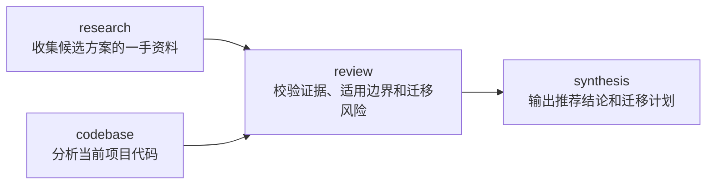

## **Hermes Kanban** 能力封装：任务图编排（进阶篇）

### 一、前言

[《02、Kanban 基础篇：单 Profile》](<./Hermes Kanban 能力封装：单 Profile（基础篇）.md>) 使用一个普通脚本创建一张或几张固定拓扑的后台 **Task**

当任务数量很少、拓扑固定、只有一个调用入口时，这种实现已经足够

复杂度并不来自“创建了多张任务”，而来自下面这些工程压力：

- 任务图需要根据业务输入动态生成
- 多个入口需要复用同一套任务规则
- 逻辑依赖必须在第一次写入前完成校验
- 部分任务写入成功后，需要安全重试并逐步收敛
- 底层调用载体可能变化，但业务规则不能随之复制
- 任务规划、写入和失败恢复需要分别测试

继续把这些责任集中在一个脚本函数中，会逐渐形成混层：

```text
业务输入校验
任务图规则
路径权限
Kanban 参数转换
拓扑排序
部分失败处理
入口参数解析
```

本文围绕“技术方案调研与迁移计划”建立一套可复用的任务图编排结构：

```text
Business Request
  -> Execution Policy
  -> Domain Plan
  -> Task Graph Writer
  -> Kanban Client
  -> Board
```

这套结构不是创建 **Kanban Task** 的必经路径

它面向的是固定脚本已经开始承受动态任务图、多个调用入口和可靠性压力的阶段

### 二、从固定脚本到共享业务核心

#### 2.1、从固定脚本到稳定业务能力

基础篇已经证明，普通脚本可以创建一张 **Task**，也可以创建一组固定拓扑的 **Task**

本文为“技术方案调研与迁移计划”增加更高的工程要求：

- 外部资料调研和当前代码分析并行执行
- 两项工作使用不同 **Workspace**
- 风险复核等待两项前置工作完成
- 最终文档等待复核通过
- 整组任务在中途失败后能够安全重试
- 调用方获得整张任务图，而不只是一个 `task_id`

这些要求同时出现后，继续把规则写在一个脚本函数里，会产生新的混层：

```text
业务输入校验
任务图规则
路径权限
CLI 参数拼装
部分失败处理
入口参数解析
```

因此需要把稳定业务核心独立出来：

```text
AssessmentRequest
  -> build_assessment_plan()：执行 Execution Policy
  -> AssessmentPlan / TaskSpec
  -> TaskGraphWriter
  -> KanbanClient
```

这套核心不关心外层由应用程序还是 **MCP Tool** 触发，底层写入统一交给 `KanbanClient`

#### 2.2、技术方案调研与迁移计划

本文统一使用下面的目标：

```text
调研三个候选技术库，结合当前代码评估迁移成本，输出推荐结论和迁移计划
```

开发者已经确定任务拓扑：



四个逻辑节点的执行策略如下：

| 节点 | **Profile** | **Workspace** | 前置依赖 |
|:---|:---|:---|:---|
| `research` | `research-profile` | `scratch` | 无 |
| `codebase` | `codebase-profile` | `dir:<repository_path>` | 无 |
| `review` | `reviewer-profile` | `scratch` | `research`、`codebase` |
| `synthesis` | `writer-profile` | `dir:<repository_path>` | `review` |

这里必须提前说明：普通父子依赖只识别 `review` 是否达到 `done`，不会理解复核结论是否为“通过”

当前完整例子使用“通过时完成、失败时阻塞”的 **Reviewer** 生命周期协议；如果业务要求代码级强门禁，应在验证结构化复核结果后再创建 `synthesis`，第七章会展开这条边界

这些 **Profile** 名称属于教学示例，运行前必须替换为当前环境中真实存在且权限匹配的 **Profile**

外部 **Harness** 只提交：

```json
{
  "goal": "比较三个向量数据库并输出迁移建议",
  "candidates": ["Qdrant", "Milvus", "Weaviate"],
  "repository_path": "/absolute/path/to/project",
  "request_id": "assessment-2026-001"
}
```

如果入口是 **MCP Tool**，`request_id` 不暴露给 **LLM**，而是由 **Handler** 根据规范化业务输入生成，或者从受信任的业务上下文取得

调用方不能覆盖：

```text
assignee
board
tenant
workspace_kind
parents
priority
max_runtime_seconds
idempotency_key
```

目录可以组织为：

```text
technology_assessment/
├── domain.py
├── policy.py
├── kanban.py
├── service.py
├── cli_entry.py
├── mcp_entry.py
└── tests/
    └── test_service.py
```

这里的目录只是示例组织方式，不是 **Hermes** 强制结构

真正的架构边界由模块责任决定：

| 模块 | 维护的真值 |
|:---|:---|
| `domain.py` | 业务请求、逻辑任务和创建结果是什么 |
| `policy.py` | 一次技术评估必须生成什么任务图 |
| `kanban.py` | 领域任务如何转换为 **Kanban** 调用 |
| `service.py` | 一次业务请求如何完成校验、规划和持久化 |
| `cli_entry.py` | 外部 **Harness** 如何触发业务服务 |
| `mcp_entry.py` | **LLM** 如何通过 **MCP Tool** 触发同一个服务 |

### 三、领域契约与执行策略

#### 3.1、定义载体无关的领域契约

`technology_assessment/domain.py`：

```python
"""技术评估能力的领域对象，不依赖具体调用入口"""

from __future__ import annotations

from dataclasses import dataclass


@dataclass(frozen=True)
class AssessmentRequest:
    """应用程序或 Tool Handler 都可以提交的业务请求"""

    goal: str
    candidates: tuple[str, ...]
    repository_path: str
    request_id: str


@dataclass(frozen=True)
class TaskSpec:
    """尚未写入 Kanban 的逻辑任务节点"""

    key: str
    title: str
    body: str
    assignee: str
    parent_keys: tuple[str, ...]
    workspace_kind: str
    workspace_path: str | None
    priority: int
    max_runtime_seconds: int
    idempotency_key: str


@dataclass(frozen=True)
class AssessmentPlan:
    """一次业务请求对应的完整逻辑任务图"""

    request_key: str
    tasks: tuple[TaskSpec, ...]


@dataclass(frozen=True)
class EnqueueResult:
    """业务入口需要返回的任务图标识"""

    request_key: str
    task_ids: dict[str, str]

    @property
    def entry_task_ids(self) -> tuple[str, str]:
        return (
            self.task_ids["research"],
            self.task_ids["codebase"],
        )

    @property
    def final_task_id(self) -> str:
        return self.task_ids["synthesis"]
```

`AssessmentRequest` 是业务输入，`TaskSpec` 是逻辑计划，`task_id` 是运行时结果

这三类对象不能合并成一个通用字典，否则调用者很容易越权修改运行时参数，代码也难以判断某个字段来自哪里

#### 3.2、用 **Policy** 构造 **Task Graph**

`technology_assessment/policy.py`：

```python
"""把技术评估请求转换成受约束的逻辑 Task Graph"""

from __future__ import annotations

import hashlib
import json
from pathlib import Path

from .domain import AssessmentPlan, AssessmentRequest, TaskSpec


POLICY_VERSION = "v1"


class PolicyValidationError(ValueError):
    """业务请求无法转换成合法任务图"""


def _normalise_candidates(values: object) -> tuple[str, ...]:
    """清理候选项并进行大小写无关去重"""

    if not isinstance(values, (list, tuple)):
        raise PolicyValidationError("candidates must be a list or tuple")

    candidates: list[str] = []
    seen: set[str] = set()
    for value in values:
        candidate = str(value or "").strip()
        if not candidate:
            continue
        identity = candidate.casefold()
        if identity in seen:
            continue
        seen.add(identity)
        candidates.append(candidate)

    if not 2 <= len(candidates) <= 5:
        raise PolicyValidationError(
            "candidates must contain 2 to 5 distinct non-empty values"
        )
    return tuple(candidates)


def _resolve_allowed_repository(
    value: object,
    *,
    allowed_roots: tuple[Path, ...],
) -> str:
    """只允许 Worker 进入开发者预先授权的项目目录"""

    raw_path = str(value or "").strip()
    path = Path(raw_path).expanduser()
    if not raw_path or not path.is_absolute():
        raise PolicyValidationError("repository_path must be an absolute path")
    if not path.is_dir():
        raise PolicyValidationError("repository_path must be an existing directory")

    resolved = path.resolve()
    resolved_roots = tuple(root.expanduser().resolve() for root in allowed_roots)
    if not any(
        resolved == root or resolved.is_relative_to(root)
        for root in resolved_roots
    ):
        raise PolicyValidationError(
            "repository_path is outside configured allowed roots"
        )
    return str(resolved)


def _request_key(request: AssessmentRequest) -> str:
    """把完整执行语义转换成稳定请求身份"""

    identity = json.dumps(
        {
            "request_id": request.request_id,
            "goal": request.goal,
            "candidates": request.candidates,
            "repository_path": request.repository_path,
            "policy_version": POLICY_VERSION,
        },
        ensure_ascii=False,
        sort_keys=True,
    )
    digest = hashlib.sha256(identity.encode("utf-8")).hexdigest()[:20]
    return f"technology-assessment:{POLICY_VERSION}:{digest}"


def build_assessment_plan(
    *,
    goal: object,
    candidates: object,
    repository_path: object,
    request_id: object,
    allowed_roots: tuple[Path, ...],
) -> AssessmentPlan:
    """校验业务输入并生成完整逻辑任务图"""

    clean_goal = str(goal or "").strip()
    clean_request_id = str(request_id or "").strip()
    if not clean_goal:
        raise PolicyValidationError("goal is required")
    if not clean_request_id:
        raise PolicyValidationError("request_id is required")

    request = AssessmentRequest(
        goal=clean_goal,
        candidates=_normalise_candidates(candidates),
        repository_path=_resolve_allowed_repository(
            repository_path,
            allowed_roots=allowed_roots,
        ),
        request_id=clean_request_id,
    )
    request_key = _request_key(request)
    candidate_text = "、".join(request.candidates)

    # Policy 只表达逻辑依赖，不要求调用方预先知道物理 task_id
    tasks = (
        TaskSpec(
            key="research",
            title=f"收集候选方案资料：{candidate_text}",
            body=(
                f"目标：{request.goal}\n\n"
                f"候选方案：{candidate_text}\n\n"
                "优先使用官方文档、官方仓库和一手技术资料，输出能力边界、"
                "版本状态、关键差异和来源链接"
            ),
            assignee="research-profile",
            parent_keys=(),
            workspace_kind="scratch",
            workspace_path=None,
            priority=20,
            max_runtime_seconds=2400,
            idempotency_key=f"{request_key}:research",
        ),
        TaskSpec(
            key="codebase",
            title="分析当前项目的接入点和迁移范围",
            body=(
                f"目标：{request.goal}\n\n"
                f"项目目录：{request.repository_path}\n\n"
                "读取当前代码，定位现有依赖、数据流、调用入口、测试覆盖和"
                "可能受迁移影响的模块，输出文件级证据"
            ),
            assignee="codebase-profile",
            parent_keys=(),
            workspace_kind="dir",
            workspace_path=request.repository_path,
            priority=20,
            max_runtime_seconds=2400,
            idempotency_key=f"{request_key}:codebase",
        ),
        TaskSpec(
            key="review",
            title="复核候选方案结论和迁移风险",
            body=(
                f"目标：{request.goal}\n\n"
                "读取父任务结果，检查证据缺口、兼容性风险和未经验证的假设\n\n"
                "只有复核通过时才能完成当前任务；如果证据不足或存在阻断风险，"
                "必须阻塞任务并写明缺口，不能以 done 表示复核失败"
            ),
            assignee="reviewer-profile",
            parent_keys=("research", "codebase"),
            workspace_kind="scratch",
            workspace_path=None,
            priority=15,
            max_runtime_seconds=1800,
            idempotency_key=f"{request_key}:review",
        ),
        TaskSpec(
            key="synthesis",
            title="生成技术选型结论和迁移计划",
            body=(
                f"目标：{request.goal}\n\n"
                f"候选方案：{candidate_text}\n\n"
                "只消费已经完成并通过复核的父任务结果，输出推荐方案、取舍依据、"
                "分阶段迁移步骤、验证门禁、回滚条件和剩余风险"
            ),
            assignee="writer-profile",
            parent_keys=("review",),
            workspace_kind="dir",
            workspace_path=request.repository_path,
            priority=10,
            max_runtime_seconds=1800,
            idempotency_key=f"{request_key}:synthesis",
        ),
    )

    return AssessmentPlan(request_key=request_key, tasks=tasks)
```

这段 **Policy** 固化了四类边界：

- 候选项数量和去重规则
- 项目目录必须位于开发者配置的允许根目录
- 执行 **Profile**、工作区、依赖和超时不能被调用方覆盖
- `request_id` 与 `POLICY_VERSION` 共同进入幂等身份

`tasks` 当前按阅读友好的依赖顺序书写，但这不应成为领域模型的隐藏前提

真正负责写入任务图的组件必须自行验证依赖并完成拓扑排序

### 四、任务图写入与调用适配

#### 4.1、用 **Kanban Adapter** 持久化 **Task Graph**

先定义底层调用契约，当前使用 **CLI** 实现 **Board** 写入

`technology_assessment/kanban.py`：

```python
"""把领域 TaskSpec 转换成 Hermes Kanban Task"""

from __future__ import annotations

import json
import subprocess
from collections.abc import Callable
from typing import Any, Protocol

from .domain import AssessmentPlan, TaskSpec


class KanbanDispatchError(RuntimeError):
    """领域任务无法通过 Kanban 持久化"""


class KanbanClient(Protocol):
    """不同调用载体共同遵守的最小 Kanban 契约"""

    def create_task(self, payload: dict[str, Any]) -> dict[str, Any]:
        ...


class HermesCliKanbanClient:
    """供 Application / Harness 使用的 CLI 实现"""

    def __init__(
        self,
        *,
        board: str,
        runner: Callable[..., Any] = subprocess.run,
    ) -> None:
        self._board = board
        self._runner = runner

    def create_task(self, payload: dict[str, Any]) -> dict[str, Any]:
        command = [
            "hermes",
            "kanban",
            "--board",
            self._board,
            "create",
            payload["title"],
            "--body",
            payload["body"],
            "--assignee",
            payload["assignee"],
            "--workspace",
            _workspace_flag(payload),
            "--tenant",
            payload["tenant"],
            "--priority",
            str(payload["priority"]),
            "--idempotency-key",
            payload["idempotency_key"],
            "--max-runtime",
            str(payload["max_runtime_seconds"]),
            "--json",
        ]
        # CLI 使用可重复的 --parent 参数表达多个父任务
        for parent_id in payload["parents"]:
            command.extend(["--parent", parent_id])

        completed = self._runner(
            command,
            capture_output=True,
            text=True,
            check=False,
        )
        if completed.returncode != 0:
            message = completed.stderr.strip() or "hermes kanban create failed"
            raise KanbanDispatchError(message)

        try:
            task = json.loads(completed.stdout)
        except json.JSONDecodeError as exc:
            raise KanbanDispatchError("Hermes CLI returned invalid JSON") from exc

        # CLI 返回完整 Task 对象，统一转换成业务层使用的字段
        return {
            "ok": True,
            "task_id": task.get("id"),
            "status": task.get("status"),
        }


def _workspace_flag(payload: dict[str, Any]) -> str:
    """把 Tool 风格的 Workspace 参数转换成 CLI 参数"""

    kind = payload["workspace_kind"]
    path = payload.get("workspace_path")
    if kind == "scratch":
        return "scratch"
    if kind in {"dir", "worktree"} and path:
        return f"{kind}:{path}"
    raise KanbanDispatchError(f"invalid workspace: {kind}")


class TaskGraphWriter:
    """验证逻辑依赖并按拓扑顺序写入整张任务图"""

    def __init__(self, *, client: KanbanClient, tenant: str) -> None:
        self._client = client
        self._tenant = tenant

    def _topological_order(self, tasks: tuple[TaskSpec, ...]) -> list[TaskSpec]:
        by_key = {task.key: task for task in tasks}
        if len(by_key) != len(tasks):
            raise KanbanDispatchError("task keys must be unique")

        # 在执行任何 Board 写入前验证所有父节点都存在
        for task in tasks:
            missing = [key for key in task.parent_keys if key not in by_key]
            if missing:
                raise KanbanDispatchError(
                    f"task {task.key} has unknown parents: {', '.join(missing)}"
                )

        ordered: list[TaskSpec] = []
        resolved: set[str] = set()
        pending = dict(by_key)

        while pending:
            # key 排序只用于得到稳定执行顺序，不改变依赖语义
            ready_keys = sorted(
                key
                for key, task in pending.items()
                if set(task.parent_keys) <= resolved
            )
            if not ready_keys:
                raise KanbanDispatchError("task graph contains a dependency cycle")

            for key in ready_keys:
                ordered.append(pending.pop(key))
                resolved.add(key)

        return ordered

    def _payload(
        self,
        spec: TaskSpec,
        *,
        parent_ids: list[str],
    ) -> dict[str, Any]:
        payload: dict[str, Any] = {
            "title": spec.title,
            "body": spec.body,
            "assignee": spec.assignee,
            "parents": parent_ids,
            "tenant": self._tenant,
            "priority": spec.priority,
            "workspace_kind": spec.workspace_kind,
            "idempotency_key": spec.idempotency_key,
            "max_runtime_seconds": spec.max_runtime_seconds,
        }
        if spec.workspace_path is not None:
            payload["workspace_path"] = spec.workspace_path
        return payload

    def create_plan(self, plan: AssessmentPlan) -> dict[str, str]:
        task_ids: dict[str, str] = {}

        for spec in self._topological_order(plan.tasks):
            parent_ids = [task_ids[key] for key in spec.parent_keys]
            result = self._client.create_task(
                self._payload(spec, parent_ids=parent_ids)
            )
            task_id = str(result.get("task_id") or "").strip()
            if not task_id:
                raise KanbanDispatchError(
                    f"create task returned no task_id for {spec.key}"
                )
            task_ids[spec.key] = task_id

        return task_ids
```

这层完成两次重要转换：

```text
逻辑依赖
  parent_keys = ("research", "codebase")
  -> parents = ["t_research", "t_codebase"]

调用载体
  CLI 参数
  或其他 Kanban Client 实现
  -> 统一 KanbanClient 结果
```

**Policy** 不需要知道 **CLI** 参数格式，也不需要感知外层是脚本还是 **MCP Tool**

`KanbanClient` 保留底层写入契约，未来替换调用载体时不需要修改 **Policy** 和 **TaskGraphWriter**

#### 4.2、用业务 **Service** 收口一次调用

`technology_assessment/service.py`：

```python
"""组织一次技术评估任务图的规划和写入"""

from __future__ import annotations

import hashlib
import json
from pathlib import Path

from .domain import EnqueueResult
from .kanban import TaskGraphWriter
from .policy import build_assessment_plan


class AssessmentService:
    """与脚本、MCP 等入口无关的应用服务"""

    def __init__(
        self,
        *,
        writer: TaskGraphWriter,
        allowed_roots: tuple[Path, ...],
    ) -> None:
        self._writer = writer
        self._allowed_roots = allowed_roots

    def enqueue(
        self,
        *,
        goal: object,
        candidates: object,
        repository_path: object,
        request_id: object,
    ) -> EnqueueResult:
        # 全部输入校验和 Plan 构造先完成，再产生任何 Board 写入
        plan = build_assessment_plan(
            goal=goal,
            candidates=candidates,
            repository_path=repository_path,
            request_id=request_id,
            allowed_roots=self._allowed_roots,
        )
        task_ids = self._writer.create_plan(plan)
        return EnqueueResult(
            request_key=plan.request_key,
            task_ids=task_ids,
        )
```

到这里，完整业务核心已经成立：

```text
AssessmentService
  -> Policy
  -> AssessmentPlan
  -> TaskGraphWriter
  -> KanbanClient
```

接下来只需要为 `AssessmentService.enqueue()` 接入需要的调用入口

### 五、入口适配

#### 5.1、接入 **Application / Harness**

如果触发条件已经由应用程序、**Webhook**、定时任务或状态机决定，就不需要先让 **LLM** 选择业务 **Tool**

`technology_assessment/cli_entry.py`：

```python
"""供外部 Application / Harness 调用的命令入口"""

from __future__ import annotations

import argparse
import json
from pathlib import Path

from .kanban import (
    HermesCliKanbanClient,
    KanbanDispatchError,
    TaskGraphWriter,
)
from .policy import PolicyValidationError
from .service import AssessmentService


def main() -> int:
    parser = argparse.ArgumentParser()
    parser.add_argument("--goal", required=True)
    parser.add_argument("--candidate", action="append", required=True)
    parser.add_argument("--repository", required=True)
    parser.add_argument("--request-id", required=True)
    args = parser.parse_args()

    # allowed_roots 是部署配置，不允许由本次请求覆盖
    service = AssessmentService(
        writer=TaskGraphWriter(
            client=HermesCliKanbanClient(board="engineering"),
            tenant="technology-assessment",
        ),
        allowed_roots=(Path("/absolute/path/to/allowed-projects"),),
    )
    try:
        result = service.enqueue(
            goal=args.goal,
            candidates=args.candidate,
            repository_path=args.repository,
            request_id=args.request_id,
        )
    except (PolicyValidationError, KanbanDispatchError) as exc:
        # Harness 也返回稳定 JSON，不把 traceback 当作调用契约
        print(
            json.dumps(
                {
                    "ok": False,
                    "error_type": type(exc).__name__,
                    "error": str(exc),
                },
                ensure_ascii=False,
            )
        )
        return 1

    print(
        json.dumps(
            {
                "ok": True,
                "request_key": result.request_key,
                "task_ids": result.task_ids,
                "entry_task_ids": result.entry_task_ids,
                "final_task_id": result.final_task_id,
            },
            ensure_ascii=False,
        )
    )
    return 0


if __name__ == "__main__":
    raise SystemExit(main())
```

调用链：

```text
Application / Harness
  -> cli_entry
  -> AssessmentService
  -> Hermes CLI
  -> Board
```

这种路径适合：

- 某类业务事件发生后必须创建任务图
- 上游已经有稳定 `request_id`
- 不需要模型再次理解自然语言
- 希望业务能力能够脱离 **Hermes Agent Loop** 单独测试

#### 5.2、接入 **LLM** 可见的 **MCP Tool**

如果仍然希望 **LLM** 负责理解用户意图和选择业务能力，可以把同一个 `AssessmentService` 暴露成 **MCP Tool**

`technology_assessment/mcp_entry.py`：

```python
"""把载体无关的 AssessmentService 暴露成 MCP Tool"""

from __future__ import annotations

from pathlib import Path

from mcp.server.fastmcp import FastMCP

from .kanban import HermesCliKanbanClient, TaskGraphWriter
from .service import AssessmentService


mcp = FastMCP("technology-assessment")


@mcp.tool()
def enqueue_technology_assessment(
    goal: str,
    candidates: list[str],
    repository_path: str,
) -> dict[str, object]:
    """创建经过复核的技术评估 Task Graph"""

    # MCP 层只建立结构化入口
    # Task Graph、执行 Profile、Workspace 和幂等规则仍由业务核心控制
    identity = json.dumps(
        {
            "goal": goal.strip(),
            "candidates": sorted(
                {
                    str(candidate).strip().casefold()
                    for candidate in candidates
                    if str(candidate).strip()
                }
            ),
            "repository_path": str(
                Path(repository_path).expanduser().resolve()
            ),
        },
        ensure_ascii=False,
        sort_keys=True,
    )
    request_id = "mcp:" + hashlib.sha256(
        identity.encode("utf-8")
    ).hexdigest()[:20]

    service = AssessmentService(
        writer=TaskGraphWriter(
            client=HermesCliKanbanClient(board="engineering"),
            tenant="technology-assessment",
        ),
        allowed_roots=(Path("/absolute/path/to/allowed-projects"),),
    )
    result = service.enqueue(
        goal=goal,
        candidates=candidates,
        repository_path=repository_path,
        request_id=request_id,
    )
    return {
        "ok": True,
        "request_key": result.request_key,
        "task_ids": result.task_ids,
        "entry_task_ids": result.entry_task_ids,
        "final_task_id": result.final_task_id,
    }


if __name__ == "__main__":
    mcp.run()
```

模型最终只看到结构化业务输入：

```text
enqueue_technology_assessment(
  goal,
  candidates,
  repository_path
)
```

它看不到也不能覆盖 `assignee`、`parents`、`tenant`、`priority` 和超时参数

调用链变成：

```text
用户请求
  -> LLM 选择 MCP Tool
  -> MCP Schema 校验业务输入
  -> Handler 调用 AssessmentService
  -> HermesCliKanbanClient 调用 Hermes CLI
  -> Board 持久化 Task Graph
```

**MCP Tool** 没有取代 **Agent**

**LLM** 仍然负责语义判断，**MCP Handler** 只把结构化业务输入交给同一套任务图编排核心

### 六、运行并观察完整任务图

先创建示例使用的 **Board**，同名 **Board** 已存在时不需要重复执行：

```bash
hermes kanban boards create engineering \
  --name "Engineering" \
  --description "Engineering background workflows" \
  --switch
```

确认以下教学用 **Profile** 已经存在，或者替换 `policy.py` 中的名称：

```text
research-profile
codebase-profile
reviewer-profile
writer-profile
```

#### 6.1、从 **Harness** 入口运行

```bash
python -m technology_assessment.cli_entry \
  --goal "比较三个向量数据库并输出可执行的迁移建议" \
  --candidate Qdrant \
  --candidate Milvus \
  --candidate Weaviate \
  --repository /absolute/path/to/allowed-projects/demo \
  --request-id assessment-2026-001
```

#### 6.2、从 **MCP Tool** 入口运行

先确保 **Profile** 已经配置并能够启动 `technology-assessment` 对应的 **MCP Server**

启动 **Hermes** 后，用户可以表达：

```text
比较 Qdrant、Milvus 和 Weaviate，结合已授权项目目录中的当前代码，
生成一份迁移建议，这项工作放到后台完成
```

**LLM** 选择 `enqueue_technology_assessment` 后，业务入口返回：

```json
{
  "ok": true,
  "request_key": "technology-assessment:v1:65a0c6f8c1d6dbe08171",
  "task_ids": {
    "research": "t_1a2b3c4d",
    "codebase": "t_2b3c4d5e",
    "review": "t_3c4d5e6f",
    "synthesis": "t_4d5e6f7a"
  },
  "entry_task_ids": ["t_1a2b3c4d", "t_2b3c4d5e"],
  "final_task_id": "t_4d5e6f7a"
}
```

所有标识都是教学示例值

查看任务列表：

```bash
hermes kanban --board engineering list
```

创建完成后的初始关系应当是：

```text
research: ready / running
codebase: ready / running
review: todo
synthesis: todo
```

`research` 和 `codebase` 没有未完成父任务，可以并行调度

两个父任务都到达 `done` 后，`review` 才会进入 `ready`

只有 `review` 以通过状态完成后，`synthesis` 才应该继续执行

### 七、复核门禁、安全与失败边界

#### 7.1、`done` 只表示完成，不天然表示业务通过

**Kanban Link** 表达的是执行依赖：

```text
所有父任务达到 done
  -> 子任务具备执行资格
```

它不会读取父任务结论并理解“通过”或“不通过”

当前示例采用下面的生命周期约定：

```text
复核通过
  -> reviewer 调用 complete
  -> review = done
  -> synthesis 可以进入 ready

复核不通过
  -> reviewer 调用 block
  -> review = blocked
  -> synthesis 继续等待
```

这属于 **Reviewer Profile** 必须遵守的任务协议

如果业务要求代码级强门禁，就不应提前创建 `synthesis`

更强的实现是：

```text
review 完成
  -> 外部 Harness 读取结构化 verdict
  -> verdict == pass 时才创建 synthesis
  -> verdict != pass 时保持阻断并请求补充材料
```

这种设计需要额外的事件消费或状态机，不应假装普通父子依赖已经提供了语义验收能力

#### 7.2、目录存在不等于调用方有权访问

`repository_path` 会成为 **Worker Process** 的真实读写目录

因此不能只校验：

```text
路径是绝对路径
目录存在
```

还需要校验：

- 路径位于部署配置的允许根目录
- 请求身份有权操作对应项目
- 目标 **Profile** 的工具权限与目录权限匹配
- `resolve()` 后的真实路径没有通过符号链接逃逸

本文代码完成了允许根目录校验，组织级身份授权仍需要由实际 **Application / Harness** 提供

#### 7.3、**MCP Server** 是独立执行边界

**MCP Server** 不在 **Hermes Runtime** 内部重新实现 **Kanban**

本文的 **MCP Handler** 仍然通过受控 **CLI** 调用 **Hermes**，因此需要明确：

- 目标环境能够启动 **MCP Server**
- **MCP Server** 进程拥有调用 **Hermes CLI** 的权限
- 只暴露业务需要的工具和字段
- 服务代码、依赖和凭据按照目标部署边界交付

如果 **MCP Server** 是远程服务，还需要单独处理认证、网络超时和服务可用性

### 八、幂等、部分失败与重试

创建一张 **Task** 是一次持久化写入，连续创建四张 **Task** 不是一个跨调用数据库事务

假设执行到第三个节点时失败：

```text
research: 已创建
codebase: 已创建
review: 创建失败
synthesis: 尚未创建
```

业务服务不能假装整组任务已经回滚，也不应该盲目重复创建前两个节点

示例为每个逻辑节点生成独立幂等键：

```text
technology-assessment:v1:<request-digest>:research
technology-assessment:v1:<request-digest>:codebase
technology-assessment:v1:<request-digest>:review
technology-assessment:v1:<request-digest>:synthesis
```

重试相同请求时：

```text
research -> 返回原 task_id
codebase -> 返回原 task_id
review -> 继续创建
synthesis -> 在 review 创建成功后继续创建
```

执行会逐步收敛到完整任务图

但幂等不等于无限期复用旧结果

当前请求身份由下面几项共同决定：

```text
request_id / runtime session identity
goal
candidates
repository_path
policy_version
```

其边界是：

- 相同业务请求与相同规则版本会复用未归档任务
- 业务目标或候选项变化会生成新请求身份
- **Policy** 发生不兼容变化时必须提升 `POLICY_VERSION`
- 已归档任务不再阻止同一幂等键创建新任务
- `request_id` 应由业务系统、调用 **Harness** 或受信任的 **Runtime Context** 提供，不应依赖 **LLM** 自由生成

常见失败需要分层处理：

| 失败位置 | 是否可能已经写入 **Board** | 处理方式 |
|:---|:---|:---|
| 业务输入或目录校验失败 | 否 | 返回 `validation_error` |
| 某次任务创建失败 | 是 | 保留相同 `request_id` 重试 |
| **Profile** 不存在或无法启动 | 是 | **Dispatcher** 记录失败并按策略重试或阻断 |
| **Gateway** 未运行 | 是 | `ready` 任务保留，等待 **Dispatcher** 恢复 |
| **Worker Process** 执行失败 | 是 | 由 **Run**、重试和阻断状态记录 |
| 用户放弃整组任务 | 是 | 显式取消或归档，不伪装成自动回滚 |

一次调用存在两个不同成功条件：

```text
创建成功：Task Graph 已经持久化
业务成功：必要 Worker 已经完成并产出通过验收的结果
```

同步入口只能确认前者，后者属于后台生命周期

### 九、测试确定性边界

业务核心测试不需要调用真实 **LLM**，也不需要启动真实 **Gateway**

`technology_assessment/tests/test_service.py`：

```python
"""验证载体无关的技术评估业务核心"""

from __future__ import annotations

from dataclasses import replace
from pathlib import Path

import pytest

from technology_assessment.kanban import (
    KanbanDispatchError,
    TaskGraphWriter,
)
from technology_assessment.domain import AssessmentPlan
from technology_assessment.policy import (
    PolicyValidationError,
    build_assessment_plan,
)


class FakeKanbanClient:
    def __init__(self) -> None:
        # calls 用于验证写入顺序和父任务映射
        self.calls: list[dict] = []
        # 使用 idempotency_key 模拟 Kanban 去重行为
        self.task_ids_by_key: dict[str, str] = {}

    def create_task(self, payload: dict) -> dict:
        self.calls.append(payload)
        key = payload["idempotency_key"]
        task_id = self.task_ids_by_key.setdefault(
            key,
            f"t_{len(self.task_ids_by_key) + 1}",
        )
        return {
            "ok": True,
            "task_id": task_id,
            "status": "ready" if not payload["parents"] else "todo",
        }


class FailOnceKanbanClient(FakeKanbanClient):
    """第一次创建 review 时失败，用于验证部分写入后的收敛重试"""

    def __init__(self) -> None:
        super().__init__()
        self.failed = False

    def create_task(self, payload: dict) -> dict:
        if payload["idempotency_key"].endswith(":review") and not self.failed:
            self.failed = True
            self.calls.append(payload)
            raise KanbanDispatchError("simulated review creation failure")
        return super().create_task(payload)


def test_policy_rejects_repository_outside_allowed_root(tmp_path: Path) -> None:
    allowed_root = tmp_path / "allowed"
    outside = tmp_path / "outside"
    allowed_root.mkdir()
    outside.mkdir()

    # 路径虽然存在，但没有进入部署允许范围，必须在 Board 写入前拒绝
    with pytest.raises(PolicyValidationError):
        build_assessment_plan(
            goal="compare vector databases",
            candidates=["Qdrant", "Milvus"],
            repository_path=str(outside),
            request_id="req-1",
            allowed_roots=(allowed_root,),
        )


def test_writer_creates_graph_and_reuses_idempotent_tasks(tmp_path: Path) -> None:
    repository = tmp_path / "project"
    repository.mkdir()
    plan = build_assessment_plan(
        goal="compare vector databases",
        candidates=["Qdrant", "Milvus", "Weaviate"],
        repository_path=str(repository),
        request_id="req-1",
        allowed_roots=(tmp_path,),
    )
    same_plan = build_assessment_plan(
        goal="compare vector databases",
        candidates=["Qdrant", "Milvus", "Weaviate"],
        repository_path=str(repository),
        request_id="req-1",
        allowed_roots=(tmp_path,),
    )
    # 相同输入必须生成完全相同的领域计划
    assert plan == same_plan

    client = FakeKanbanClient()
    writer = TaskGraphWriter(
        client=client,
        tenant="technology-assessment",
    )

    first = writer.create_plan(plan)
    second = writer.create_plan(plan)

    assert first == second
    assert set(first) == {"research", "codebase", "review", "synthesis"}

    # 只检查第一次执行的四次调用，第二次用于验证幂等复用
    first_run = client.calls[:4]
    research_id = first["research"]
    codebase_id = first["codebase"]
    review_id = first["review"]

    review_call = next(
        call for call in first_run if call["parents"] == [research_id, codebase_id]
    )
    synthesis_call = next(
        call for call in first_run if call["parents"] == [review_id]
    )

    assert review_call["tenant"] == "technology-assessment"
    assert synthesis_call["workspace_kind"] == "dir"
    assert synthesis_call["workspace_path"] == str(repository.resolve())
    assert {call["assignee"] for call in first_run} == {
        "research-profile",
        "codebase-profile",
        "reviewer-profile",
        "writer-profile",
    }


def test_partial_failure_converges_on_retry(tmp_path: Path) -> None:
    repository = tmp_path / "project"
    repository.mkdir()
    plan = build_assessment_plan(
        goal="compare vector databases",
        candidates=["Qdrant", "Milvus"],
        repository_path=str(repository),
        request_id="req-1",
        allowed_roots=(tmp_path,),
    )
    client = FailOnceKanbanClient()
    writer = TaskGraphWriter(
        client=client,
        tenant="technology-assessment",
    )

    with pytest.raises(KanbanDispatchError):
        writer.create_plan(plan)

    # 第二次执行复用已经创建的入口任务，并补齐后续节点
    recovered = writer.create_plan(plan)
    assert set(recovered) == {"research", "codebase", "review", "synthesis"}
    assert len(client.task_ids_by_key) == 4


def test_writer_rejects_dependency_cycle_before_writing(tmp_path: Path) -> None:
    repository = tmp_path / "project"
    repository.mkdir()
    plan = build_assessment_plan(
        goal="compare vector databases",
        candidates=["Qdrant", "Milvus"],
        repository_path=str(repository),
        request_id="req-1",
        allowed_roots=(tmp_path,),
    )

    by_key = {task.key: task for task in plan.tasks}
    cyclic_plan = AssessmentPlan(
        request_key=plan.request_key,
        tasks=(
            # research 依赖 synthesis，而后者又间接依赖 research，形成环
            replace(by_key["research"], parent_keys=("synthesis",)),
            by_key["codebase"],
            by_key["review"],
            by_key["synthesis"],
        ),
    )
    client = FakeKanbanClient()
    writer = TaskGraphWriter(
        client=client,
        tenant="technology-assessment",
    )

    with pytest.raises(KanbanDispatchError):
        writer.create_plan(cyclic_plan)

    # 依赖图非法时必须在第一次 Board 写入前失败
    assert client.calls == []
```

这组测试覆盖：

- 未授权目录是否在写入前被拒绝
- **Policy** 是否稳定生成同一任务图
- **Adapter** 是否自行处理拓扑顺序和逻辑依赖
- 逻辑父节点是否转换成真实 `task_id`
- **Tenant** 和 **Workspace** 是否由代码固定
- 相同请求重试时是否复用相同任务标识

完整验证体系应分成四层：

```text
Policy Unit Test
  -> 相同输入是否产生相同 Domain Plan

Adapter Contract Test
  -> TaskSpec 是否转换成正确 Kanban 参数

CLI / MCP Integration Test
  -> 当前 Hermes 版本的调用接口是否仍兼容

LLM Tool Selection Evaluation
  -> 应该调用时模型是否正确选择业务 Tool
```

前三层验证“调用发生后能否确定执行”，最后一层验证“模型是否正确触发”

### 十、一次请求如何穿过完整运行链

#### 10.1、**Application / Harness** 入口

```text
1. 外部业务事件产生稳定 request_id

2. Application 调用 AssessmentService

3. Policy 校验输入、目录权限并生成 AssessmentPlan

4. TaskGraphWriter 验证依赖并完成拓扑排序

5. HermesCliKanbanClient 调用 Hermes CLI

6. Board 持久化四张 Task 和父子依赖

7. Application 获得 request_key 和 task_id map

8. Dispatcher 领取 research 与 codebase

9. Runtime 启动对应 Profile 的 Worker Process

10. 两个父任务完成后，review 获得执行资格

11. review 通过并完成后，synthesis 获得执行资格

12. 最终 Worker 写回 Run Summary / Metadata / Artifact
```

#### 10.2、**LLM + MCP Tool** 入口

两条链只有前两步不同：

```text
1. 用户提出后台技术评估目标

2. LLM 读取 MCP Tool Schema，选择 enqueue_technology_assessment

3. MCP Handler 调用同一个 AssessmentService

4. 后续 Policy、Domain Plan、TaskGraphWriter 和 Runtime 链路保持一致
```

因此，代码中的稳定真值是：

```text
AssessmentService
Policy
AssessmentPlan
TaskSpec
TaskGraphWriter
```

**CLI** 和 **MCP Tool** 是两种消费入口，不应分别复制一套任务图规则

整条链路包含三种控制流：

| 控制流 | 起点 | 终点 |
|:---|:---|:---|
| 触发控制 | **LLM / Application** | 业务请求 |
| 策略控制 | `AssessmentService` | 固定 **Domain Plan** |
| 运行时控制 | **Task** 写入 **Board** | **Dispatcher** 启动 **Worker Process** |

### 十一、交付边界

能力封装和能力分发是两个问题

```text
封装问题
  -> 业务规则怎样进入 Policy、Domain Plan 和 Adapter

分发问题
  -> 代码、配置和依赖怎样到达目标运行环境
```

不同入口对应不同交付面：

| 入口 | 需要交付什么 |
|:---|:---|
| **Application / Harness** | 业务包、运行依赖、调用配置 |
| **Skill + Script** | **Skill**、脚本和调用说明 |

| **MCP Tool** | **MCP Server**、连接配置和服务凭据 |

**Profile Distribution** 是否携带连接配置、更新时如何保留本地设置、目标环境能否启动 **MCP Server**，都属于部署契约

它们需要针对目标版本单独验证，但不改变本文的领域封装模型

因此，本文不把某种分发方式写成使用 **Kanban** 的前置条件

### 十二、最终心智模型

开发者封装 **Kanban**，不是重新实现任务系统，也不是默认先开发一个 **MCP Server**

真正的工作是把通用运行时能力转换成受业务约束的领域能力：

```text
Invocation Entry
  -> 谁触发
     LLM / Application / Skill / User

Business Contract
  -> 调用方可以提交什么

Policy
  -> 哪些规则不可被调用方改变

Domain Plan
  -> 这次请求应该生成什么 Task Graph

Kanban Adapter
  -> 领域对象如何转换成 CLI 或 Runtime Tool 调用

Hermes Runtime
  -> Task 如何持久化、调度、重试和交接
```

基础篇完成的是：

```text
一个业务请求
  -> Skill + Script
  -> 一张或几张固定拓扑的受控后台 Task
```

本文完成的是：

```text
一个业务请求
  -> AssessmentPlan
  -> 一组受控 TaskSpec
  -> 一张可恢复的 Task Graph
  -> 多个 Profile 依赖执行
```

**MCP Tool** 在其中的位置是：

```text
当业务能力需要成为 LLM 可见的一等 Tool 时
  -> MCP Server 负责暴露结构化入口
```

它不会替代 **Policy**，也不是普通脚本和外部 **Harness** 的必需组件

最后需要记住的是控制权如何逐层转移：

```text
入口决定何时触发
契约决定能够提交什么
策略决定任务必须怎样组织
适配器决定如何写入 Kanban
运行时决定任务如何执行
```

记忆锚点：

> 业务规则独立于入口，运行能力交给 **Kanban**

### 十三、参考资料

- **Hermes Kanban**：<https://hermes-agent.nousresearch.com/docs/user-guide/features/kanban>
- **Hermes Kanban Tutorial**：<https://hermes-agent.nousresearch.com/docs/user-guide/features/kanban-tutorial>
- **Hermes MCP**：<https://hermes-agent.nousresearch.com/docs/user-guide/features/mcp>
