## 从业务机会到产品交付的完整链路

### 一、核心结论

产品研发不是一条独立发生的流程，而是“从业务机会到价值实现”这条端到端链路中的生产环节

完整链路由五条相互咬合的工作流组成：

```text
商业流程：判断客户和机会是否值得投入
产品流程：判断应该解决什么问题、沉淀什么产品能力
项目流程：管理范围、资源、进度、成本、风险与沟通
研发流程：完成设计、开发、测试与发布
交付流程：完成上线、验收、运营与价值兑现
```

==**业务方提供目标，销售与售前识别机会，产品确定产品边界，项目经理管理交付承诺，研发负责实现，交付与运营验证最终价值**==

> 教学示例：某企业客户希望建设内部知识问答系统，售前最先接收到的是“希望员工能够向公司文档提问”，但此时还无法确定问题是否真实、产品是否支持、需要多少定制、公司是否值得投入以及最终如何验收

以下流程以 **B2B** 或项目交付型企业为主要场景，标准化 **SaaS** 产品和内部产品可以裁剪商务签约、客户验收等节点

### 二、完整流程总览

```mermaid
flowchart LR
    A["客户线索 / 内部业务机会"] --> B["商机筛选"]
    B --> C["售前需求调研"]
    C --> D["业务问题与目标对齐"]
    D --> E["产品适配与解决方案设计"]
    E --> F{"存在高风险假设吗"}
    F -->|是| G["Prototype / POC"]
    F -->|否| H["BRD / 商业论证"]
    G --> H
    H --> I["报价、SOW 与合同边界"]
    I --> J{"Go / No-Go"}
    J -->|否| X["放弃、延后或重新定义"]
    J -->|是| K["正式立项与项目启动"]
    K --> L["PRD 与需求范围基线"]
    L --> M["项目计划与技术方案"]
    M --> N["MVP / 迭代研发"]
    N --> O["测试、UAT 与生产就绪评审"]
    O --> P["RC / Release / GA"]
    P --> Q["实施交付与业务验收"]
    Q --> R["运营、价值复盘与持续迭代"]
    R --> L
```



这不是严格的瀑布流程，**BRD** 会从售前调研阶段逐步形成，商务谈判、产品评估和技术可行性验证也可能并行推进

==每个阶段都必须回答三个问题：==

- ==当前要消除什么不确定性==
- ==谁拥有最终决策权==
- ==什么证据允许流程进入下一阶段==

### 三、各阶段由谁参与、产出什么

| 阶段 | 主要负责人 | 关键参与者 | 核心产出与决策 |
|---|---|---|---|
| 机会识别 | 业务方、销售 | 市场、客户成功 | 客户线索、内部机会、初步价值判断 |
| 商机筛选 | 销售 | 售前、产品负责人 | 客户需求、预算、决策人、时间窗口、产品匹配度 |
| 需求调研 | 售前 | 业务方、客户、产品 | 当前流程、业务问题、目标、用户、限制条件 |
| 产品与方案对齐 | 产品、售前 | 架构师、研发负责人、交付 | 标准能力、产品缺口、定制范围、解决方案 |
| 可行性验证 | 产品、技术负责人 | 售前、研发、数据、安全 | 原型、**POC** 结果、风险与成本判断 |
| 商业论证 | 业务负责人 | 产品、销售、财务、管理层 | **BRD**、收益目标、成本、优先级、投资依据 |
| 商务边界确认 | 销售 | 售前、产品、法务、交付 | 报价、**SOW**、合同、交付范围、排除项 |
| 立项决策 | 业务发起人 | 管理层、产品、项目经理、财务 | 预算、优先级、项目章程、负责人、授权关系 |
| 需求基线 | 产品经理 | 业务方、研发、测试、设计 | **PRD**、用户流程、验收标准、非功能要求 |
| 项目规划 | 项目经理 | 产品、技术负责人、测试、交付 | 里程碑、资源、依赖、风险、沟通与变更机制 |
| 研发执行 | 研发负责人 | 产品、研发、测试、设计 | **MVP**、迭代版本、测试证据、候选版本 |
| 上线验收 | 项目经理、业务方 | 测试、运维、安全、客户 | **UAT**、生产就绪评审、发布与回滚方案 |
| 发布交付 | 研发、运维、交付 | 产品、项目经理、业务方 | **RC**、**Release**、培训、迁移、上线记录 |
| 业务验收 | 业务方或客户 | 项目经理、销售、交付 | 验收报告、合同里程碑、回款或项目关闭 |
| 运营与价值复盘 | 产品、业务方 | 运营、客户成功、研发 | 业务指标、用户反馈、续约、迭代或退役决策 |

阶段顺序可以裁剪，但责任问题不能消失，例如没有专职项目经理时，仍然需要有人明确承担范围、进度、风险和沟通责任

### 四、关键角色的责任边界

#### 1. 业务方

业务方定义为什么做、要解决什么业务问题、预期产生什么价值，并承担预算、优先级和业务验收责任

业务方不能直接决定具体技术方案，也不能绕过产品和项目治理持续扩大范围

#### 2. 销售与售前

- **销售**负责客户关系、商业机会、报价、合同和商务承诺
- **售前**负责需求调研、解决方案、产品匹配和技术可行性协调

销售和售前不能在没有产品、研发与交付确认的情况下，独立承诺功能、工期和交付范围

#### 3. 产品经理

产品经理把业务问题转换为可复用的产品能力，决定：

- 哪些使用场景进入产品
- 哪些需求属于标准能力
- 哪些属于客户定制
- 哪些需求暂不支持
- 用什么指标验证产品价值

产品经理负责产品范围，但不能单独承诺资源和完成时间

#### 4. 项目经理

项目经理不负责定义产品价值，也不负责决定技术实现，而是把已经确认的目标转化为可执行的交付体系，包括：

- 范围与变更控制
- 里程碑与资源协调
- 风险、依赖和问题管理
- 跨团队沟通与决策升级
- 验收与项目关闭

#### 5. 研发负责人

研发负责人对技术可行性、架构方案、工作量评估、技术风险和工程质量负责

研发不能直接接受未经产品确认的业务需求，也不能独立改变已经基线化的业务范围

#### 6. 交付、运维与客户成功

- **交付**负责实施、迁移、培训和现场问题收敛
- **运维**负责生产环境、监控、故障响应和服务稳定性
- **客户成功**负责使用效果、续约风险和长期价值反馈

发布完成后，控制权会从研发主导逐步转向交付、运维和业务运营主导

### 五、关键文档是不同层面的交接契约

| 文档 | 回答的问题 | 主要负责人 | 主要消费者 |
|---|---|---|---|
| **BRD** | 为什么做、解决什么业务问题、创造什么价值 | 业务方、业务分析师、产品 | 管理层、产品、项目经理 |
| **Business Case** | 是否值得投资、成本收益是否合理 | 业务负责人、财务、管理层 | 立项决策者 |
| **SOW / 合同** | 对外承诺什么、不承诺什么、如何验收 | 销售、售前、法务、交付 | 客户、项目经理、交付团队 |
| 项目章程 | 谁授权、谁负责、预算和治理方式是什么 | 项目发起人、项目经理 | 项目团队、管理层 |
| **PRD** | 用户是谁、产品应该表现出什么行为 | 产品经理 | 设计、研发、测试 |
| 技术方案 | 系统如何实现、依赖什么、风险在哪里 | 架构师、研发负责人 | 研发、测试、运维 |
| 项目计划 | 谁在什么时间完成什么、如何控制风险 | 项目经理 | 全体项目干系人 |
| 验收标准 | 什么证据能够证明需求已经完成 | 业务方、产品、测试 | 研发、客户、项目经理 |
| 发布方案 | 如何上线、监控、降级和回滚 | 研发、测试、运维 | 项目经理、业务方、交付 |

最重要的边界是：

> **BRD** 是业务价值契约，**PRD** 是产品行为契约，**SOW** 是商业交付契约，技术方案是工程实现契约

以企业知识问答项目为例：

- **BRD** 描述员工查找知识耗时过长，以及期望降低的时间成本
- **PRD** 定义文档导入、提问、引用来源和反馈闭环
- **SOW** 确认服务部门、文档规模、交付范围和验收条件
- 技术方案定义索引、检索、生成、权限与监控如何实现

这些文档相互关联，但不能相互替代

### 六、项目管理控制的关键节点

项目经理通过一系列决策节点推动链路，而不是只在研发开始后跟踪排期：

```text
商机评审
→ 需求调研会
→ 产品适配评审
→ 方案与 POC 评审
→ Go / No-Go
→ 立项评审
→ 项目启动会
→ 需求评审与范围基线
→ 技术方案评审
→ 迭代计划与阶段演示
→ 变更控制
→ UAT
→ 生产就绪评审
→ 发布决策
→ 客户验收
→ 项目复盘与价值复盘
```

每个管理节点都应该明确：

- 谁拥有最终决策权
- 需要哪些输入证据
- 产出什么决议或基线
- 不通过时返回哪个阶段

没有退出条件的会议只是信息同步，不是项目管理节点

### 七、产品研发流程位于哪里

| 节点 | 所在阶段 | 验证对象 |
|---|---|---|
| **POC** | 产品适配或立项前的可行性阶段 | 技术与关键业务假设 |
| **MVP** | 立项后的产品研发阶段 | 用户价值和最小业务闭环 |
| **RC** | 研发完成后的发布验收阶段 | 是否达到正式发布标准 |
| **Release / GA** | 生产发布阶段 | 是否能安全、稳定地规模化交付 |
| 业务验收 | 发布或实施完成后 | 是否满足合同与业务目标 |
| 价值复盘 | 运行一段时间后 | 是否真正产生预期收益 |

需要特别区分：

> 发布成功不等于项目验收成功，项目验收成功也不等于业务价值已经实现

在企业知识问答项目中，系统成功上线只证明发布完成，客户签署验收单才表示交付完成，运行后员工查找时间确实下降才表示业务价值实现

具体的 **POC、MVP、Pilot / Beta、RC、Release** 研发链路，参见 [产品研发完整流程](./02、产品研发完整流程.md)

### 八、最终认知模型

外层业务交付链路是：

```text
商机
→ 售前
→ 业务论证
→ 立项
→ 产品定义
→ 项目治理
→ 产品研发
→ 交付验收
→ 价值实现
```

内层产品研发链路是：

```text
问题验证
→ POC
→ MVP
→ Pilot / Beta
→ 产品化加固
→ RC
→ Release
→ 持续运营
```

两者是嵌套关系，不是替代关系

> 业务流程决定为什么投入，产品流程决定做什么，项目流程保证协作与交付，研发流程负责实现，运营流程验证价值
