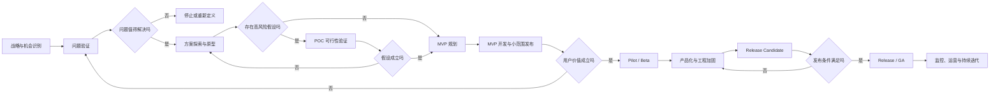

## 产品研发完整流程

### 一、核心结论

产品研发并不是简单的 `POC → MVP → Release` 三段流程，完整链路通常是：

```text
战略与机会识别
→ 问题验证
→ 方案探索
→ POC 可行性验证
→ MVP 价值验证
→ Pilot / Beta 规模化验证
→ Release Candidate 上线验证
→ Release / GA 正式发布
→ 运营、迭代与退役
```

三个核心版本分别回答不同问题：

- **POC**：技术或关键假设能不能成立
- **MVP**：真实用户是否需要，商业价值是否成立
- **Release**：产品能否稳定、安全、可持续地交付给目标市场

最容易出现的错误，是把 **POC** 当成第一版产品、把 **MVP** 当成低质量正式版，然后直接将 **MVP** 推向全面发布

### 二、完整流程总览



这是一个带有决策闸门的迭代流程，不是只能向前的瀑布流程，每个阶段都可能停止、回退或重新定义问题

### 三、各阶段的目标与产出

| 阶段 | 核心问题 | 主要工作 | 主要产出 | 退出条件 |
|---|---|---|---|---|
| 战略与机会识别 | 为什么要做 | 市场、公司战略、商业目标分析 | 产品愿景、目标指标、机会说明 | 与战略一致，值得投入探索 |
| 问题验证 | 问题真的存在吗 | 用户访谈、数据分析、场景调研 | 问题定义、目标用户、需求证据 | 问题真实、频繁且具有价值 |
| 方案探索 | 应该怎么解决 | 用户流程、原型、方案比较 | 原型、方案设计、假设清单 | 形成可验证方案 |
| **POC** | 关键假设能成立吗 | 技术实验、供应商测试、性能试验 | 实验程序、验证报告、技术结论 | 关键风险被证实或证伪 |
| **MVP** | 用户愿意使用吗 | 最小闭环开发、小范围投放 | 可用产品、行为数据、反馈 | 核心价值指标出现正向信号 |
| **Pilot / Beta** | 能否服务更多真实用户 | 试点客户、容量验证、流程磨合 | 试点报告、缺陷清单、支持流程 | 稳定性与运营条件基本满足 |
| 产品化加固 | 能否可靠地长期运行 | 安全、性能、监控、容灾、合规 | 生产级系统与运营能力 | 非功能性要求达标 |
| **Release Candidate** | 是否已具备发布条件 | 全量回归、验收、发布演练 | 候选版本、发布与回滚方案 | 发布检查全部通过 |
| **Release / GA** | 能否正式推向市场 | 灰度发布、监控、营销与支持 | 正式版本、发布公告、运营数据 | 正式稳定运行 |
| 持续运营 | 是否持续创造价值 | 指标分析、迭代、故障治理 | 新版本、优化计划、退役计划 | 进入下一轮产品循环 |

### 四、**POC**：验证“可不可行”

#### 1. **POC** 验证什么

**POC**，即 **Proof of Concept**，用来隔离并验证最大的不确定性，例如：

- 某个 **AI 模型**能否达到所需准确率
- 某个数据库能否支撑预计吞吐量
- 第三方接口或关键算法能否满足交易与延迟要求
- 某种业务规则或人工流程能否实际运转

#### 2. **POC** 的特征

- 验证范围非常窄
- 可以使用假数据、**Mock**、手动流程
- 通常不服务真实的大规模用户
- 不要求具备完整的安全、监控和容灾能力，程序代码也不保证进入正式产品

#### 3. **POC** 的正确产出

**POC** 最重要的不是演示，而是有证据的决策：

```text
假设：模型准确率可以达到 90%
测试条件：10,000 条标注数据
结果：准确率 86%，P95 延迟 1.8 秒
结论：准确率不达标，但可通过人工复核满足业务要求
决策：允许进入 MVP，但 MVP 必须包含人工复核流程
```

#### 4. **POC** 退出决策

- **通过**：进入产品化设计或 **MVP**
- **部分通过**：缩小范围，增加补偿机制
- **不通过**：更换方案、重新实验或停止项目

**POC** 不应因为“已经写了很多程序代码”而被强行转成正式产品

### 五、**MVP**：验证“有没有价值”

#### 1. **MVP** 的真正含义

**MVP**，即 **Minimum Viable Product**，不是功能最少的演示，而是：

> 能让特定用户完成一个完整核心任务，并产生可观察价值的最小产品

例如，一个企业知识问答产品的 **MVP**，最小闭环可能是：

```text
管理员导入文档
→ 系统建立索引
→ 员工提出问题
→ 系统返回带来源的回答
→ 收集回答是否有用
```

可以暂时没有高级权限、复杂报表与完整管理后台，但不能缺少核心任务闭环

#### 2. **MVP** 必须具备的基本能力

即使是最小版本，也通常需要：

- 真实用户可操作的产品界面
- 核心业务流程能够端到端完成
- 基本权限、安全与数据保护
- 基本错误处理、监控与问题追踪
- 用户行为与核心指标埋点
- 明确的使用范围与风险说明

#### 3. **MVP** 验证指标

指标应在开发前定义，例如：

- 激活率
- 核心任务完成率与使用频率
- 次日或周期留存率
- 付费意愿或转化率
- 节省时间、降低成本、提高收入或持续使用的程度

没有预先定义成功指标的 **MVP**，往往只是在发布功能，没有真正进行价值验证

#### 4. **MVP** 退出决策

- **价值成立**：进入试点与产品化加固
- **部分成立**：调整目标用户、场景或价值主张
- **价值不成立**：停止投入或重新回到问题验证

### 六、**Pilot / Beta**：验证“能不能扩大”

**MVP** 成功不代表可以立即全面发布，还需要验证产品在更多真实用户和真实流程下的表现

#### 1. **Pilot**

通常面向少量指定客户或内部部门，主要验证：

- 是否能嵌入真实业务流程
- 用户培训和导入成本
- 权限、数据、组织流程与支持体系是否合理
- 客户是否愿意续用或付费

#### 2. **Beta**

通常面向更大但仍受控的用户群体，主要验证：

- 系统稳定性与边界场景
- 兼容性、容量与性能
- 用户自助能力与运营负载

这一阶段可以使用邀请制、白名单、功能开关和限量配额控制风险

### 七、产品化加固：从“能用”变成“可交付”

**POC** 和 **MVP** 主要验证假设，正式发布则需要完整的工程和运营能力

#### 1. 功能完整性

- 核心流程与异常流程
- 权限、角色与数据隔离
- 数据迁移、通知、审计与管理能力
- 用户引导与错误处理

#### 2. 非功能性要求

- 性能与容量
- 可用性与容灾
- 安全、隐私、合规与审计
- 可观测性与可维护性
- 兼容性、无障碍与国际化

#### 3. 运营能力

- 监控告警
- 客服、工单与故障应急流程
- 数据备份与恢复
- 服务等级目标
- 使用文档、内部培训与计费授权流程

### 八、**Release Candidate**：验证“能不能安全发布”

**Release Candidate**，简称 **RC**，是准备正式发布的候选版本

典型发布闸门包括：

- 产品验收、自动化测试和全量回归通过
- 性能、容量、安全与权限审查通过
- 数据迁移与发布步骤演练完成
- 监控与告警已配置
- 回滚方案已验证
- 已知问题已评估并被接受
- 客服、运营、销售和文档已准备，相关负责人完成发布审批

如果其中某项不满足，应返回产品化加固阶段，而不是依靠发布后人工补救

### 九、**Release / GA**：正式发布

**Release** 是一次技术版本交付，**GA**，即 **General Availability**，通常表示产品已经正式面向目标市场提供服务

成熟团队通常采用渐进式发布：

```text
内部环境
→ 测试用户
→ 1% 灰度
→ 10% 灰度
→ 50% 灰度
→ 全量发布
```

发布期间需要实时观察：

- 错误率、延迟和资源使用率
- 核心交易成功率
- 用户投诉与业务指标异常
- 新旧版本数据一致性

如果指标超过阈值，控制权应立即转向暂停、降级或回滚，而不是继续扩大流量

### 十、发布后不是结束

正式发布之后进入产品生命周期管理：

```text
监控数据
→ 收集反馈
→ 分析问题
→ 排定优先级
→ 开发新版本
→ 灰度发布
→ 再次观察
```

后续版本一般可以分为：

- **Patch**：缺陷修复、安全修复
- **Minor Release**：向后兼容的新功能
- **Major Release**：存在重大能力或契约变化
- **Deprecation**：宣布功能即将停止
- **End of Life**：停止维护并完成迁移或下线

### 十一、三个版本的本质区别

| 维度 | POC | MVP | Release |
|---|---|---|---|
| 核心目的 | 验证可行性 | 验证用户价值 | 规模化交付价值 |
| 主要对象 | 研发与决策者 | 少量目标用户 | 正式市场与客户 |
| 验证内容 | 技术与关键假设 | 使用、留存与商业价值 | 稳定、安全、运营与合规 |
| 功能范围 | 单点实验 | 最小业务闭环 | 承诺范围内的完整产品 |
| 工程质量 | 可以是实验级 | 具备最低生产标准 | 完整生产级标准 |
| 程序代码去向 | 可以全部丢弃 | 可以重构或演进 | 长期维护 |
| 失败含义 | 方案不成立 | 价值主张不成立 | 交付体系不成熟 |
| 成功标准 | 实验证据 | 用户行为证据 | 市场与运营证据 |

一句话概括：

> **POC** 降低技术风险，**MVP** 降低产品与市场风险，**Release** 降低规模化交付与运营风险
