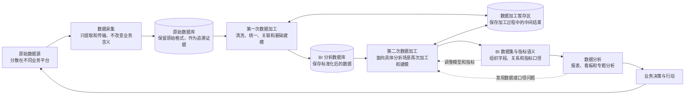

## BI 行业相关

### 一、前言

**BI**，即商业智能，是将分散在不同业务平台中的数据集中起来，经过整理、加工和分析，转化为报表、指标和业务洞察，帮助业务人员理解现状、发现问题并作出决策

从整体上看，**BI** 并不只是制作报表，而是建立一条从业务数据产生、数据采集加工，到分析决策和业务行动的完整闭环

### 二、BI 数据处理与业务闭环

- 分散在不同业务平台中的原始数据，首先通过数据采集进入原始数据库，并保留原始格式作为追溯证据；
- 数据加工引擎利用数据加工暂存区完成清洗、统一、关联和基础建模，再将标准化数据写入 **BI 分析数据库**

- 针对具体分析需求，数据可以再次加工和建模，形成带有统一指标语义的 **BI 数据集**；
- 分析人员可以根据分析结果持续调整加工规则、数据模型和指标口径，因此这一阶段是可以反复迭代的

- 业务人员通过报表和分析形成决策并采取行动，行动又会影响业务运行并产生新的业务数据，这些数据重新进入采集和分析流程，由此形成完整的业务闭环

整个流程可以简化为：

> 原始数据源 → 数据采集 → 原始数据库 → 第一次加工与基础建模 → BI 分析数据库 → 第二次加工与分析建模 → BI 数据集与指标语义 → 数据分析 → 业务决策与行动 → 新的业务数据

其中，原始数据库保存原始证据，数据加工暂存区保存加工过程，**BI 分析数据库** 保存标准化结果，**BI 数据集** 组织具体分析需要的数据和指标
